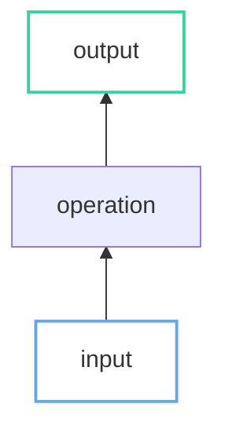

# CLAUDE.md

Jekyll 4.3.3 blog (bolu.dev) → GitHub Pages via Actions.

## Commands

```bash
bundle exec jekyll serve --drafts --future  # Dev server at localhost:4000
bundle exec jekyll build                     # Production build
./docker_jekyll.sh serve --drafts --future   # Docker alternative
```

## Structure

```
_posts/YYYY-MM-DD-slug.md   # Published posts
_drafts/                    # WIP (--drafts flag)
_layouts/                   # default.html → post.html/page.html
_includes/                  # Components (header, footer, analytics)
_sass/                      # SCSS partials
tag/*.md                    # Tag pages (one per tag)
```

**Front matter:**
```yaml
---
layout: post
title:  "Post Title"
date:   YYYY-MM-DD HH:MM:SS -0700
tags: tag1 tag2
author: bolu-atx
categories: programming
---
```

Excerpt separator: `<!--more-->`

## Mermaid Diagrams

Hand-drawn (xkcd) style with light/dark theme support. Click any diagram to open pan/zoom lightbox.

**Rules:** No hardcoded hex in `style` — use `classDef` with semantic classes.

### Classes & Colors

| Class | Use | Color |
|-------|-----|-------|
| `input` | Variables, parameters | `#60a5fa` blue |
| `output` | Final results | `#34d399` green |
| `highlight` | Emphasis | `#f472b6` pink |
| `done` | Completed | `#34d399` green |
| `progress` | In-progress | `#fbbf24` yellow |
| `result` | Computed values | `#a78bfa` purple |
| `positive` | Success | `#4ade80` green |
| `negative` | Error | `#f87171` red |

### Template



**For linkStyle:** `linkStyle 0 stroke:#f472b6,stroke-width:3px`
