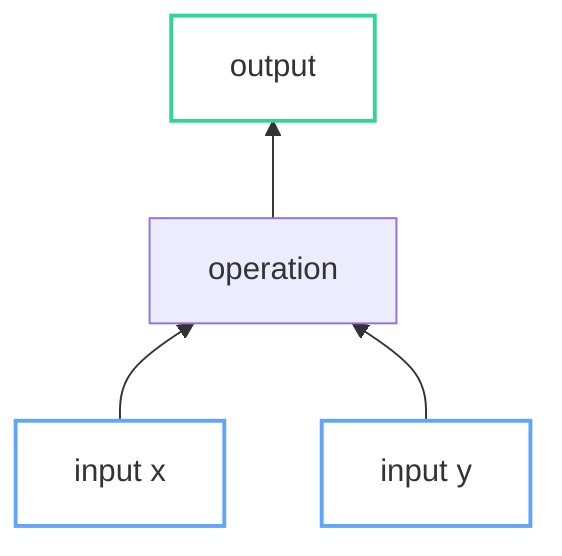
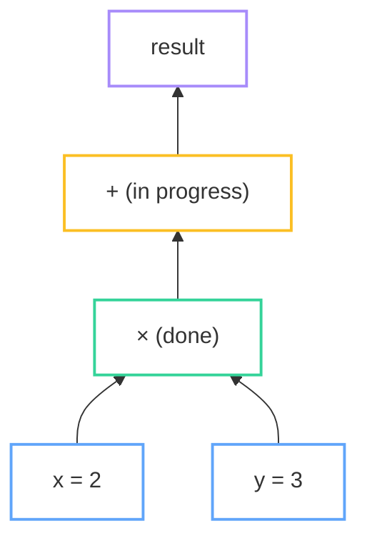

# CLAUDE.md

This file provides guidance to Claude Code (claude.ai/code) when working with code in this repository.

## Project Overview

Personal tech blog (bolu.dev) built with Jekyll 4.3.3, deployed to GitHub Pages via GitHub Actions.

## Development Commands

```bash
# Install dependencies
bundle install

# Run local dev server (includes drafts and future posts)
bundle exec jekyll serve --drafts --future

# Build for production
bundle exec jekyll build

# Alternative: Docker-based development
./docker_jekyll.sh serve --drafts --future
```

Local server runs at http://localhost:4000

## Content Structure

**Posts**: `_posts/YYYY-MM-DD-slug.md` - Published blog posts

**Drafts**: `_drafts/` - Work-in-progress posts (visible with `--drafts` flag)

**Post front matter format**:
```yaml
---
layout: post
title:  "Post Title"
date:   YYYY-MM-DD HH:MM:SS -0700
tags: tag1 tag2
author: bolu-atx
categories: programming
---
```

Use `<!--more-->` to mark the excerpt separator.

**Tag pages**: `tag/*.md` - Each tag needs a corresponding page file.

## Architecture

- `_layouts/`: default.html → post.html/page.html chain
- `_includes/`: Reusable components (header, footer, analytics, read-time estimator)
- `_sass/`: SCSS partials compiled into site CSS
- `css/`: Main stylesheet entry point
- `assets/`: Images and static files

## Deployment

Push to `master` triggers GitHub Actions workflow (`.github/workflows/jekyll.yml`) which builds and deploys to GitHub Pages.

## Mermaid Diagram Styling Guide

The blog uses Mermaid with a hand-drawn (xkcd) aesthetic that supports both light and dark themes. **Never use hardcoded hex colors in `style` directives** — use `classDef` with the semantic classes below.

### Semantic Classes

Use these predefined classes for consistent, theme-aware styling:

| Class | Purpose | Color (adapts to theme) |
|-------|---------|-------------------------|
| `input` | Input nodes, variables, parameters | Blue (`#60a5fa`) |
| `output` | Output nodes, final results | Green (`#34d399`) |
| `highlight` | Emphasized/active nodes | Pink (`#f472b6`) |
| `done` | Completed states, checkmarks | Green (`#34d399`) |
| `progress` | In-progress, processing states | Yellow (`#fbbf24`) |
| `result` | Computed values, gradients | Purple (`#a78bfa`) |
| `positive` | Good outcomes, success | Green (`#4ade80`) |
| `negative` | Bad outcomes, errors | Red (`#f87171`) |
| `shared` | Shared/referenced nodes | Blue (`#60a5fa`) |

### Usage Pattern



### Best Practices

1. **Always use `fill:none`** — let the theme handle backgrounds
2. **Use `stroke-width:2px`** — consistent with hand-drawn aesthetic
3. **Group related nodes** — `class x,y,z input` not separate style lines
4. **Link styling** — use theme-compatible colors:
   ```
   linkStyle 0 stroke:#f472b6,stroke-width:3px
   ```
5. **No inline `style` with hex colors** — these break in dark mode

### Color Reference (for linkStyle)

When you need colors for `linkStyle` directives, use these theme-friendly values:
- Highlight/active: `#f472b6` (pink)
- Error/warning: `#f87171` (red)
- Success: `#4ade80` (green)
- Info: `#60a5fa` (blue)
- Caution: `#fbbf24` (yellow)

### Example: Multi-state Diagram


