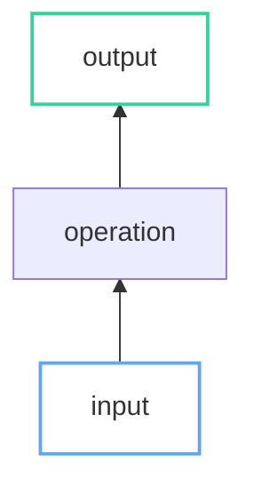

# CLAUDE.md

Jekyll 4.3.3 blog (bolu.dev) → GitHub Pages via Actions.

## Commands
```bash
bundle exec jekyll serve --drafts --future  # localhost:4000
bundle exec jekyll build                     # Production
```

## Structure
```
_posts/YYYY-MM-DD-slug.md   _drafts/            _layouts/  _includes/  _sass/
tag/*.md                     assets/posts-media/  assets/js/  assets/data/
```

**Front matter:** `layout: post`, `title`, `date: YYYY-MM-DD HH:MM:SS -0700`, `tags`, `author: bolu-atx`, `categories`. Excerpt separator: `<!--more-->`

## Writing Style

Casual, first-person, like explaining to a smart friend. No corporate tone or filler.

- **No jargon without earning it** — explain terms on first use, expand acronyms per post
- **Deep + specific** — show the math, trace the code, explain *why* not just *what*
- **Examples first** — start concrete (snippet, number, diagram), then generalize
- **Layer complexity** — simple case → edge cases → full picture, one new idea per step
- **Tight prose** — every paragraph earns its place; use diagrams/code/math to break up text
- **Avoid:** buzzwords ("leverage", "utilize"), hedging filler, unnecessary preambles

## Mermaid Diagrams

xkcd hand-drawn style, Mermaid v11. Fenced ` ```mermaid ` blocks auto-render. Click → pan/zoom lightbox.

**No hardcoded hex in `style`** — use `classDef` with semantic classes:

| Class | Color | Class | Color |
|-------|-------|-------|-------|
| `input` | `#60a5fa` blue | `output` | `#34d399` green |
| `highlight` | `#f472b6` pink | `result` | `#a78bfa` purple |
| `progress` | `#fbbf24` yellow | `done` | `#34d399` green |
| `positive` | `#4ade80` green | `negative` | `#f87171` red |


`linkStyle 0 stroke:#f472b6,stroke-width:3px`

## MathJax

v4, async. Inline: `$...$`. Block: `$$...$$`. Always pair formulas with plain-English explanation.

## D3.js

D3 v7. Theme via `data-theme` attr; must listen `themechange` event and redraw. Never hardcode colors.

**Inline** (one-off): `<script src="https://cdn.jsdelivr.net/npm/d3@7">` + code in post.
**Shared lib** (series): `assets/js/<name>-charts.js` exposing color palette + helpers.

## Code & Images

Rouge highlighter, GFM fenced blocks, theme-aware. Images in `/assets/posts-media/`, auto-centered.
