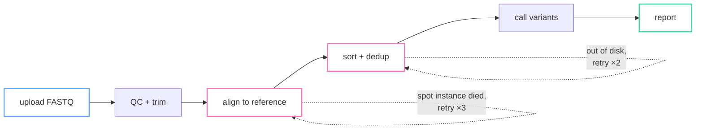
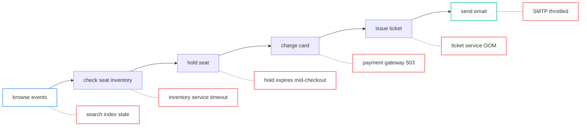

Through my career building software and algorithms that touch the real world, I've collected my fair share of failures, edge cases and head scratchers — the kind that make for great war stories to tell junior engineers.

Scrolling through Hacker News a while back, I came across Richard Cook's [How Complex Systems Fail](https://how.complexsystems.fail). Combined with some recent firefighting at work, it got me thinking: how *do* you build systems that survive failure and recover gracefully? Is it as simple as adopting the latest mantra — chaos engineering, SOLID, KISS, micro-services, Kubernetes, multi-AZ — or is there something more fundamental underneath all of those?

<!--more-->

## Systems as ANDs and ORs

Here's a reductive mental model I keep coming back to. A system is a set of steps. Each step either succeeds or fails. Draw it as a graph — the same DAG we've all come to love and hate in workflow engines — and every node is one of two kinds:

- **AND**: a serial step. The system gets past this point only if *this* step works. Every AND you add is another thing that has to go right.
- **OR**: an alternative. The system gets past this point if *any one* of the branches works. Redundancy, failover, and retries are all ORs.

Retries are worth calling out, because they're the OR most people reach for first. "Try again" is just "path A or path A again," and it only helps if the second attempt can fail differently from the first. That assumption — independent failures — is doing enormous work here, and we'll come back to it.

Here's a genomics pipeline I've built variants of many times. Serial by nature: you can't call variants on reads you haven't aligned yet.

Six ANDs in a row, with two of them wrapped in a small OR. The pink nodes are the ones I've actually had to retry in production; the dotted self-loops are the retries.

The same shape shows up almost everywhere once you look for it — rockets, DNA sequencers, ML training runs, or the thing you did this morning:

Six steps, and each one has a failure mode that I've personally seen fire. Note that the failure modes are not equal: a stale search index is a bad afternoon, a double charge on step four is a support ticket and a refund. Hold that thought — it comes back when we talk about retries.

## Now let's do the math

Once the system is a graph of ANDs and ORs, the arithmetic falls out. For an AND chain, you multiply. If each of $n$ steps succeeds independently with probability $p$:

$$P_{\text{success}} = p^n$$

For an OR of two alternatives that each *fail* with probability $q$, the pair only fails if both fail:

$$P_{\text{failure}} = q \times q = q^2$$

In plain English: ANDs multiply your failure in, ORs multiply it out. The trouble is that real systems have far more ANDs than ORs, and the exponent is unforgiving. Take a very respectable per-step reliability of 99.9%:

| Steps | End-to-end success |
|---|---|
| 10 | 99.0% |
| 100 | 90.5% |
| 1,000 | 36.8% |
| 10,000 | 0.005% |

A thousand steps at three nines each and your system works about a third of the time. Turn it around: to hit 99.99% end-to-end across 100 steps, every step needs roughly six nines. Each order of magnitude of steps eats about a nine of your budget.

Play with it — pick a topology, drag the sliders, and watch the curve:

Blue is the plain serial chain, green is the topology you picked. The "shared failures" slider is the interesting one — it's the fraction of failures that kill both paths at once.

Two things are worth noticing before you move on. First, the retry topology buys you a lot for one step and nothing for the other 99 — a local fix to a global problem. Second, push "shared failures" up from 0% and watch the redundant chain collapse back toward the plain one. At 100% shared, two copies are worth exactly one copy. That slider is the whole rest of this post.

So: overall reliability is a function of how many steps you have, and how good each one is. Which gives you exactly two levers.

## Lever one: fewer ANDs

The cheapest fix is not having the step at all. Every hop you remove — a needless proxy, a cache nobody needs, a synchronous call that could be async, a service that exists because two teams didn't talk to each other — is one less multiplication in the product.

This is the actual quantitative argument for simplicity. "Keep it simple" isn't a taste preference; it's a direct lever on the math. Every layer you add, no matter how well built, is a factor less than 1 multiplied into your reliability.

The limit is obvious: simplify past a point and the system stops doing its job. But most systems I've worked on are nowhere near that point.

## Lever two: more ORs

The other lever is redundancy. Instead of one path that must succeed, build two, and succeed if path A **or** path B works. Two 99% paths that fail independently give you 99.99% — two extra nines, apparently free, just for having a backup.

That's genuinely powerful, and it's why every serious system has replicas, retries, and failover. But "free" is doing a lot of work in that sentence, and "independently" is doing even more. The OR machinery is itself a program that has to be built, deployed, and maintained — which is to say, it's a new AND chain. We'll get to what that costs.

## Translating this into engineering principles

Software people argue endlessly about design principles, and it turns out a lot of that advice is just these two levers wearing different clothes. Four of the big ones, in plain terms:

- **Make each step repeatable.** If doing a thing twice is the same as doing it once, you can safely try again. That's the whole precondition for a retry. Charging a credit card is the classic step where this isn't true by default, and it's why every payment system eventually grows a way to say "this is the same charge, not a second one."
- **Say what you want, not how to get there.** If the system knows the state it's supposed to be in, it can keep nudging itself back toward that state without anyone diagnosing what went wrong. Recovery becomes automatic instead of a procedure someone has to remember at 3am.
- **Don't let the copies hold anything unique.** Two backups are only worth two if they can fail separately. The moment each one is holding something the other doesn't have, they stop being interchangeable and start being two ways to lose data.
- **Keep it simple.** Fewer steps, fewer multiplications. Simplicity also keeps the whole thing small enough that a person can picture how it breaks — and a person who can't picture it can't fix it under pressure.

None of these are aesthetic preferences. Each one either removes an AND or makes an OR actually work.

If the model were the whole story, you could stop here. It isn't, and the gap is where the expensive outages live.

## Where this model breaks down

Every one of those principles rests on an assumption the arithmetic hands you for free and reality charges for. Here's where you get billed.

**Independence is an assumption, not a property.** Squaring the failure probability only works if the two paths fail for different reasons. Two servers in the same AZ aren't redundant against a power failure. Two replicas running the same binary aren't redundant against a bug, because the same bad input kills both. A health check that evicts "unhealthy" instances can, under a spike, evict enough of them that the survivors drown. Worst of all is the backup that the triggering event itself makes unusable — that's not two paths, it's one path wearing two costumes. Ask every OR the same question: *what do these two paths share?* If the answer is "the same deploy, the same region, the same team's assumptions," you didn't buy a nine. You bought the illusion of one.

**The OR machinery is itself an AND chain.** Automatic failover isn't a property, it's a program: detect the failure, decide to fail over, redirect traffic, reconcile state. Every one of those can fail, so you spent ANDs to buy an OR. And the chain is usually longer than it looks — a failover that correctly promotes a new primary is still broken if nobody checked that the application tier can follow it. That one cost GitHub [24 hours off the back of a 43-second network blip](https://github.blog/2018-10-30-oct21-post-incident-analysis/), with nothing malfunctioning: *"Orchestrator's actions behaved as configured."* Retries without a cap and jitter turn one slow dependency into a self-inflicted DDoS. A healing path that runs on the thing it's healing isn't a healing path at all; rollback tooling that authenticates through the service that's down is the version of this everyone eventually meets.

**You can only harden against failures you've imagined.** The multiplication table assumes you already know each step's failure rate. The outages that hurt come from a combination nobody had seen, so the model's ceiling is your imagination, and money doesn't raise it. Having incidents on purpose does: game days, chaos drills, near-miss reviews. An untested failover isn't an OR, it's a latent failure you've scheduled.

**Your system is already running degraded.** The math describes a fully healthy system that barely exists. Real systems run with some replica behind, some cache stale, some queue backed up, and they keep working anyway — because people are actively managing that degradation.

### The human is a step in the chain too

People sit on both sides of the model.

They are the recovery path. Read enough postmortems and the shape repeats: the automation makes the problem, and a person on call spots the inconsistency, decides to stop the bleeding, and does the slow manual work of getting back to a correct state. That's Cook's point — the operator is the adaptable part. Architecture buys time; the operator spends it.

They are also the correlation. Every failover policy that fired at the wrong moment was configured by someone months earlier, and it was reasonable against the topology in their head. Shared assumptions travel with shared authorship, so people are where most dead ORs come from. Heroics hide degradation: the engineer who restarts the stuck job every morning has turned a visible defect into an invisible dependency on themselves. Tribal knowledge is an AND with no OR: if one person can fail over the database, their vacation is in your reliability budget.

A checklist to run before adding any OR:

| Check | The question | What it costs you if you skip it |
|---|---|---|
| Independence | What do these two paths share? | The nine you thought you bought |
| Replay safety | Can this run twice safely? | A double charge instead of a retry |
| Boundedness | Cap, jitter, circuit breaker? | Your retries become the outage |
| Self-independence | Does the healer depend on the healed? | No recovery path when you need one |
| Testability | Has anyone fired this in a drill? | A latent failure you scheduled |
| Cost accounting | Does its own AND chain cost more than it buys? | Net-negative redundancy |

## Where to spend

The useful question is never "how do I make this more reliable." It's "which step, specifically."

Two budgets constrain the answer. Money: each extra nine costs about ten times the last, from 3.65 days of downtime a year at 99% to 5 minutes at 99.999%. Complexity: every OR is machinery someone has to understand at 3am, and past a point the system is more reliable on paper and less recoverable in practice.

So find the steps that can't become ORs. Look for high fan-in — the primary database, DNS, the auth service. Those are single points of failure even when every consumer has its own redundancy, because they all still point at the same one thing. Then look for shared fate rather than topology: a shared binary, config, AZ, or team assumption makes two boxes one path.

Some of what you find is convertible: build the alternative, then run the checklist. Some isn't — you can't run two independent sources of truth — so spend the nines there and design the degraded mode explicitly: stale reads, queued writes, a read-only path that actually works. The rest is a human decision or the outside world, and the only move is a practiced person in that seat.

## What changes at scale

Steps grow linearly, but interactions grow quadratically. Adding a service adds one term to the multiplication and a handful of new edges to the graph — the arithmetic degrades gently, the number of ways two components can surprise each other does not. Your ignorance outruns your coverage the same way: at 10 steps you can list the failure modes on a whiteboard; at 1,000 you handle more of them and a smaller fraction of them.

That flips the strategy. Small system: buy nines and harden the choke points. Large system: stop preventing failure and start bounding it. Cells so one bad input can't reach everything, blast-radius limits so the failure you didn't imagine is survivable, progressive rollout so a change meets 1% of production first — Cloudflare's July 2019 outage was one WAF rule deployed globally in one shot.

Past a certain size the goal isn't a system nobody can break. It's a system that fails in ways somebody can still reason about, where being wrong is cheap.

Count your ANDs, buy ORs where they're genuinely independent, and keep the whole thing small enough that a person can picture how it breaks. The math gets you that far. The outages that actually hurt come from machinery that didn't malfunction at all — it worked exactly as designed, one assumption short of correct. That gap, between *worked as designed* and *worked*, is where all of this lives.
