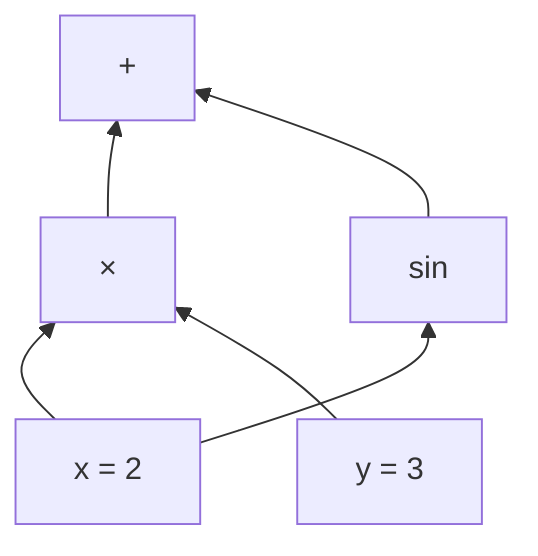
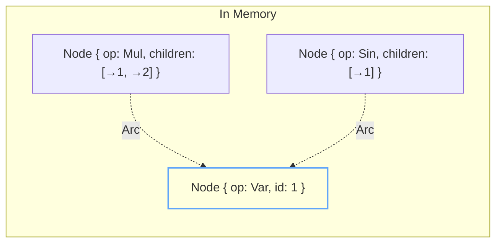
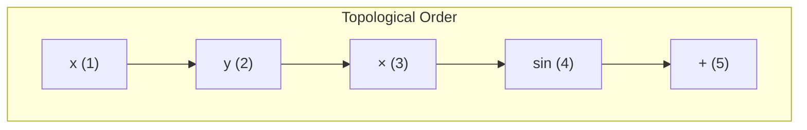
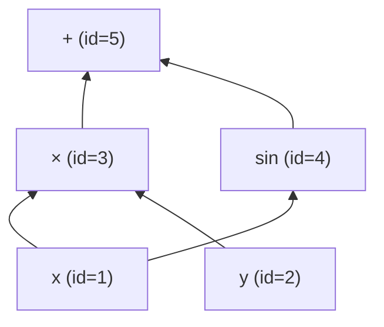
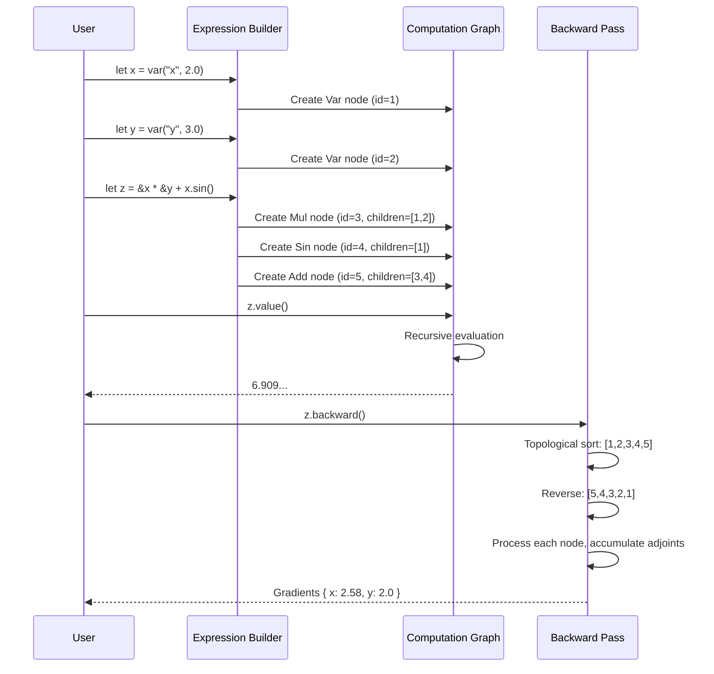

In [Part 1](), we built intuition for autodiff: computation as graphs, derivatives as sensitivity flowing backward, the chain rule as path multiplication.

Now let's make it real. We'll implement a working autodiff engine in Rust — something you can actually use to compute gradients.

<!--more-->

Fair warning: this will be more code-heavy. But I'll try to connect each piece back to the mental model we built.

## What We're Building

By the end, we'll have code that does this:

```rust
let x = var("x", 2.0);
let y = var("y", 3.0);

let z = &x * &y + x.sin();

println!("z = {}", z.value());           // 6.909...
println!("∂z/∂x = {}", z.backward().wrt(&x).unwrap());  // 2.583...
println!("∂z/∂y = {}", z.backward().wrt(&y).unwrap());  // 2.0
```

Clean API, exact gradients, works for arbitrary expressions. Let's build it.

## Step 1: Representing the Graph

Remember our computation graph?



Each bubble is a **node**. Each node has:
- What operation it performs (or if it's a leaf, what value it holds)
- Which nodes it depends on (its children)

Let's define the operations:

```rust
#[derive(Debug, Clone)]
pub enum Op {
    // Leaf nodes
    Const(f64),                      // A fixed number
    Var { name: String, value: f64 }, // An input variable

    // Binary operations
    Add,  // children[0] + children[1]
    Sub,  // children[0] - children[1]
    Mul,  // children[0] * children[1]
    Div,  // children[0] / children[1]

    // Unary operations
    Neg,                 // -children[0]
    Pow { exponent: f64 }, // children[0] ^ exponent
    Exp,                 // e^children[0]
    Log,                 // ln(children[0])
    Sin,                 // sin(children[0])
    Cos,                 // cos(children[0])
}
```

And the node structure:

```rust
pub struct Node {
    pub id: NodeId,          // Unique identifier
    pub op: Op,              // What this node does
    pub children: Vec<Expr>, // Nodes this depends on
}
```

## Step 2: Cheap Cloning with Arc

Here's a design decision that matters. When we write:

```rust
let a = x.sin();
let b = &x * &y;
let c = a + b;  // Both a and b flow into c
```

We're building a graph where `x` might be used multiple times. We don't want to *copy* the entire subgraph each time — we want to *share* it.

Rust's `Arc` (atomic reference counted pointer) is perfect for this:

```rust
#[derive(Clone)]
pub struct Expr(Arc<Node>);
```

Now cloning an `Expr` is just incrementing a counter — O(1), no deep copying. The same node can have multiple parents without duplication.



Multiple expressions can point to the same underlying node. This is exactly the graph structure we need.

## Step 3: Building Expressions

Now let's make it easy to construct graphs. We want `x + y` and `x.sin()` to just work:

```rust
impl Expr {
    pub fn var(name: &str, value: f64) -> Self {
        Expr(Arc::new(Node {
            id: NodeId::new(),
            op: Op::Var { name: name.to_string(), value },
            children: vec![],
        }))
    }

    pub fn sin(&self) -> Expr {
        Expr(Arc::new(Node {
            id: NodeId::new(),
            op: Op::Sin,
            children: vec![self.clone()],
        }))
    }

    // Similar for cos, exp, log, etc.
}
```

For binary operations, we implement Rust's operator traits:

```rust
impl std::ops::Add for &Expr {
    type Output = Expr;

    fn add(self, rhs: &Expr) -> Expr {
        Expr(Arc::new(Node {
            id: NodeId::new(),
            op: Op::Add,
            children: vec![self.clone(), rhs.clone()],
        }))
    }
}

// Similar for Sub, Mul, Div
```

Now we can write math naturally:

```rust
let x = Expr::var("x", 2.0);
let y = Expr::var("y", 3.0);
let z = &x * &y + x.sin();  // Builds the graph automatically
```

Each operation creates a new node, linking back to its dependencies. The graph builds itself as we write math.

## Step 4: Forward Pass (Evaluation)

Evaluating the expression means computing the value at each node, bottom-up. This is straightforward recursion:

```rust
impl Expr {
    pub fn value(&self) -> f64 {
        match &self.0.op {
            Op::Const(v) => *v,
            Op::Var { value, .. } => *value,

            Op::Add => self.children()[0].value() + self.children()[1].value(),
            Op::Sub => self.children()[0].value() - self.children()[1].value(),
            Op::Mul => self.children()[0].value() * self.children()[1].value(),
            Op::Div => self.children()[0].value() / self.children()[1].value(),

            Op::Neg => -self.children()[0].value(),
            Op::Sin => self.children()[0].value().sin(),
            Op::Cos => self.children()[0].value().cos(),
            Op::Exp => self.children()[0].value().exp(),
            Op::Log => self.children()[0].value().ln(),
            Op::Pow { exponent } => self.children()[0].value().powf(*exponent),
        }
    }
}
```

Nothing fancy here. We're just implementing the semantics of each operation.

## Step 5: Local Gradients

Remember from Part 1: each operation knows its own "exchange rate" for wiggles. Let's codify that:

```rust
pub fn local_gradients(op: &Op, children: &[Expr]) -> Vec<f64> {
    match op {
        // Leaves have no children to propagate to
        Op::Const(_) | Op::Var { .. } => vec![],

        // Addition/subtraction just pass through
        Op::Add => vec![1.0, 1.0],   // ∂(a+b)/∂a = 1, ∂(a+b)/∂b = 1
        Op::Sub => vec![1.0, -1.0],  // ∂(a-b)/∂a = 1, ∂(a-b)/∂b = -1

        // Multiplication: each input scaled by the other
        Op::Mul => {
            let a = children[0].value();
            let b = children[1].value();
            vec![b, a]  // ∂(a·b)/∂a = b, ∂(a·b)/∂b = a
        }

        // Division: quotient rule
        Op::Div => {
            let a = children[0].value();
            let b = children[1].value();
            vec![1.0 / b, -a / (b * b)]  // ∂(a/b)/∂a = 1/b, ∂(a/b)/∂b = -a/b²
        }

        Op::Neg => vec![-1.0],

        // Transcendental functions
        Op::Sin => vec![children[0].value().cos()],    // ∂sin(a)/∂a = cos(a)
        Op::Cos => vec![-children[0].value().sin()],   // ∂cos(a)/∂a = -sin(a)
        Op::Exp => vec![children[0].value().exp()],    // ∂eᵃ/∂a = eᵃ
        Op::Log => vec![1.0 / children[0].value()],    // ∂ln(a)/∂a = 1/a

        // Power rule (constant exponent)
        Op::Pow { exponent } => {
            let a = children[0].value();
            vec![exponent * a.powf(exponent - 1.0)]  // ∂aⁿ/∂a = n·aⁿ⁻¹
        }
    }
}
```

This is just calculus, but notice how localized it is. Each operation doesn't know or care about the larger graph. It only knows: "if my input wiggles, here's how my output wiggles."

## Step 6: Topological Sort

Before we can go backward, we need to know the order to visit nodes. We want to process parents before children (going backward means starting at the output).

A depth-first search gives us topological order:

```rust
fn topological_sort(root: &Expr) -> Vec<Expr> {
    let mut visited = HashSet::new();
    let mut order = Vec::new();

    fn dfs(expr: &Expr, visited: &mut HashSet<NodeId>, order: &mut Vec<Expr>) {
        if visited.contains(&expr.id()) {
            return;  // Already processed this node
        }
        visited.insert(expr.id());

        // Visit children first
        for child in expr.children() {
            dfs(child, visited, order);
        }

        // Then add this node (post-order)
        order.push(expr.clone());
    }

    dfs(root, &mut visited, &mut order);
    order
}
```

Post-order DFS means children come before parents in `order`. If we reverse it, we get parents before children — exactly what we need for the backward pass.



Reversed: +, sin, ×, y, x — output first, inputs last.

## Step 7: The Backward Pass

Now the magic. We'll maintain an "adjoint" for each node — its sensitivity with respect to the final output.

```rust
pub fn backward(output: &Expr) -> Gradients {
    // Step 1: Get nodes in topological order
    let topo_order = topological_sort(output);

    // Step 2: Initialize adjoints (sensitivity values)
    let mut adjoints: HashMap<NodeId, f64> = HashMap::new();
    adjoints.insert(output.id(), 1.0);  // ∂output/∂output = 1

    // Step 3: Process nodes from output to inputs (reversed order)
    for expr in topo_order.iter().rev() {
        let node_adjoint = *adjoints.get(&expr.id()).unwrap_or(&0.0);

        if node_adjoint == 0.0 {
            continue;  // No sensitivity flowing through this node
        }

        // Get local gradients for this operation
        let local_grads = local_gradients(expr.op(), expr.children());

        // Propagate to each child: chain rule!
        for (i, child) in expr.children().iter().enumerate() {
            // child_adjoint += this_adjoint × local_gradient
            *adjoints.entry(child.id()).or_insert(0.0)
                += node_adjoint * local_grads[i];
        }
    }

    Gradients { adjoints, /* ... */ }
}
```

Let's trace through this with our example. Graph:



Process in reverse topo order:

| Node | Adjoint Before | Action | Adjoint After |
|------|----------------|--------|---------------|
| + (id=5) | 1.0 | output, initialize | 1.0 |
| × (id=3) | 0.0 | receives 1.0×1 from + | 1.0 |
| sin (id=4) | 0.0 | receives 1.0×1 from + | 1.0 |
| y (id=2) | 0.0 | receives 1.0×x from × | 2.0 |
| x (id=1) | 0.0 | receives 1.0×y from × | 3.0 |
| x (id=1) | 3.0 | receives 1.0×cos(2) from sin | 3.0 + (-0.42) = 2.58 |

Notice how x's adjoint accumulates contributions from both paths. That's the `+=` doing its job.

## Step 8: Querying Results

Finally, let's make the gradients easy to access:

```rust
pub struct Gradients {
    adjoints: HashMap<NodeId, f64>,
    name_to_grads: HashMap<String, Vec<(NodeId, f64)>>,
}

impl Gradients {
    /// Get gradient with respect to a specific expression
    pub fn wrt(&self, expr: &Expr) -> Option<f64> {
        if !expr.is_var() {
            return None;  // Only variables have meaningful gradients
        }
        self.adjoints.get(&expr.id()).copied()
    }

    /// Get gradient by variable name
    pub fn by_name(&self, name: &str) -> Option<f64> {
        self.name_to_grads.get(name)?.first().map(|(_, g)| *g)
    }

    /// Get all gradients as a map
    pub fn all_named_grads(&self) -> HashMap<String, f64> {
        self.name_to_grads.iter()
            .map(|(name, grads)| (name.clone(), grads.iter().map(|(_, g)| g).sum()))
            .collect()
    }
}
```

## Putting It Together

Here's how the full flow works:



## Testing Against Numerical Gradients

How do we know our gradients are correct? We compare against numerical differentiation:

```rust
pub fn finite_diff_grad<F>(f: F, point: &[f64], eps: f64) -> Vec<f64>
where
    F: Fn(&[f64]) -> f64,
{
    let mut grads = Vec::new();

    for i in 0..point.len() {
        let mut plus = point.to_vec();
        let mut minus = point.to_vec();
        plus[i] += eps;
        minus[i] -= eps;

        // Central difference: (f(x+ε) - f(x-ε)) / 2ε
        grads.push((f(&plus) - f(&minus)) / (2.0 * eps));
    }

    grads
}
```

Central differences give $O(\varepsilon^2)$ accuracy. With $\varepsilon = 10^{-7}$, we get errors around $10^{-14}$ — more than enough to validate our exact gradients.

```rust
#[test]
fn test_gradient_correctness() {
    let x = var("x", 1.5);
    let y = var("y", 2.5);
    let z = &x * &y + x.sin();

    let grads = z.backward();

    let f = |vals: &[f64]| {
        let x = var("x", vals[0]);
        let y = var("y", vals[1]);
        (&x * &y + x.sin()).value()
    };

    let numerical = finite_diff_grad(f, &[1.5, 2.5], 1e-7);

    assert!((grads.wrt(&x).unwrap() - numerical[0]).abs() < 1e-5);
    assert!((grads.wrt(&y).unwrap() - numerical[1]).abs() < 1e-5);
}
```

## What We Built

Let's step back and appreciate what we have:

1. **Expression building**: Natural math syntax (`&x * &y + x.sin()`)
2. **Automatic graph construction**: The graph builds itself as we compose operations
3. **Forward evaluation**: Compute values by recursive traversal
4. **Backward differentiation**: One pass gives all gradients
5. **Numerical validation**: Confidence our gradients are correct

The complete implementation is about 500 lines of Rust. Not bad for a working autodiff engine!

## Extensions

This is a learning implementation. Production systems like PyTorch add:

- **Tensors**: We only handle scalars; real systems work with n-dimensional arrays
- **GPU acceleration**: Offload computation to CUDA/Metal
- **Caching**: Store intermediate values to avoid recomputation
- **Memory optimization**: Gradient checkpointing, in-place operations
- **Graph optimization**: Fuse operations, eliminate common subexpressions

But the core algorithm is the same. Once you understand scalar autodiff, tensor autodiff is "just" applying the same ideas to matrices.

## Closing Thoughts

Building this helped me finally *get* autodiff. It's not black magic — it's:

1. Representing math as a graph
2. Each node knowing its own derivative
3. Chain rule = multiplying along paths
4. Reverse mode = working backward from output

The implementation follows directly from the mental model. That's the sign of a good abstraction.

If you want to explore further, the full code is at [github.com/bolu-atx/autodiff-rs](https://github.com/bolu-atx/autodiff-rs). Try adding new operations, or maybe implement forward mode for comparison!

---

*Part 2 of the "Autodiff in Rust" series. [Part 1]() covers the conceptual foundations.*
