You've probably heard of XGBoost—it's won countless Kaggle competitions and powers prediction systems everywhere. But how does it actually work? In this post, we'll build up the intuition from simple decision trees to the full gradient boosting algorithm.

<!--more-->

## Starting Simple: Decision Trees

A decision tree asks yes/no questions about your data to make predictions.

The tree learns by finding the best question to ask at each step. But what makes a question "good"?

### Traditional Split Criterion: Gini Impurity

Classic decision trees (like CART) use **Gini impurity** to measure how "mixed" a node is:

$$\text{Gini}(node) = 1 - \sum_{k} p_k^2$$

Where $p_k$ is the fraction of samples belonging to class $k$.

A pure node (all same class) has Gini = 0. A 50/50 split has Gini = 0.5.

```mermaid
graph LR
    subgraph "Pure Node (Gini=0)"
        P1[("🟢🟢🟢🟢")]
    end
    subgraph "Mixed Node (Gini=0.5)"
        M1[("🟢🟢🔴🔴")]
    end
    subgraph "Mostly Pure (Gini=0.32)"
        MP1[("🟢🟢🟢🔴")]
    end
```

The best split maximizes **Gini Gain**:

$$\text{Gini Gain} = \text{Gini}_{parent} - \left( \frac{n_L}{n} \cdot \text{Gini}_L + \frac{n_R}{n} \cdot \text{Gini}_R \right)$$

This works, but it has a limitation: **it doesn't know what you're optimizing for**. Whether you care about accuracy, log-loss, or some custom metric—Gini treats them all the same.

## The Boosting Idea: Ensemble of Weak Learners

Instead of building one complex tree, what if we built many simple trees that each fix the mistakes of the previous ones?

The prediction is the **sum** of all tree outputs:

$$\hat{y}_i = \sum_{t=1}^{T} f_t(x_i)$$

Each tree $f_t$ is shallow (a "weak learner"), but together they're powerful.

## Gradient Boosting: Learning from Mistakes

Here's the key insight: each new tree should predict **what the previous trees got wrong**.

### Step-by-Step Intuition

Let's trace through gradient boosting for a simple regression problem:

```mermaid
sequenceDiagram
    participant Data as Training Data
    participant Pred as Current Prediction
    participant Error as Residual/Error
    participant Tree as New Tree

    Note over Pred: Initialize: ŷ = 0.5 for all

    Data->>Error: Calculate errors
    Note over Error: error_i = y_i - ŷ_i

    Error->>Tree: Fit tree to errors
    Note over Tree: Learn to predict the errors

    Tree->>Pred: Update predictions
    Note over Pred: ŷ_new = ŷ_old + η × tree(x)

    Note over Data,Tree: Repeat for T rounds...
```

After each round, predictions get closer to the truth because we're directly targeting what we got wrong.

### From Residuals to Gradients

The "residual" (error) is actually the **gradient** of the squared error loss:

$$L = \frac{1}{2}(y - \hat{y})^2$$

$$\frac{\partial L}{\partial \hat{y}} = -(y - \hat{y}) = \hat{y} - y$$

So fitting to residuals = fitting to negative gradients. This is **gradient descent in function space**!

```mermaid
graph TD
    subgraph "Gradient Descent Analogy"
        A["Parameters θ"] --> B["Gradient ∂L/∂θ"]
        B --> C["Update: θ -= η × gradient"]
    end

    subgraph "Gradient Boosting"
        D["Prediction ŷ"] --> E["Gradient ∂L/∂ŷ"]
        E --> F["Update: ŷ += η × tree(x)"]
    end

    A -.->|"analogous to"| D
    B -.->|"analogous to"| E
    C -.->|"analogous to"| F
```

This generalization is powerful: **any differentiable loss function works**. Just compute its gradient.

## XGBoost's Innovation: Second-Order Optimization

Standard gradient boosting uses only the first derivative (gradient). XGBoost uses the **second derivative (Hessian)** too—like Newton's method vs. gradient descent.

### Taylor Expansion of the Loss

When we add a new tree $f(x)$ to our prediction, the loss changes:

$$L(y, \hat{y} + f(x)) \approx L(y, \hat{y}) + g \cdot f(x) + \frac{1}{2} h \cdot f(x)^2$$

Where:
- $g = \frac{\partial L}{\partial \hat{y}}$ — the gradient (first derivative)
- $h = \frac{\partial^2 L}{\partial \hat{y}^2}$ — the Hessian (second derivative)

### Why Does the Hessian Help?

The Hessian captures **curvature**—how fast the gradient is changing.

For logistic regression, the Hessian is $p(1-p)$ where $p$ is the predicted probability. When the model is confident ($p$ near 0 or 1), the Hessian is small. When uncertain ($p$ near 0.5), it's large. This naturally **weights uncertain samples more**.

## The XGBoost Split Criterion

Now we can derive how XGBoost decides where to split.

### Optimal Leaf Weight

For samples in a leaf, they all get the same prediction $w$. The optimal weight minimizes:

$$\sum_{i \in leaf} \left[ g_i \cdot w + \frac{1}{2} h_i \cdot w^2 \right] + \frac{1}{2}\lambda w^2$$

The $\lambda w^2$ term is L2 regularization to prevent overfitting.

Taking the derivative and setting to zero:

$$G + (H + \lambda)w = 0$$

$$w^* = -\frac{G}{H + \lambda}$$

Where $G = \sum g_i$ and $H = \sum h_i$ are the sums over all samples in the leaf.

### Split Gain Formula

The quality of a split is measured by how much it reduces the loss:

$$\text{Gain} = \frac{1}{2} \left[ \frac{G_L^2}{H_L + \lambda} + \frac{G_R^2}{H_R + \lambda} - \frac{G^2}{H + \lambda} \right] - \gamma$$

```mermaid
graph TD
    Parent["Parent Node<br/>G, H"] --> Split{"Split?"}
    Split --> Left["Left Child<br/>G_L, H_L"]
    Split --> Right["Right Child<br/>G_R, H_R"]

    Left --> ScoreL["Score_L = G_L²/(H_L+λ)"]
    Right --> ScoreR["Score_R = G_R²/(H_R+λ)"]
    Parent --> ScoreP["Score_P = G²/(H+λ)"]

    ScoreL --> Gain["Gain = ½(Score_L + Score_R - Score_P) - γ"]
    ScoreR --> Gain
    ScoreP --> Gain
```

Where:
- $\lambda$ = L2 regularization (prevents large weights)
- $\gamma$ = minimum gain required (prevents trivial splits)

### Comparing to Gini

| Aspect | Gini | XGBoost Gain |
|--------|------|--------------|
| Task-aware | No | Yes (via gradients) |
| Uses predictions | No | Yes (via Hessians) |
| Regularization | None | Built-in (λ, γ) |
| Works for any loss | No | Yes |

## Putting It All Together

Here's the complete XGBoost training algorithm:

```mermaid
flowchart TD
    Init["Initialize predictions<br/>ŷ = base_score"] --> Loop

    subgraph Loop ["For each boosting round"]
        Grad["Compute gradients g_i = ∂L/∂ŷ_i"] --> Hess
        Hess["Compute Hessians h_i = ∂²L/∂ŷ_i²"] --> Build
        Build["Build tree using<br/>gradient-based splits"] --> Update
        Update["Update: ŷ += η × tree(x)"]
    end

    Loop --> |"Repeat T times"| Loop
    Loop --> Final["Final model:<br/>sum of all trees"]
```

### Concrete Example: Squared Error

For squared error loss $L = \frac{1}{2}(y - \hat{y})^2$:

| Component | Formula | Value |
|-----------|---------|-------|
| Gradient | $g = \hat{y} - y$ | prediction minus truth |
| Hessian | $h = 1$ | constant |
| Leaf weight | $w^* = -\frac{\sum(\hat{y}_i - y_i)}{n + \lambda}$ | mean residual (regularized) |

### Concrete Example: Logistic Loss

For binary classification with $L = -[y \log p + (1-y)\log(1-p)]$ where $p = \sigma(\hat{y})$:

| Component | Formula | Interpretation |
|-----------|---------|----------------|
| Gradient | $g = p - y$ | predicted prob minus label |
| Hessian | $h = p(1-p)$ | higher when uncertain |
| Leaf weight | $w^* = -\frac{\sum(p_i - y_i)}{\sum p_i(1-p_i) + \lambda}$ | weighted by confidence |

## Key Takeaways

1. **Boosting = Additive Model**: Each tree corrects previous mistakes
2. **Gradients = Direction of Improvement**: They point toward the loss minimum
3. **Hessians = Step Size Control**: They prevent overshooting in curved regions
4. **Regularization Built-In**: λ and γ prevent overfitting naturally
5. **Loss-Agnostic**: Works for any differentiable loss function

In Part 2, we'll implement this algorithm in Rust from scratch, seeing exactly how these formulas translate to code.

---

*Part 1 of the "XGBoost from Scratch" series. Part 2 covers the Rust implementation.*
