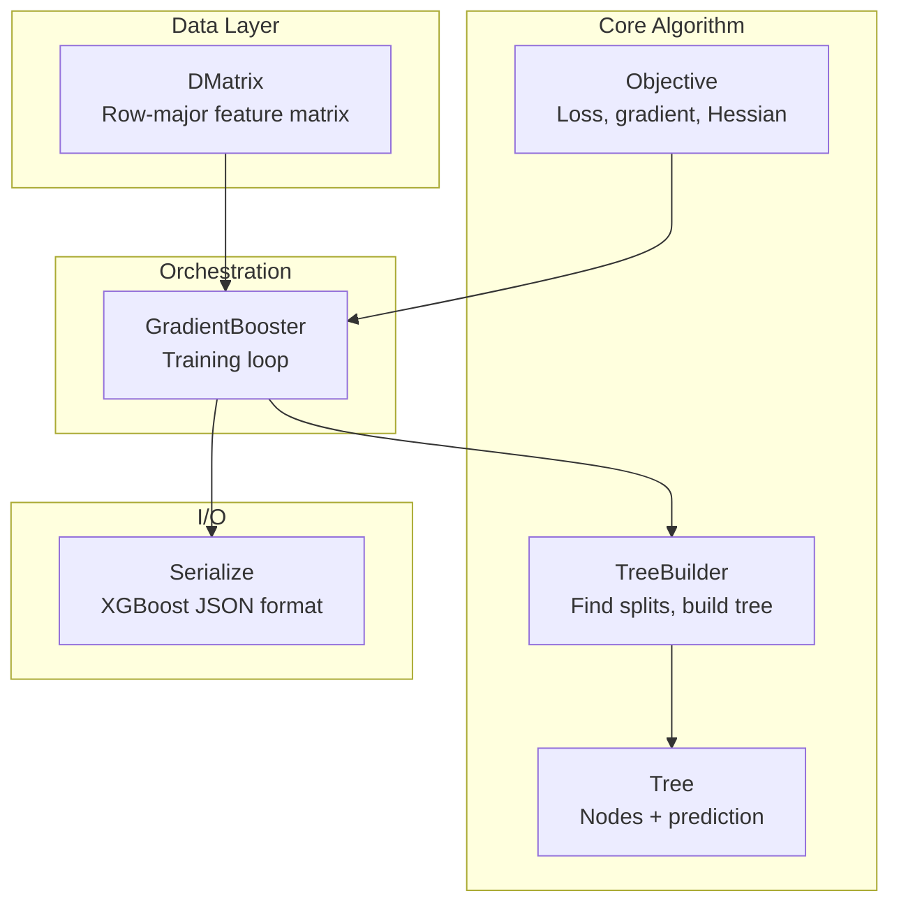
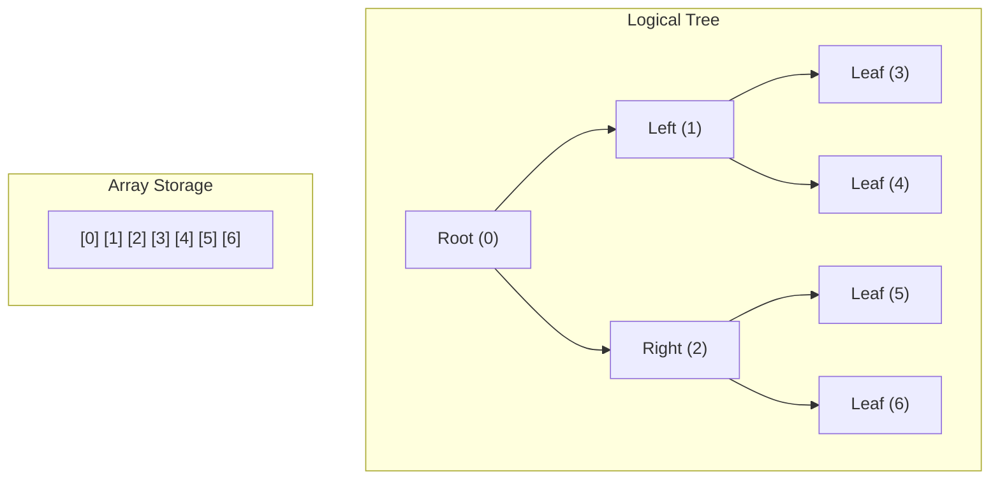
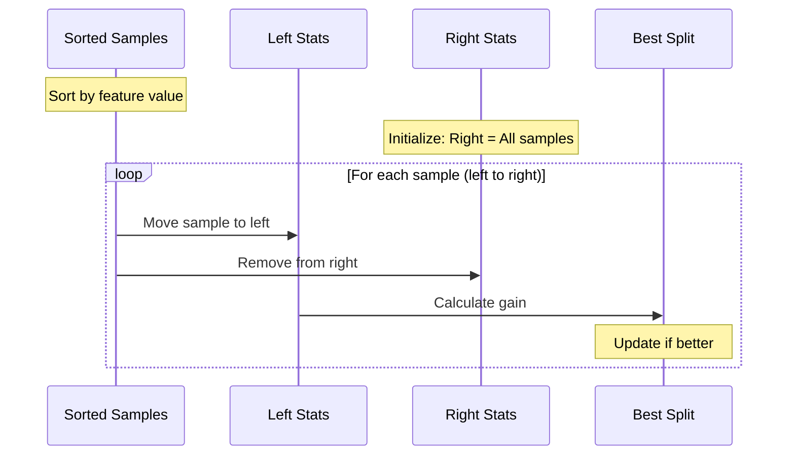
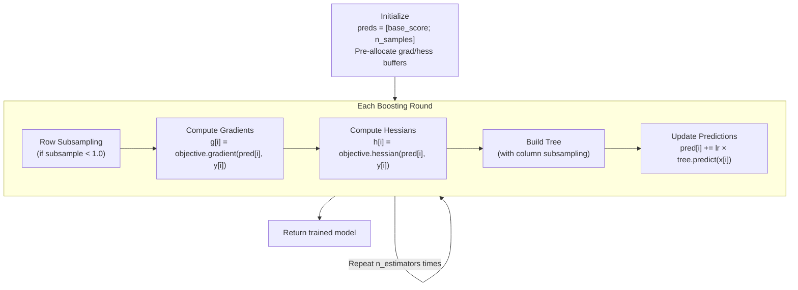
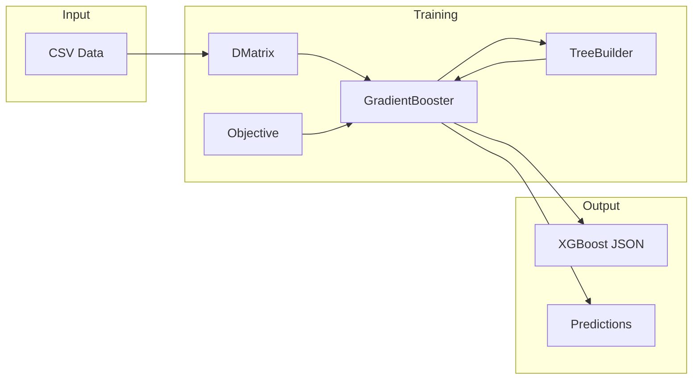

In Part 1, we covered the theory behind gradient boosting. Now let's implement it. We'll build a gradient boosted tree library in Rust that produces XGBoost-compatible models.

<!--more-->

## Architecture Overview



Let's build each component.

## 1. The Objective Trait: Encoding the Loss Function

The objective defines what we're optimizing. It computes gradients and Hessians for each sample.

```rust
pub trait Objective: Send + Sync {
    /// First derivative: g = ∂L/∂ŷ
    fn gradient(&self, pred: f32, label: f32) -> f32;

    /// Second derivative: h = ∂²L/∂ŷ²
    fn hessian(&self, pred: f32, label: f32) -> f32;

    /// Transform raw score to final prediction (e.g., sigmoid)
    fn transform_prediction(&self, raw: f32) -> f32 { raw }

    /// Loss value for progress reporting
    fn loss(&self, pred: f32, label: f32) -> f32;
}
```

### Squared Error (Regression)

For $L = \frac{1}{2}(y - \hat{y})^2$:

$$g = \frac{\partial L}{\partial \hat{y}} = \hat{y} - y$$

$$h = \frac{\partial^2 L}{\partial \hat{y}^2} = 1$$

```rust
pub struct SquaredError;

impl Objective for SquaredError {
    fn gradient(&self, pred: f32, label: f32) -> f32 {
        pred - label
    }

    fn hessian(&self, _pred: f32, _label: f32) -> f32 {
        1.0  // Constant curvature
    }

    fn loss(&self, pred: f32, label: f32) -> f32 {
        let diff = pred - label;
        diff * diff
    }
}
```

### Logistic Loss (Binary Classification)

For $L = -[y \log \sigma(\hat{y}) + (1-y)\log(1-\sigma(\hat{y}))]$:

$$g = \sigma(\hat{y}) - y$$

$$h = \sigma(\hat{y})(1 - \sigma(\hat{y}))$$

```rust
pub struct LogisticLoss;

impl Objective for LogisticLoss {
    fn gradient(&self, pred: f32, label: f32) -> f32 {
        sigmoid(pred) - label
    }

    fn hessian(&self, pred: f32, _label: f32) -> f32 {
        let p = sigmoid(pred);
        p * (1.0 - p)  // High when uncertain, low when confident
    }

    fn transform_prediction(&self, raw: f32) -> f32 {
        sigmoid(raw)  // Convert logit to probability
    }
}

fn sigmoid(x: f32) -> f32 {
    1.0 / (1.0 + (-x).exp())
}
```

The Hessian $p(1-p)$ is elegant: samples where the model is confident (p near 0 or 1) contribute less to split decisions. Uncertain samples matter more.

## 2. Tree Structure: Flattened for Performance

Instead of a recursive tree with heap-allocated children, we use a flat array:



```rust
pub struct TreeNode {
    pub split_feature: usize,   // Which feature to split on
    pub split_value: f32,       // Threshold
    pub left_child: usize,      // Index of left child
    pub right_child: usize,     // Index of right child
    pub is_leaf: bool,
    pub weight: f32,            // Leaf prediction value
    pub gain: f32,              // Split quality (for feature importance)
    pub default_left: bool,     // Direction for NaN values
}

pub struct Tree {
    pub nodes: Vec<TreeNode>,   // Flat array, root at index 0
    pub n_features: usize,
}
```

Prediction is a simple traversal:

```rust
pub fn predict_single(&self, features: &[f32]) -> f32 {
    let mut node = &self.nodes[0];  // Start at root

    while !node.is_leaf {
        let val = features[node.split_feature];
        let go_left = val < node.split_value
                   || (val.is_nan() && node.default_left);

        node = if go_left {
            &self.nodes[node.left_child]
        } else {
            &self.nodes[node.right_child]
        };
    }

    node.weight
}
```

## 3. Finding the Best Split

This is the core algorithm. For each node, we find the (feature, threshold) pair that maximizes gain.

### The Gain Formula (from Part 1)

$$\text{Gain} = \frac{1}{2} \left[ \frac{G_L^2}{H_L + \lambda} + \frac{G_R^2}{H_R + \lambda} - \frac{G^2}{H + \lambda} \right] - \gamma$$

```rust
pub fn calculate_split_gain(
    &self,
    left: &SplitStats,
    right: &SplitStats,
    parent: &SplitStats,
) -> f32 {
    let score = |g: f32, h: f32| g * g / (h + self.reg_lambda);

    0.5 * (score(left.sum_grad, left.sum_hess)
         + score(right.sum_grad, right.sum_hess)
         - score(parent.sum_grad, parent.sum_hess))
        - self.gamma
}
```

### Leaf Weight with L1/L2 Regularization

$$w^* = -\frac{\text{sign}(G) \cdot \max(0, |G| - \alpha)}{H + \lambda}$$

```rust
pub fn calculate_leaf_weight(&self, sum_grad: f32, sum_hess: f32) -> f32 {
    let abs_grad = sum_grad.abs();
    if abs_grad <= self.reg_alpha {
        0.0  // L1 shrinks small gradients to zero
    } else {
        -sum_grad.signum() * (abs_grad - self.reg_alpha)
            / (sum_hess + self.reg_lambda)
    }
}
```

### The Split-Finding Algorithm

For each feature, we sort samples and scan left-to-right, accumulating statistics:



```rust
pub fn find_best_split(
    &self,
    data: &DMatrix,
    indices: &[usize],
    gradients: &[f32],
    hessians: &[f32],
    feature_indices: &[usize],  // For column subsampling
) -> Option<SplitCandidate> {
    let parent_stats = SplitStats {
        sum_grad: indices.iter().map(|&i| gradients[i]).sum(),
        sum_hess: indices.iter().map(|&i| hessians[i]).sum(),
        count: indices.len(),
    };

    let mut best_split: Option<SplitCandidate> = None;

    for &col_idx in feature_indices {
        // Collect (value, grad, hess) and sort by value
        let mut tuples: Vec<(f32, f32, f32)> = indices
            .iter()
            .map(|&i| (data.get(i, col_idx), gradients[i], hessians[i]))
            .collect();
        tuples.sort_by(|a, b| a.0.total_cmp(&b.0));

        // Scan left to right, accumulating left statistics
        let mut left_stats = SplitStats::default();

        for i in 0..tuples.len() - 1 {
            let (value, grad, hess) = tuples[i];

            left_stats.sum_grad += grad;
            left_stats.sum_hess += hess;
            left_stats.count += 1;

            let right_stats = parent_stats - left_stats;

            // Skip if same value (can't split between identical values)
            if tuples[i + 1].0 == value {
                continue;
            }

            // Check min_child_weight constraint
            if left_stats.sum_hess < self.min_child_weight
                || right_stats.sum_hess < self.min_child_weight {
                continue;
            }

            let gain = self.calculate_split_gain(
                &left_stats, &right_stats, &parent_stats
            );

            if gain > best_split.as_ref().map_or(0.0, |s| s.gain) {
                best_split = Some(SplitCandidate {
                    feature: col_idx,
                    threshold: (value + tuples[i + 1].0) / 2.0,
                    gain,
                    left_stats,
                    right_stats,
                });
            }
        }
    }

    best_split
}
```

**Why sum gradients?** Each sample contributes independently to the loss. The total loss is $\sum_i L_i$, so the total gradient is $\sum_i g_i$. Samples in the same leaf get the same weight, so we optimize for their collective gradient.

## 4. Building the Tree Recursively

```rust
fn build_tree_impl(
    &self,
    data: &DMatrix,
    indices: &[usize],
    gradients: &[f32],
    hessians: &[f32],
    feature_indices: &[usize],
    depth: usize,
) -> Tree {
    let mut tree = Tree::new(data.n_cols);

    let sum_grad: f32 = indices.iter().map(|&i| gradients[i]).sum();
    let sum_hess: f32 = indices.iter().map(|&i| hessians[i]).sum();

    // Base case: max depth or too few samples
    if depth >= self.max_depth || indices.len() < 2 {
        tree.nodes.push(TreeNode {
            is_leaf: true,
            weight: self.calculate_leaf_weight(sum_grad, sum_hess),
            ..Default::default()
        });
        return tree;
    }

    // Try to find a split
    let Some(split) = self.find_best_split(
        data, indices, gradients, hessians, feature_indices
    ) else {
        // No valid split → make leaf
        tree.nodes.push(TreeNode {
            is_leaf: true,
            weight: self.calculate_leaf_weight(sum_grad, sum_hess),
            ..Default::default()
        });
        return tree;
    };

    // Partition samples
    let (left_idx, right_idx): (Vec<_>, Vec<_>) = indices
        .iter()
        .copied()
        .partition(|&i| data.get(i, split.feature) <= split.threshold);

    // Recurse
    let left_tree = self.build_tree_impl(
        data, &left_idx, gradients, hessians, feature_indices, depth + 1
    );
    let right_tree = self.build_tree_impl(
        data, &right_idx, gradients, hessians, feature_indices, depth + 1
    );

    // Merge subtrees into flat array
    // [root] [left_subtree...] [right_subtree...]
    let left_offset = 1;
    let right_offset = 1 + left_tree.nodes.len();

    tree.nodes.push(TreeNode {
        is_leaf: false,
        split_feature: split.feature,
        split_value: split.threshold,
        left_child: left_offset,
        right_child: right_offset,
        gain: split.gain,
        ..Default::default()
    });

    // Append children with adjusted indices
    for mut node in left_tree.nodes {
        if !node.is_leaf {
            node.left_child += left_offset;
            node.right_child += left_offset;
        }
        tree.nodes.push(node);
    }

    for mut node in right_tree.nodes {
        if !node.is_leaf {
            node.left_child += right_offset;
            node.right_child += right_offset;
        }
        tree.nodes.push(node);
    }

    tree
}
```

## 5. The Training Loop



```rust
pub fn train(&mut self, data: &DMatrix) -> Result<()> {
    let labels = data.labels.as_ref()
        .ok_or_else(|| Error::Training("No labels".into()))?;

    let mut preds = vec![self.params.base_score; data.n_rows];
    let builder = TreeBuilder::new(&self.params);

    // Pre-allocate buffers (reused each round)
    let mut rng = rand::rng();
    let mut all_indices: Vec<usize> = (0..data.n_rows).collect();
    let mut grads = vec![0.0f32; data.n_rows];
    let mut hessians = vec![0.0f32; data.n_rows];

    let n_samples = if self.params.subsample < 1.0 {
        ((data.n_rows as f32 * self.params.subsample) as usize).max(1)
    } else {
        data.n_rows
    };

    for round in 0..self.params.n_estimators {
        // Row subsampling with partial shuffle - O(k) not O(n)
        let indices: Option<&[usize]> = if self.params.subsample < 1.0 {
            partial_shuffle(&mut all_indices, n_samples, &mut rng);
            Some(&all_indices[..n_samples])
        } else {
            None
        };

        // Compute gradients/Hessians in-place
        for ((&pred, &label), (g, h)) in preds.iter()
            .zip(labels.iter())
            .zip(grads.iter_mut().zip(hessians.iter_mut()))
        {
            *g = self.objective.gradient(pred, label);
            *h = self.objective.hessian(pred, label);
        }

        // Build tree (column subsampling happens inside)
        let tree = builder.build_tree(data, indices, &grads, &hessians);

        // Update predictions
        let tree_preds = tree.predict(data);
        for (p, tp) in preds.iter_mut().zip(tree_preds.iter()) {
            *p += self.params.learning_rate * tp;
        }

        self.trees.push(tree);
    }

    Ok(())
}
```

### Optimization: Partial Shuffle

For row subsampling, we don't need a full shuffle. If we want k samples, we only need to randomize k positions:

```rust
fn partial_shuffle<T, R: Rng>(slice: &mut [T], k: usize, rng: &mut R) {
    let len = slice.len();
    for i in 0..k.min(len) {
        let j = rng.random_range(i..len);
        slice.swap(i, j);
    }
}
```

This is O(k) instead of O(n)—significant when subsampling 10% of a large dataset.

## 6. XGBoost-Compatible Serialization

Our trees serialize to XGBoost's exact JSON format:

```rust
fn tree_to_xgboost_json(tree: &Tree, tree_id: usize) -> Value {
    let n_nodes = tree.nodes.len();

    let mut left_children = Vec::with_capacity(n_nodes);
    let mut right_children = Vec::with_capacity(n_nodes);
    let mut split_indices = Vec::with_capacity(n_nodes);
    let mut split_conditions = Vec::with_capacity(n_nodes);
    // ... etc

    for node in &tree.nodes {
        if node.is_leaf {
            left_children.push(-1);   // XGBoost uses -1 for leaves
            right_children.push(-1);
        } else {
            left_children.push(node.left_child as i32);
            right_children.push(node.right_child as i32);
        }
        // ...
    }

    json!({
        "left_children": left_children,
        "right_children": right_children,
        "split_indices": split_indices,
        "split_conditions": split_conditions,
        // ...
    })
}
```

This enables **perfect interoperability**: train in Rust, load in Python's XGBoost, and vice versa.

## Putting It All Together



### Example Usage

```rust
use rgboost::{DMatrix, GradientBooster, TrainingParams};

fn main() -> Result<()> {
    // Load data
    let data = DMatrix::from_csv("train.csv", true)?
        .with_labels(labels)?;

    // Configure
    let params = TrainingParams {
        n_estimators: 100,
        max_depth: 6,
        learning_rate: 0.3,
        objective: "reg:squarederror".into(),
        ..Default::default()
    };

    // Train
    let mut booster = GradientBooster::new(params);
    booster.train(&data)?;

    // Predict
    let predictions = booster.predict(&test_data);

    // Save (XGBoost-compatible)
    booster.save_model("model.json")?;

    Ok(())
}
```

## Key Implementation Insights

### 1. Gradients Are Per-Sample, Summed Per-Node

```
Sample i: g_i = ∂L_i/∂ŷ_i    (how wrong is this prediction?)
Node:     G = Σ g_i           (total wrongness in this node)
```

The sum works because loss is additive and all samples in a leaf get the same weight.

### 2. Hessians Act as Weights

For logistic loss, $h = p(1-p)$. Confident predictions (p near 0 or 1) have low Hessian, so they influence splits less. The algorithm naturally focuses on hard examples.

### 3. Regularization Everywhere

- **λ (reg_lambda)**: L2 on leaf weights → prevents extreme values
- **α (reg_alpha)**: L1 on leaf weights → encourages sparsity
- **γ (gamma)**: Minimum gain → prevents trivial splits
- **max_depth**: Structural constraint
- **min_child_weight**: Minimum Hessian sum → prevents tiny leaves

### 4. Column Subsampling Per Tree

```rust
let feature_indices: Vec<usize> = if self.colsample_bytree < 1.0 {
    // Random subset of features for this tree
    partial_shuffle(&mut all_features, n_features, &mut rng);
    all_features[..n_features].to_vec()
} else {
    (0..data.n_cols).collect()
};
```

Each tree sees only a random subset of features. This decorrelates trees and improves generalization.

## What's Missing (Future Work)

1. **Multiclass classification**: Requires K trees per round for K classes
2. **Histogram-based splitting**: O(n) instead of O(n log n) per feature
3. **GPU acceleration**: Parallel split finding
4. **Early stopping**: Validation-based termination

But the core algorithm—the part that actually makes XGBoost work—is complete and compatible.

---

*Part 2 of the "XGBoost from Scratch" series. [Part 1](/2025/08/15/xgboost-visual-guide-part1-theory.html) covers theory, [Part 3](/2025/09/22/xgboost-visual-guide-part3-distributed.html) covers scaling to terabytes.*
