In Part 2, we built a working gradient boosted tree implementation. It produces correct, XGBoost-compatible models. But try running it on 100 million rows and you'll be waiting a while. Let's understand why, and how production systems solve it.

<!--more-->

## The Problem: Where Does Time Go?

Before optimizing anything, we need to know what's slow. Here's a simplified view of our training loop:

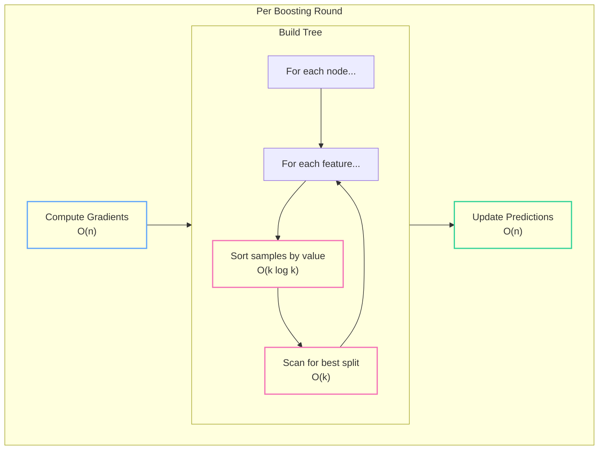

Let's profile where time actually goes:

| Operation | Complexity | % of Training Time |
|-----------|------------|-------------------|
| **Split finding (sort + scan)** | O(f × k log k) per node | **80-90%** |
| Tree prediction | O(n × depth) per tree | 10-15% |
| Gradient computation | O(n) per round | 3-5% |

The bottleneck is clear: **sorting samples for every feature at every node**.

### The Exact Greedy Algorithm

Our Part 2 implementation uses exact greedy split finding:

```rust
for &col_idx in feature_indices {
    // Collect (value, grad, hess) tuples
    let mut tuples: Vec<(f32, f32, f32)> = indices
        .iter()
        .map(|&i| (data.get(i, col_idx), gradients[i], hessians[i]))
        .collect();  // ← Allocation: O(k)

    tuples.sort_by(|a, b| a.0.total_cmp(&b.0));  // ← Sort: O(k log k)

    // Linear scan for best split point
    // ...
}
```

For a node with 1 million samples and 100 features:
- **100 allocations** of 1M × 12 bytes = 1.2 GB of temporary memory
- **100 sorts** of 1M elements = ~20M comparisons each

This is the **exact** algorithm—it considers every possible split point. Accurate, but expensive.

## Thinking Distributed: The Communication Challenge

Now imagine we have 1 billion rows across 100 machines. The obvious approach:

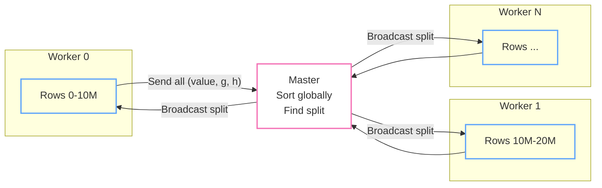

This requires **O(n)** communication per feature per node. With 1B rows and 100 features, we're moving terabytes of data through the network just to find one split.

The insight: we don't need exact split points. We need **good enough** split points with **minimal communication**.

## The Histogram Trick

Instead of sorting continuous values, we **bin** them into discrete buckets:

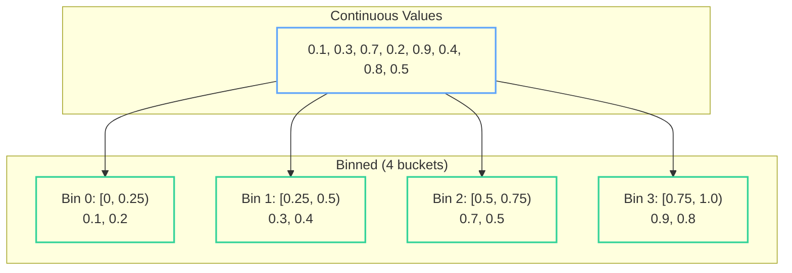

Now instead of tracking individual samples, we track **histogram bins**:

$$\text{Histogram}[f][b] = \left( \sum_{i \in \text{bin } b} g_i, \sum_{i \in \text{bin } b} h_i, \text{count} \right)$$

### Building Histograms: O(n) Single Pass

```rust
fn build_histogram(
    data: &DMatrix,
    indices: &[usize],
    gradients: &[f32],
    hessians: &[f32],
    bin_boundaries: &[Vec<f32>],  // Pre-computed quantiles per feature
) -> Vec<Vec<HistBin>> {
    let n_features = data.n_cols;
    let n_bins = 256;  // Typical choice

    // Initialize: O(features × bins)
    let mut histograms = vec![vec![HistBin::default(); n_bins]; n_features];

    // Single pass over data: O(samples × features)
    for &row_idx in indices {
        let g = gradients[row_idx];
        let h = hessians[row_idx];

        for feature in 0..n_features {
            let value = data.get(row_idx, feature);
            let bin = find_bin(value, &bin_boundaries[feature]);

            histograms[feature][bin].sum_grad += g;
            histograms[feature][bin].sum_hess += h;
            histograms[feature][bin].count += 1;
        }
    }

    histograms
}

struct HistBin {
    sum_grad: f32,
    sum_hess: f32,
    count: u32,
}
```

**Complexity comparison:**

| Approach | Split Finding | Memory |
|----------|--------------|--------|
| Exact greedy | O(f × k log k) | O(f × k) per node |
| Histogram | O(f × k + f × bins) | O(f × bins) fixed |

With 256 bins, histogram building is **O(k)** and split finding is **O(256)** per feature—independent of sample count.

### Finding Splits from Histograms

```rust
fn find_best_split_from_histogram(
    histogram: &[HistBin],
    parent_stats: &SplitStats,
) -> Option<(usize, f32)> {  // (bin_index, gain)
    let mut left_stats = SplitStats::default();
    let mut best: Option<(usize, f32)> = None;

    // Linear scan: O(bins)
    for (bin_idx, bin) in histogram.iter().enumerate() {
        left_stats.sum_grad += bin.sum_grad;
        left_stats.sum_hess += bin.sum_hess;
        left_stats.count += bin.count as usize;

        let right_stats = *parent_stats - left_stats;

        let gain = calculate_gain(&left_stats, &right_stats, parent_stats);

        if gain > best.map_or(0.0, |(_, g)| g) {
            best = Some((bin_idx, gain));
        }
    }

    best
}
```

The split threshold becomes the bin boundary, not the exact value. With 256 bins, we lose some precision but gain massive speedup.

## Distributed Histogram Aggregation

Here's where histograms shine for distributed training:

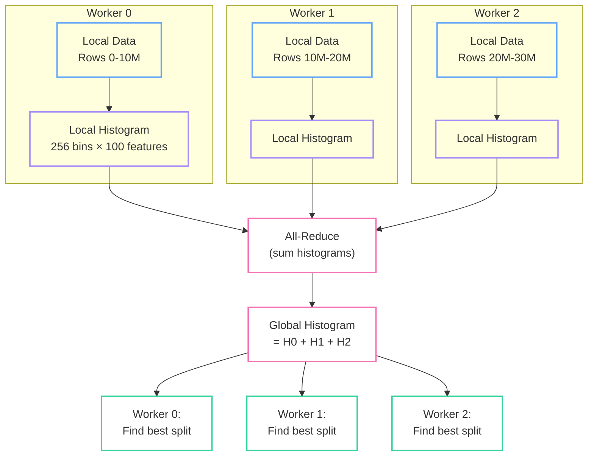

**Communication cost:**
- Per node: O(features × bins × 3 floats)
- With 100 features, 256 bins: **307 KB** per tree node
- vs. exact method: **O(n)** samples × 12 bytes per feature

This is the key insight: **histogram aggregation is additive**. Each worker computes local histograms, then a single all-reduce produces the global histogram.

### All-Reduce: Efficient Global Aggregation

Ring all-reduce is the standard pattern:

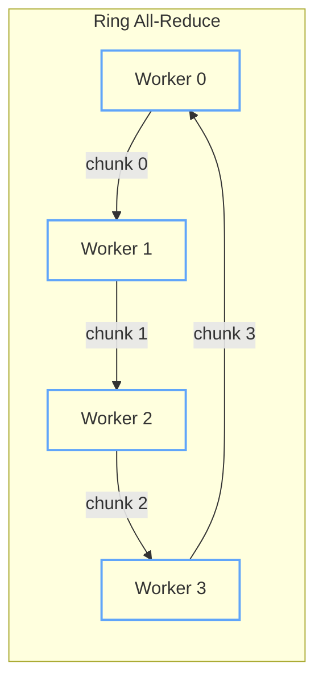

Each worker sends 1/k of its data to the next worker, receives 1/k from the previous, and accumulates. After k steps, everyone has the global sum.

**Bandwidth:** O(data_size) total, not O(workers × data_size).

## Computing Bin Boundaries: Quantile Sketches

Before training, we need to determine where the bin boundaries are. We want quantiles (e.g., 256-quantiles) of each feature's distribution.

For distributed data, we can't sort globally. Instead, we use **approximate quantile sketches**:

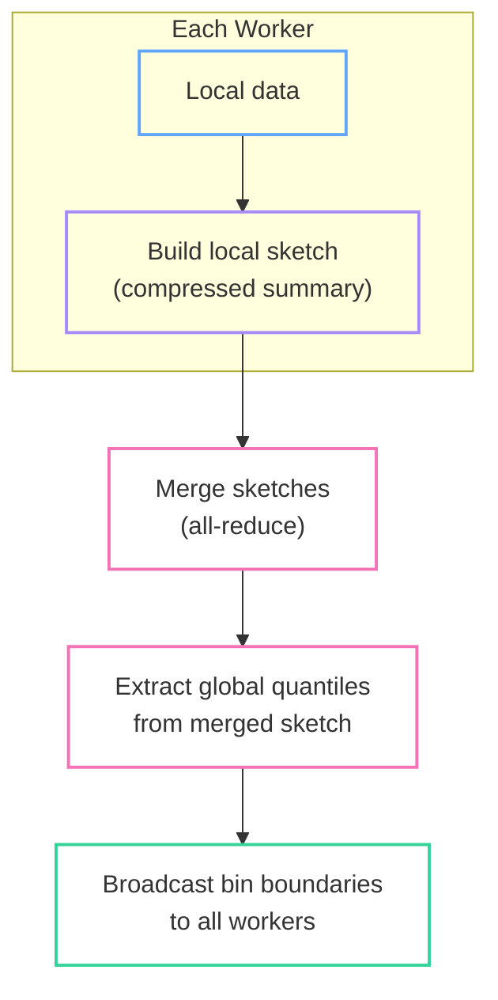

The key property: sketches are **mergeable**. A sketch of size O(1/ε) can answer quantile queries within ε error, regardless of data size.

XGBoost uses a **weighted quantile sketch** (Section 3.2 of the [original paper](https://arxiv.org/abs/1603.02754)) where samples are weighted by their Hessians:

$$\text{rank}(x) = \frac{\sum_{i: x_i < x} h_i}{\sum_i h_i}$$

This means regions where the model is uncertain (high Hessian) get finer-grained bins. The sketch algorithm provides theoretical guarantees on quantile accuracy while being mergeable across distributed workers.

## The Histogram Subtraction Trick

When building a tree, we compute histograms for many nodes. But there's redundancy:

$$\text{Histogram}_{\text{parent}} = \text{Histogram}_{\text{left}} + \text{Histogram}_{\text{right}}$$

Therefore:

$$\text{Histogram}_{\text{right}} = \text{Histogram}_{\text{parent}} - \text{Histogram}_{\text{left}}$$

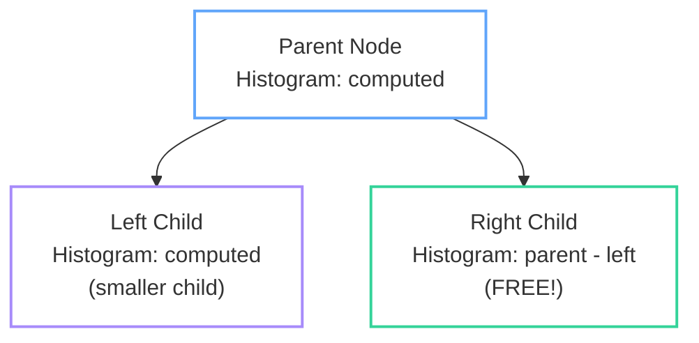

**Strategy:** Always compute the histogram for the **smaller** child, derive the larger one by subtraction.

This gives a **2x speedup** in histogram building with zero additional communication.

## Sparsity-Aware Split Finding

Real-world data is often sparse—missing values, zeros from one-hot encoding, or genuine nulls. XGBoost handles this with a **sparsity-aware algorithm** (Section 3.4 of the [original paper](https://arxiv.org/abs/1603.02754)) that learns the optimal default direction for missing values at each split.

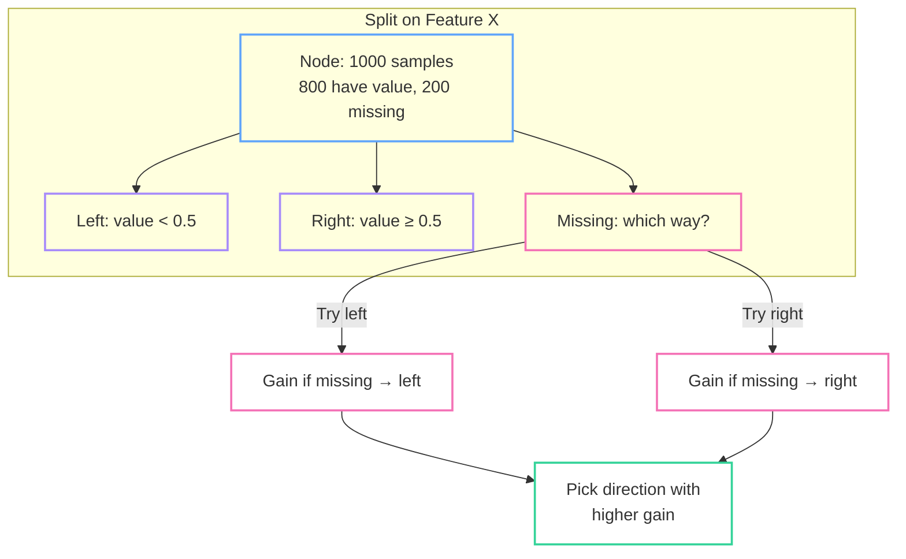

The algorithm:

```rust
fn find_split_with_default_direction(
    histogram: &[HistBin],
    missing_stats: &SplitStats,  // Stats for samples with missing values
    parent_stats: &SplitStats,
) -> SplitCandidate {
    let mut best = SplitCandidate::default();

    // Forward scan: missing values go RIGHT
    let mut left = SplitStats::default();
    for (bin, stats) in histogram.iter().enumerate() {
        left += stats;
        let right = *parent_stats - left;  // Includes missing

        let gain = calculate_gain(&left, &right, parent_stats);
        if gain > best.gain {
            best = SplitCandidate { bin, gain, default_left: false, .. };
        }
    }

    // Backward scan: missing values go LEFT
    let mut right = SplitStats::default();
    for (bin, stats) in histogram.iter().enumerate().rev() {
        right += stats;
        let left = *parent_stats - right;  // Includes missing

        let gain = calculate_gain(&left, &right, parent_stats);
        if gain > best.gain {
            best = SplitCandidate { bin, gain, default_left: true, .. };
        }
    }

    best
}
```

This is powerful: the model **learns** where missing values should go based on the training data, rather than requiring imputation.

## Cache-Aware Block Structure

Memory access patterns matter—a lot. Modern CPUs can process data 100x faster from L1 cache than from main memory. XGBoost addresses this with a **block structure** for efficient cache utilization (Section 4.1 of the [original paper](https://arxiv.org/abs/1603.02754)).

The problem with row-major data:

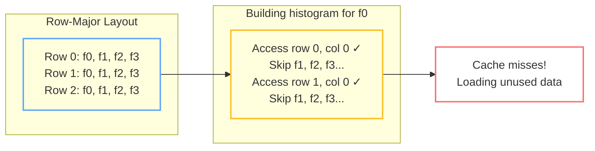

XGBoost's solution: **Column Block** structure.

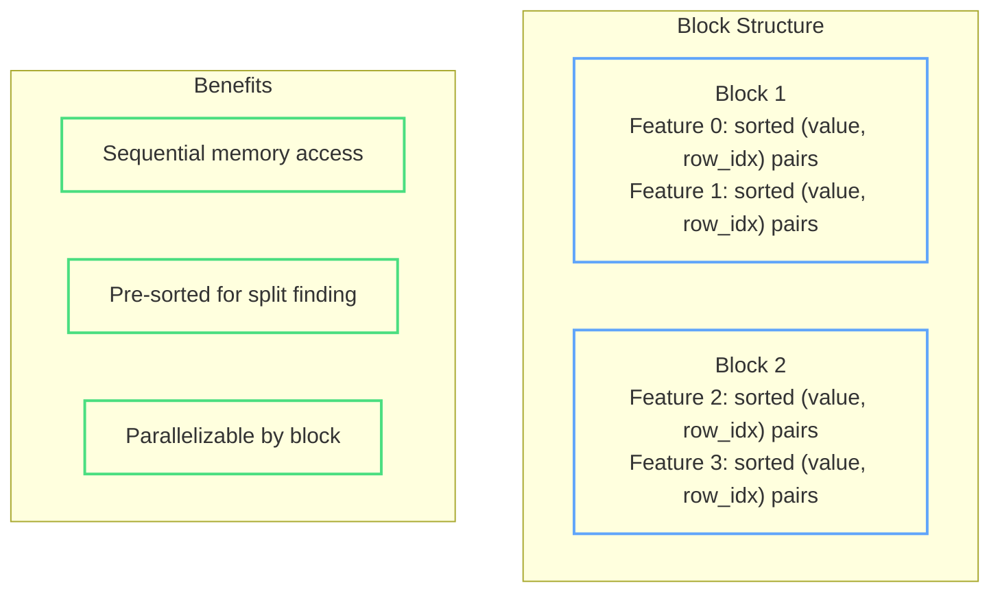

Each block stores a subset of features in **column-major, pre-sorted** order:

```rust
struct ColumnBlock {
    // For each feature in this block:
    // - Values sorted ascending
    // - Corresponding row indices
    // - Pre-computed bin indices (for histogram method)
    features: Vec<SortedFeature>,
}

struct SortedFeature {
    values: Vec<f32>,      // Sorted feature values
    row_indices: Vec<u32>, // Which row each value came from
    bin_indices: Vec<u8>,  // Pre-computed histogram bins
}
```

**Benefits:**
1. **Sequential reads** when scanning a feature (cache-friendly)
2. **Pre-sorted** eliminates per-node sorting for exact method
3. **Blocks enable parallelism** — different threads process different blocks
4. **Pre-computed bins** avoid repeated binary search during histogram building

## Out-of-Core Computation

What if your data doesn't fit in memory? XGBoost supports [external memory training](https://xgboost.readthedocs.io/en/stable/tutorials/external_memory.html) (also described in Section 4.3 of the [original paper](https://arxiv.org/abs/1603.02754)).

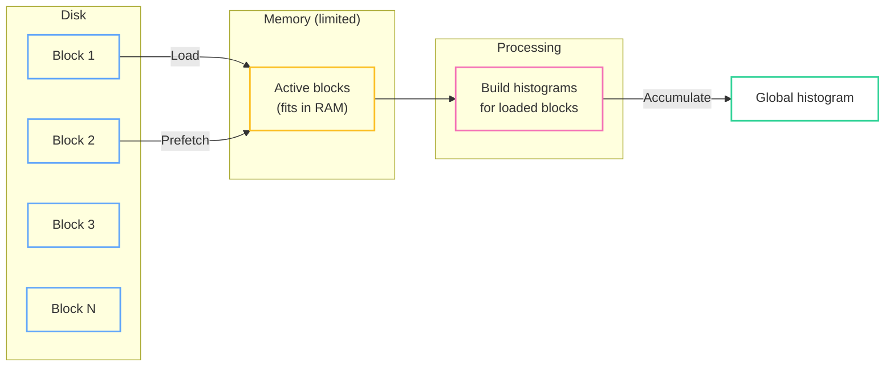

The strategy:
1. **Partition data into blocks** that fit in memory
2. **Stream blocks from disk**, prefetching the next block while processing current
3. **Accumulate histograms** across all blocks
4. **Compress blocks** on disk (sorted data compresses well)

This trades speed for scale—you can train on datasets 10x larger than RAM, at ~2-3x slowdown.

## Level-wise vs Leaf-wise Growth

Two strategies for building trees:

### Level-wise (XGBoost default)

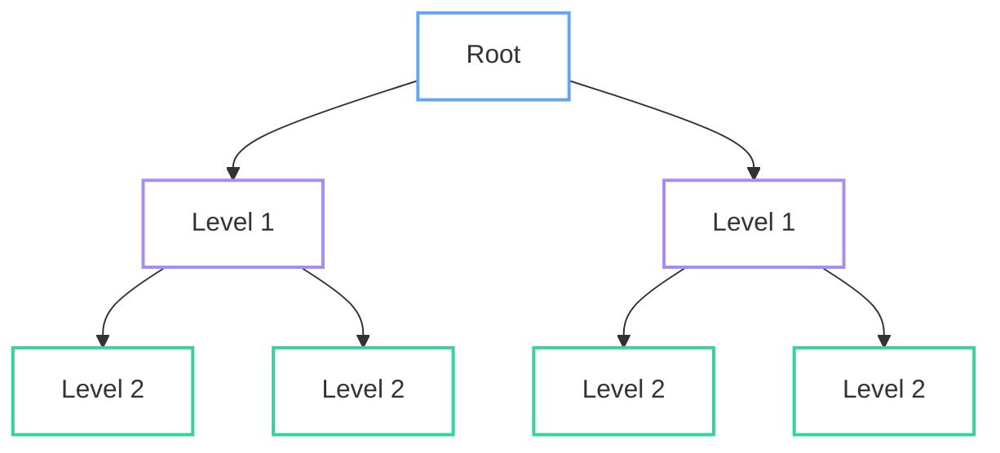

Build all nodes at depth d before depth d+1.

**Pros:**
- Balanced trees
- Predictable communication pattern
- Natural parallelism (all nodes at a level are independent)

**Cons:**
- May build splits that don't improve the model

### Leaf-wise (LightGBM default)

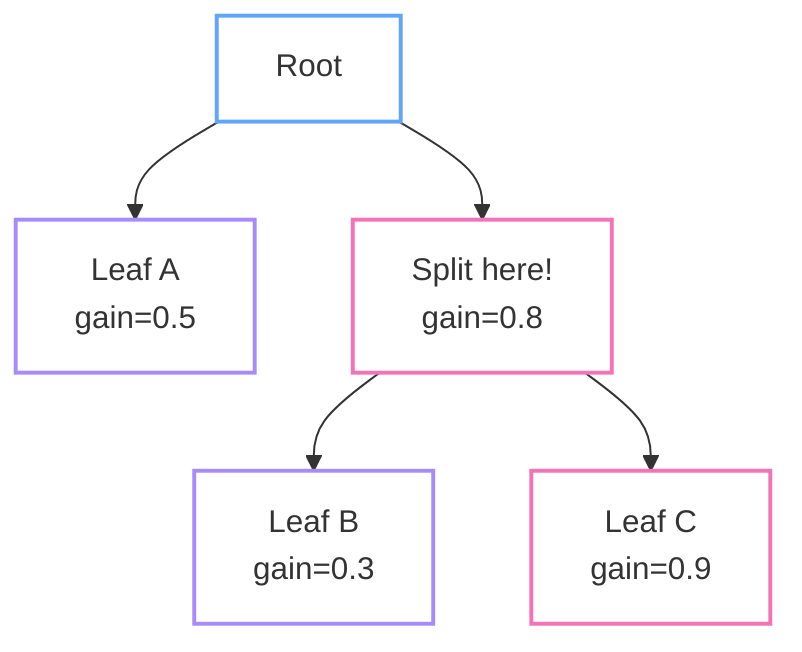

Always split the leaf with the highest gain.

**Pros:**
- Faster convergence (fewer nodes for same accuracy)
- Lower loss with fewer splits

**Cons:**
- Can overfit (deeper trees)
- Less parallelism
- Unbalanced communication

## Putting It All Together: The Distributed Training Loop

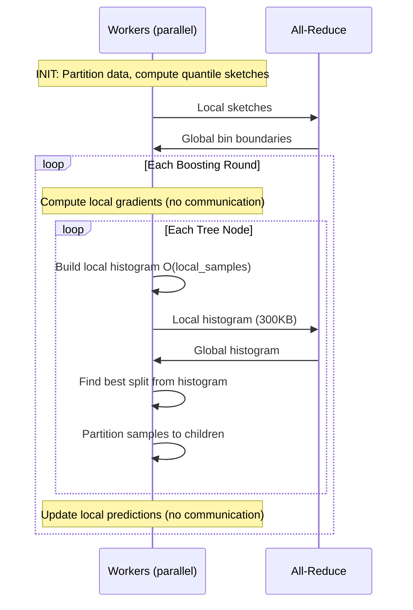

### Communication Summary

| Operation | Frequency | Size | Total |
|-----------|-----------|------|-------|
| Quantile sketches | Once | O(bins × features) | ~100KB |
| Histogram all-reduce | Per node | O(bins × features × 3) | ~300KB |
| Split broadcast | Per node | O(1) | ~20B |

For a model with 100 trees, depth 6 (63 nodes each):
- **Exact method:** ~6,300 × O(n) = terabytes
- **Histogram method:** ~6,300 × 300KB = **~2GB total**

## Performance Comparison

| Optimization | Speedup | Trade-off |
|--------------|---------|-----------|
| Histogram binning | 10-50x | Slight precision loss (~256 candidate splits vs all) |
| Histogram subtraction | 2x | None |
| Weighted quantile sketch | Enables distributed | O(1/ε) accuracy guarantee |
| Sparsity-aware splits | 2x on sparse data | None (learns optimal direction) |
| Column block structure | 2-5x | Memory for pre-sorting |
| **Combined** | **50-200x** | Minimal quality impact |

## XGBoost at Scale

XGBoost provides multiple backends for distributed training:

| Backend | Use Case | Communication |
|---------|----------|---------------|
| **Dask** | Python data science workflows | In-memory, single machine to cluster |
| **Spark** | Enterprise data pipelines | HDFS/S3, fault-tolerant |
| **Ray** | ML platforms, hyperparameter tuning | Actor-based, flexible |

All backends use the same core algorithm: histogram aggregation via all-reduce.

### GPU Acceleration

XGBoost's CUDA implementation parallelizes across samples and features:
- Histogram building: one thread block per feature
- Split finding: parallel reduction
- 10-50x speedup over CPU for large datasets

## Other Libraries

Other gradient boosting libraries take different approaches:

- **LightGBM**: Leaf-wise tree growth, gradient-based one-side sampling (GOSS), exclusive feature bundling (EFB). Often faster training, especially on large datasets. See [LightGBM Features](https://lightgbm.readthedocs.io/en/latest/Features.html) and the [LightGBM paper (Ke et al., 2017)](https://papers.nips.cc/paper/6907-lightgbm-a-highly-efficient-gradient-boosting-decision-tree).

- **CatBoost**: Ordered boosting to reduce prediction shift, native categorical feature handling without one-hot encoding, symmetric (oblivious) trees for faster inference. See [CatBoost documentation](https://catboost.ai/en/docs/) and [research papers](https://catboost.ai/en/docs/concepts/educational-materials-papers).

## Key Takeaways

1. **The bottleneck is split finding** — sorting samples per feature per node dominates training time

2. **Histograms change the game** — O(n log n) → O(n) for split finding, O(n) → O(bins) for communication

3. **Distributed training is about minimizing communication** — histogram aggregation sends kilobytes instead of gigabytes

4. **Approximations are fine** — 256 bins lose minimal precision but enable massive scale

5. **Data layout matters** — column blocks with pre-sorting turn random access into sequential scans

6. **Handle missing data natively** — learning default directions beats imputation

The path from our Part 2 implementation to production scale isn't about clever tricks—it's about recognizing that exact answers aren't necessary when good-enough answers are orders of magnitude cheaper.

## References

### Original Paper

The algorithmic innovations discussed here—weighted quantile sketch, sparsity-aware split finding, and cache-aware block structure—are described in detail in the original XGBoost paper:

- Chen, T., & Guestrin, C. (2016). **XGBoost: A Scalable Tree Boosting System**. KDD '16. [[arXiv]](https://arxiv.org/abs/1603.02754) [[PDF]](https://arxiv.org/pdf/1603.02754)

### Official Documentation

| Topic | Link |
|-------|------|
| Tree Methods (histogram, approx) | [xgboost.readthedocs.io/en/stable/treemethod.html](https://xgboost.readthedocs.io/en/stable/treemethod.html) |
| External Memory Training | [xgboost.readthedocs.io/en/stable/tutorials/external_memory.html](https://xgboost.readthedocs.io/en/stable/tutorials/external_memory.html) |
| GPU Acceleration | [xgboost.readthedocs.io/en/stable/gpu/](https://xgboost.readthedocs.io/en/stable/gpu/) |
| Distributed with Dask | [xgboost.readthedocs.io/en/stable/tutorials/dask.html](https://xgboost.readthedocs.io/en/stable/tutorials/dask.html) |
| Distributed with Spark | [xgboost.readthedocs.io/en/stable/tutorials/spark_estimator.html](https://xgboost.readthedocs.io/en/stable/tutorials/spark_estimator.html) |
| Distributed with Ray | [xgboost.readthedocs.io/en/stable/tutorials/ray.html](https://xgboost.readthedocs.io/en/stable/tutorials/ray.html) |
| Parameters Reference | [xgboost.readthedocs.io/en/stable/parameter.html](https://xgboost.readthedocs.io/en/stable/parameter.html) |

---

*Part 3 of the "XGBoost from Scratch" series. [Part 1](/2025/08/15/xgboost-visual-guide-part1-theory.html) covers theory, [Part 2](/2025/09/15/xgboost-visual-guide-part2-implementation.html) covers implementation.*
