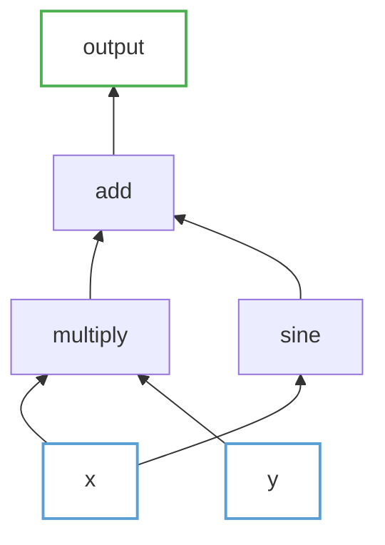
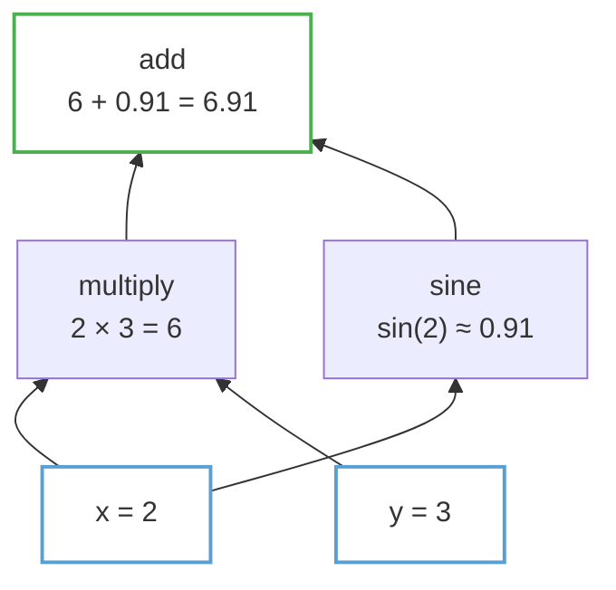
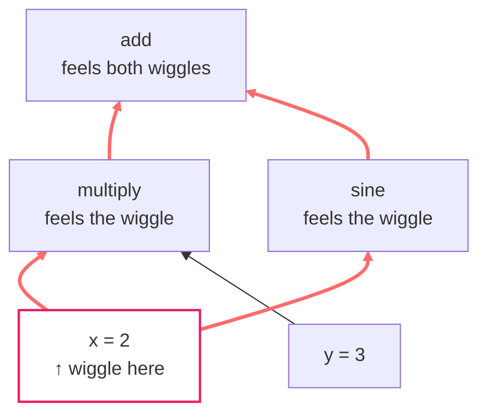
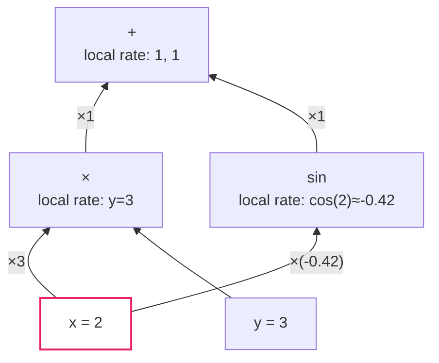
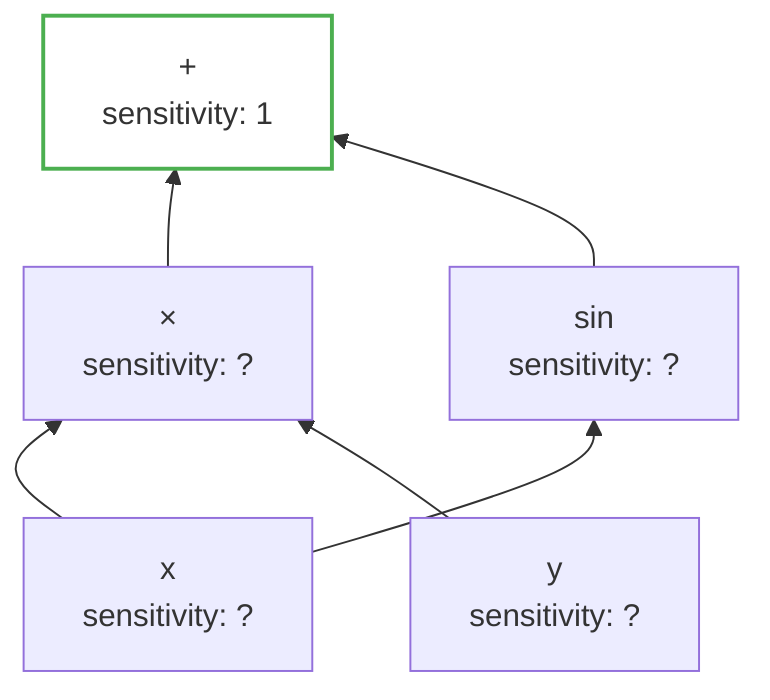
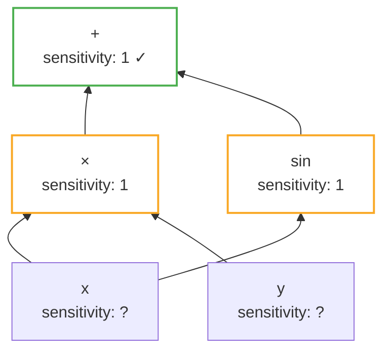
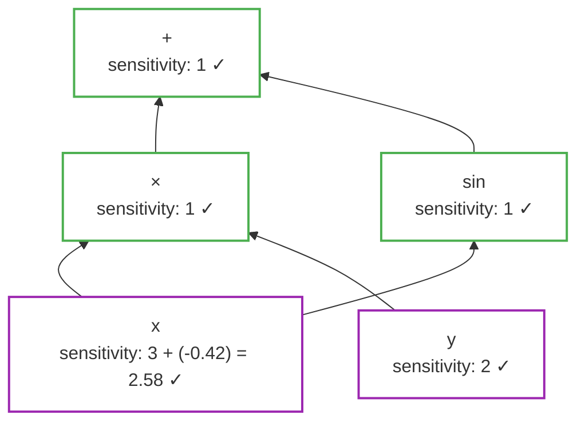
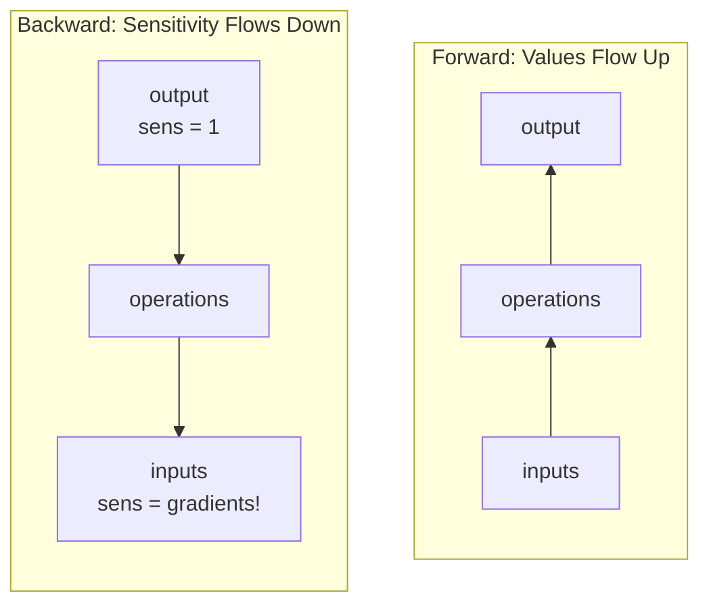
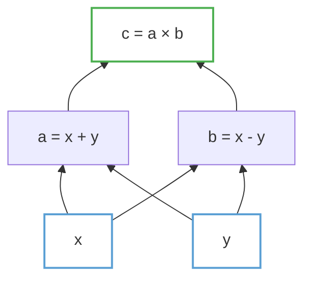

I've always found automatic differentiation a bit magical. You write some math, call `.backward()`, and somehow the computer figures out all the derivatives. For years I used it without really understanding it.

Back in grad school, when I was writing DAE/ODE solvers using RK45 integrators, Professor Michael Baldea would mention that automatic differentiation was the "hot new research area." It sounded like magic to me at the time. Fast forward to today, and it's everywhere — PyTorch, JAX, tinygrad, anywhere there's backprop and gradients. What was once cutting-edge research is now something we take for granted.

Then I sat down and implemented one from scratch. Turns out it's not magic at all — it's actually a beautiful idea that clicks once you see it the right way.

<!--more-->

## Forget Calculus Class (For Now)

When most of us learned calculus, we memorized rules:

- $\frac{d}{dx}(x^2) = 2x$
- $\frac{d}{dx}(\sin x) = \cos x$
- The chain rule: $\frac{d}{dx}f(g(x)) = f'(g(x)) \cdot g'(x)$

These rules work great on paper. But here's the thing — computers don't manipulate symbols the way we do. They work with numbers and data structures.

So instead of asking "how do I differentiate this expression?", let's ask a different question:

**How do I represent a mathematical expression in a way that makes differentiation natural?**

## Math as a Picture

Consider this function:

$$f(x, y) = x \cdot y + \sin(x)$$

Nothing fancy — multiplication, addition, a sine. But let's draw it differently. Instead of one line of symbols, let's trace how the computation actually happens:

Read this bottom-to-top. The inputs `x` and `y` flow upward. They get combined by operations. Eventually we get our output.

This is a **computation graph**. Every mathematical expression can be drawn this way.

Let me add the actual values. Say x = 2 and y = 3:

Now you can literally *see* the computation happening. Values flow up from inputs to output.

## The Question We Actually Want to Answer

Here's what we care about in machine learning:

> If I wiggle the inputs a tiny bit, how much does the output wiggle?

That's what a derivative is. It's a measure of sensitivity.

For our function at $x=2$, $y=3$:
- If I increase $x$ slightly, how much does the output change? (That's $\partial f/\partial x$)
- If I increase $y$ slightly, how much does the output change? (That's $\partial f/\partial y$)

The graph view makes this intuitive. Wiggle x, and that wiggle propagates up through every node that depends on x.

## Following the Wiggle

Let's trace what happens when we wiggle $x$:

Notice something important: **$x$ connects to the output through two different paths**.

1. x → multiply → add → output
2. x → sine → add → output

Both paths carry the wiggle. The total effect on the output is the *sum* of both contributions.

This is the key insight. In a graph, derivatives flow backward along edges, and when paths merge, contributions add up.

## Local Rules, Global Result

Here's what makes autodiff elegant. Each operation only needs to know one thing: **how sensitive is my output to each of my inputs?**

Let's write these down:

| Operation | If input wiggles by $\varepsilon$... | Output wiggles by... |
|-----------|--------------------------|---------------------|
| $\text{add}(a, b)$ | $a$ wiggles by $\varepsilon$ | $\varepsilon$ (just passes through) |
| $\text{add}(a, b)$ | $b$ wiggles by $\varepsilon$ | $\varepsilon$ (just passes through) |
| $\text{multiply}(a, b)$ | $a$ wiggles by $\varepsilon$ | $b \cdot \varepsilon$ (scaled by the other input) |
| $\text{multiply}(a, b)$ | $b$ wiggles by $\varepsilon$ | $a \cdot \varepsilon$ (scaled by the other input) |
| $\sin(a)$ | $a$ wiggles by $\varepsilon$ | $\cos(a) \cdot \varepsilon$ |

These are just the derivatives you learned in calculus, but think of them as **local exchange rates** for wiggles.

## The Chain Rule as Plumbing

Now here's the beautiful part. To find the total sensitivity from input to output, we just:

1. Find all paths from input to output
2. Multiply the local exchange rates along each path
3. Add up the contributions from all paths

Let's do it for $\partial f/\partial x$:

**Path 1: x → multiply → add**
- $x \to \text{multiply}$: exchange rate $= y = 3$ (the other input to multiply)
- $\text{multiply} \to \text{add}$: exchange rate $= 1$ (addition just passes through)
- Total for this path: $3 \times 1 = 3$

**Path 2: x → sin → add**
- $x \to \sin$: exchange rate $= \cos(2) \approx -0.42$
- $\sin \to \text{add}$: exchange rate $= 1$
- Total for this path: $-0.42 \times 1 = -0.42$

**Grand total: $3 + (-0.42) = 2.58$**

That's $\partial f/\partial x$. We computed a derivative without doing any symbolic manipulation — just multiplying and adding numbers along paths in a graph.

## Why Not Just Go Forward?

You might wonder: can't we just wiggle each input and measure what happens at the output?

Yes! That's called **forward mode** autodiff. For each input, you trace the wiggle forward through the graph.

But think about a neural network. It might have millions of input parameters. Forward mode would require millions of passes through the graph — one for each parameter.

Here's the trick: what if we went **backward** instead?

## Thinking Backward

Instead of asking "if I wiggle $x$, what happens to output?", ask:

> "If the output needed to change, how much would each input need to change?"

Start at the output. Its "sensitivity to itself" is 1 (trivially). Now work backward:

The add node has sensitivity 1. It passes this backward to both its inputs (because addition has local rate 1 in both directions):

Now multiply and sin both have sensitivity 1. They propagate backward using their local rates:

- From multiply: $x$ gets $1 \times y = 1 \times 3 = 3$, $y$ gets $1 \times x = 1 \times 2 = 2$
- From sin: $x$ gets $1 \times \cos(2) \approx -0.42$

But wait — $x$ receives from both multiply AND sin! We add them up:

**One backward pass gave us *all* the derivatives.**

This is reverse-mode autodiff. It's why PyTorch can train a model with 175 billion parameters — one forward pass to compute the loss, one backward pass to get all 175 billion gradients.

## The Mental Model

Here's how I think about it now:

**Forward pass**: Values flow upward like water. Inputs combine, transform, eventually reach the output.

**Backward pass**: Sensitivity flows downward like... inverse water? Each node receives sensitivity from above, multiplies by its local rate, and passes it down.

When paths split going forward, sensitivities add going backward. When paths merge going forward, sensitivities... well, they just follow their edges backward.

## What About More Complex Graphs?

The same principle scales to any computation:

This is $c = (x + y)(x - y) = x^2 - y^2$. The graph has a diamond shape — $x$ and $y$ each flow through two different paths before rejoining.

Backward pass still works the same way:
1. Start at $c$ with sensitivity 1
2. $c$ passes to $a$: sensitivity $\times$ (value of $b$)
3. $c$ passes to $b$: sensitivity $\times$ (value of $a$)
4. $a$ and $b$ pass to $x$ and $y$, with appropriate signs
5. $x$ and $y$ sum their incoming sensitivities

The answers come out to $\partial c/\partial x = 2x$ and $\partial c/\partial y = -2y$. Exactly what we'd get from calculus, but computed mechanically through the graph.

## See It In Motion

Static diagrams are nice, but autodiff really clicks when you *see* the flow. Here's an interactive demo — watch values flow forward, then gradients flow backward:

  

  

    <button id="btn-forward" style="padding: 8px 20px; margin: 0 5px; font-size: 14px; cursor: pointer; background: #4CAF50; color: white; border: none; border-radius: 4px;">
      ▶ Forward Pass
    </button>
    <button id="btn-backward" style="padding: 8px 20px; margin: 0 5px; font-size: 14px; cursor: pointer; background: #E91E63; color: white; border: none; border-radius: 4px;">
      ◀ Backward Pass
    </button>
    <button id="btn-reset" style="padding: 8px 20px; margin: 0 5px; font-size: 14px; cursor: pointer; background: #666; color: white; border: none; border-radius: 4px;">
      ↺ Reset
    </button>
  

  

Try clicking **Forward Pass** first to see how $f(x,y) = x \cdot y + \sin(x)$ computes its value, then **Backward Pass** to watch the chain rule in action — gradients flowing backward, multiplying by local rates, and accumulating where paths merge.

<em>Animation crafted with Claude Opus 4.5</em>

## The Punchline

Automatic differentiation isn't really about calculus. It's about:

1. **Representation**: Seeing computation as a graph
2. **Locality**: Each operation only knows its own derivative
3. **Composition**: The chain rule falls out naturally from graph traversal
4. **Direction**: Going backward lets us compute all gradients at once

That's the conceptual foundation. In [Part 2](), we'll build this in Rust — turning these pictures into actual code.
