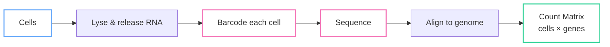
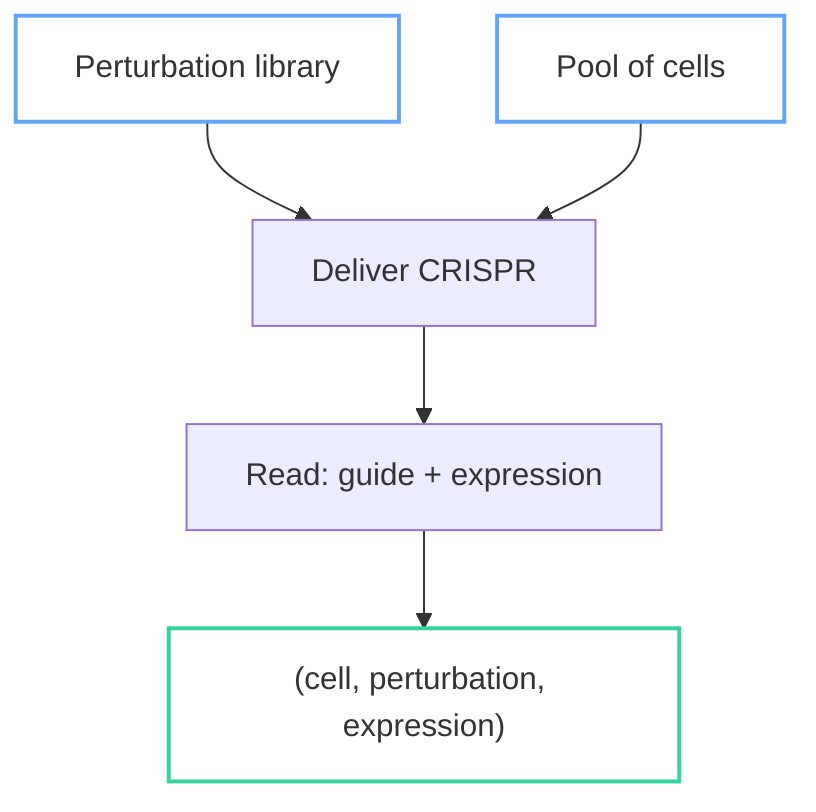
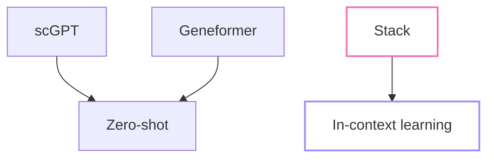

What if you could simulate a cell's response to any drug without a wet lab? This is the promise of cellular foundation models—large pretrained models that learn the grammar of gene expression and can predict how cells behave under perturbations.

This is Part 1 of a five-part series on Stack, a new foundation model from the Arc Institute that's changing how we think about cellular prediction. We'll cover the full stack (pun intended): data representation, transformer architecture, training strategies, and inference. By the end, you'll understand how to go from raw count matrices to drug response predictions.

This series is written for ML engineers who are comfortable with transformers and attention mechanisms but don't have a biology background. If you've worked with language models or vision transformers, you'll find the concepts here surprisingly familiar—just with cells instead of tokens and genes instead of pixels.

<!--more-->

## What is Single-Cell RNA-seq?

Every cell in your body contains the same DNA, but different cells express different genes. A neuron expresses genes for signaling, while a muscle cell expresses genes for contraction. **Single-cell RNA sequencing (scRNA-seq)** measures which genes are "on" in each individual cell.

The output is a **count matrix**: rows are cells, columns are genes (about 20,000 in humans), and each entry is an integer count representing how many copies of that gene's RNA were detected in that cell.



A typical dataset might have 10,000-100,000 cells and 20,000 genes. But here's the catch: the matrix is **extremely sparse**. Around 90-95% of entries are zeros. This isn't missing data—it reflects both biology (most genes are off in any given cell) and technical limitations (low capture efficiency).

The technology has evolved rapidly. Before 2009, we could only measure **bulk RNA-seq**: averaging gene expression across millions of cells. This is like measuring the average income of a city—useful, but you lose individual variation. Single-cell methods (starting with Tang et al. 2009, then droplet-based methods around 2015) let us see each cell individually. It's the difference between census statistics and individual tax returns.

## The Biology You Need to Know

The **central dogma** of molecular biology is straightforward: DNA → RNA → Protein. Your genes (DNA) are copied into messenger RNA (mRNA), which is then translated into proteins that do the actual work in your cells. scRNA-seq measures the middle step: which genes are being transcribed into RNA.

Think of genes as **volume knobs** on a mixing console. Each cell has the same set of 20,000 knobs, but different cell types have different settings. A T-cell turns up immune-related genes and turns down others. A hepatocyte (liver cell) turns up metabolism genes. The pattern of which knobs are up or down defines the cell's identity.

This is why we can identify cell types from expression data. Certain genes are "markers"—they're highly expressed in one cell type and low in others:

| Cell Type | Marker Genes | Function |
|-----------|--------------|----------|
| T-cell | CD3D, CD4, CD8A | Immune response |
| B-cell | CD19, MS4A1 | Antibody production |
| Monocyte | CD14, LYZ | Innate immunity |
| NK cell | NKG7, GNLY | Cell killing |
| Platelet | PPBP, PF4 | Blood clotting |

These markers aren't arbitrary—they reflect the proteins these cells need to do their jobs. CD3D is part of the T-cell receptor complex. CD14 helps monocytes recognize bacterial components. The expression pattern is a direct readout of cellular function.

## Why This Data is Different from Images and Text

If you're coming from computer vision or NLP, single-cell data will feel strange. It breaks many assumptions that work well for other modalities.

**No spatial ordering.** In images, pixel (10, 20) is near pixel (11, 21). In text, token 5 comes after token 4. But genes have no inherent order. Gene #500 (maybe *BRCA1*) has no relationship to Gene #501 (maybe *ZNF234*). You can permute the columns of a count matrix and the biology is unchanged. This means convolutions and positional embeddings don't make sense in the traditional way.

**No sequential structure.** Language models exploit the fact that "the cat sat on the ___" strongly predicts "mat." Gene expression has correlations (co-expression networks), but there's no left-to-right causality. All genes are expressed simultaneously.

**Extreme sparsity and counts.** Images have dense pixels, text has dense token IDs. Gene counts are 90%+ zeros, and the non-zero values are small integers (typically 0-100, occasionally higher). This isn't like masking in BERT—the zeros are real signal.

**The data is not Gaussian.** This is crucial for loss functions. Gene counts follow a **Negative Binomial distribution**, not a Normal distribution:

$$P(X = k) = \binom{k + r - 1}{k} p^r (1-p)^k$$

The key property is **overdispersion**—the variance is larger than the mean:

$$\text{Var}(X) = \mu + \frac{\mu^2}{\theta}$$

A Poisson distribution has Var = μ. The Negative Binomial adds a μ²/θ term, capturing the extra variability we see in real gene expression. Using MSE loss (which assumes Gaussian noise) on count data is a common mistake that hurts model performance.

**Batch effects are everywhere.** Run the same cells through two different sequencing machines, and you'll get different results. Different labs, different days, different reagent lots—all introduce systematic biases. This is like domain shift in ML, but more pervasive. Any model that ignores batch effects will learn spurious patterns.

## Perturbation Biology and Perturb-seq

Here's where it gets interesting for drug discovery. What if we could systematically knock out every gene and see what happens to the cell? That's exactly what **Perturb-seq** does.

**CRISPR** is a gene editing tool that can precisely cut DNA at specific locations. By designing guide RNAs that target specific genes, we can:
- **Knock out** a gene (delete it entirely)
- **Knock down** a gene (reduce its expression)
- **Activate** a gene (increase its expression)

In 2016, researchers combined CRISPR with scRNA-seq in a technique called [Perturb-seq](https://www.cell.com/cell/fulltext/S0092-8674(16)31610-5). The key innovation: you can read out which perturbation each cell received and its resulting expression profile in one experiment.



The output is triplets: (cell, perturbation, expression). For each cell, you know what gene was perturbed and how the cell's expression changed in response.

This is powerful for drug discovery. Many diseases involve genes being over- or under-expressed. If we can predict how perturbing one gene affects all others, we can:
- Identify drug targets (which gene to perturb to fix the disease state)
- Predict side effects (what else changes when we perturb that gene)
- Screen thousands of compounds *in silico* before touching a wet lab

The challenge: Perturb-seq experiments are expensive. The largest datasets have ~1 million cells covering ~10,000 perturbations. That sounds like a lot, but there are ~20,000 genes, and we want to test combinations. We need models that can generalize beyond the perturbations seen in training.

## Prediction Tasks That Matter

Not all single-cell prediction tasks are equally important or difficult:

| Task | Input | Output | Difficulty | Status |
|------|-------|--------|------------|--------|
| Cell type classification | Expression vector | Cell type label | Easy | Solved |
| Batch integration | Multiple batches | Unified embedding | Medium | Mostly solved |
| Perturbation prediction | Cell + perturbation | New expression | Hard | Active research |
| Multi-modal translation | RNA expression | Protein levels | Hard | Active research |

**Cell type classification** is largely solved. Given an expression vector, predicting whether it's a T-cell or B-cell works well with simple methods (k-NN, random forests). Marker genes are strong signals.

**Batch integration** asks: can we align cells from different experiments into a shared space? Methods like Harmony and scVI do this reasonably well, though edge cases remain.

**Perturbation prediction** is the killer app—and the hardest. Given a cell's current state and a proposed perturbation (knock out gene X), predict the resulting expression. This requires understanding causal relationships between genes, not just correlations. Most zero-shot methods fail here.

## Why Foundation Models?

The dream is a single pretrained model that works across datasets, cell types, and perturbations—without retraining for each new experiment. This is the foundation model paradigm that's worked for language and vision.

Several groups have tried this for single-cell data:



**scGPT** and **Geneformer** use masked language modeling adapted for genes. They pretrain on large cell atlases, then fine-tune or evaluate zero-shot on downstream tasks. The architecture treats genes somewhat like tokens.

A recent [Genome Biology paper (2025)](https://genomebiology.biomedcentral.com/articles/10.1186/s13059-025-03574-x) threw cold water on zero-shot claims. When properly evaluated, these models often performed no better than simple baselines on perturbation prediction. The models learn useful representations, but zero-shot generalization to unseen perturbations remains elusive.

**Stack** from the [Arc Institute](https://arcinstitute.org/news/foundation-model-stack) takes a different approach: **in-context learning**. Instead of encoding the perturbation as a separate input, Stack uses example cells as context. You show the model: "Here are cells that received perturbation X. Now predict what happens to this new cell with perturbation X."

This is analogous to how language models can learn new tasks from few-shot examples in the prompt. The perturbation isn't encoded in the weights—it's provided as context. This sidesteps the zero-shot generalization problem by requiring a few examples of each perturbation at inference time.

The [Stack paper (2026)](https://www.biorxiv.org/content/10.64898/2026.01.09.698608v1) shows this works surprisingly well, even for perturbations not seen during training. In Part 3 of this series, we'll dig into exactly how this in-context mechanism is implemented.

## Hands-on: Loading AnnData

Let's get concrete. The standard data structure for single-cell data is **AnnData** (Annotated Data), implemented in the `scanpy` library. Here's how to load and inspect a dataset:

```python
import scanpy as sc

# Load the classic PBMC 3k dataset (peripheral blood mononuclear cells)
adata = sc.datasets.pbmc3k()
print(f"Cells: {adata.n_obs}, Genes: {adata.n_vars}")
print(f"Sparsity: {1 - (adata.X > 0).mean():.1%}")
```

AnnData has three key components:
- `.X` — the count matrix (cells × genes), usually sparse
- `.obs` — cell metadata (DataFrame with one row per cell)
- `.var` — gene metadata (DataFrame with one row per gene)

Quality control metrics help identify outliers:

```python
sc.pp.calculate_qc_metrics(adata, inplace=True)
print(f"Median genes/cell: {adata.obs['n_genes_by_counts'].median():.0f}")
print(f"Median counts/cell: {adata.obs['total_counts'].median():.0f}")
```

Visualizing distributions reveals the data's structure:

```python
import matplotlib.pyplot as plt

fig, axes = plt.subplots(1, 2, figsize=(10, 4))
axes[0].hist(adata.obs['total_counts'], bins=50)
axes[0].set_xlabel('Total counts per cell')
axes[0].set_ylabel('Number of cells')
axes[1].hist(adata.obs['n_genes_by_counts'], bins=50)
axes[1].set_xlabel('Genes detected per cell')
axes[1].set_ylabel('Number of cells')
plt.tight_layout()
```

You'll notice the distributions are right-skewed (more cells with low counts than high). Cells with very few counts or genes are often low-quality and get filtered out. The [sc-best-practices](https://www.sc-best-practices.org/) resource covers QC in detail.

## Key Takeaways

1. **Single-cell data is fundamentally different from images/text** — no spatial ordering, no sequential structure, extreme sparsity
2. **The Negative Binomial distribution is correct** — gene counts are overdispersed; don't use MSE loss
3. **Perturb-seq is the killer application** — predicting cellular response to perturbations enables in-silico drug screening
4. **Foundation models promise cellular simulation without wet labs** — but zero-shot generalization remains challenging
5. **Stack's innovation is in-context learning** — cells as prompts, no retraining needed for new perturbations

## Coming Up in Part 2

Next, we'll dive into Stack's architecture. How do you turn a count matrix into something a transformer can process? What does attention look like when genes have no natural ordering? We'll walk through the tabular attention mechanism that makes this work.

---

*Part 1 of the "Stack Foundation Models" series. [Part 2](/2026/02/08/stack-foundation-models-part2-architecture) covers the transformer architecture.*
