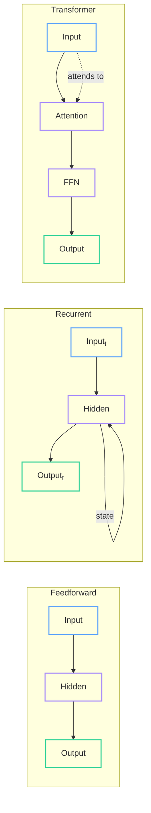
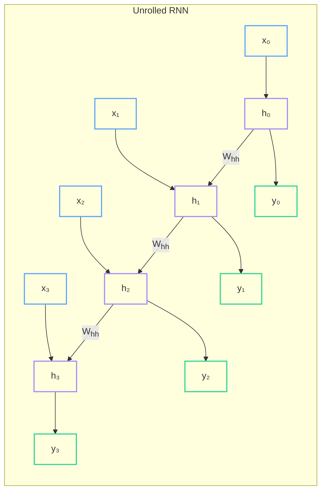
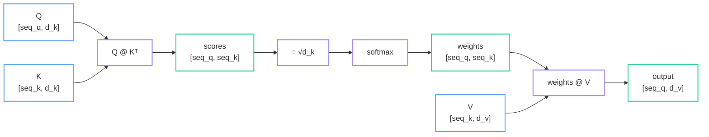
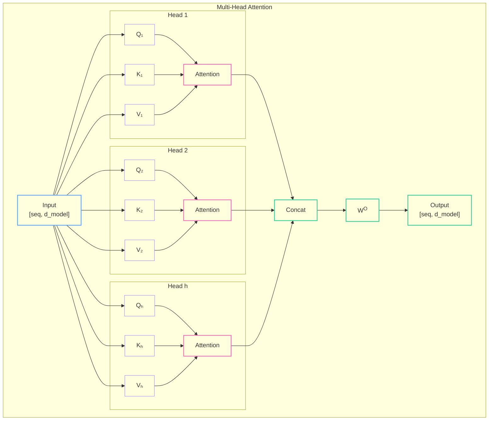
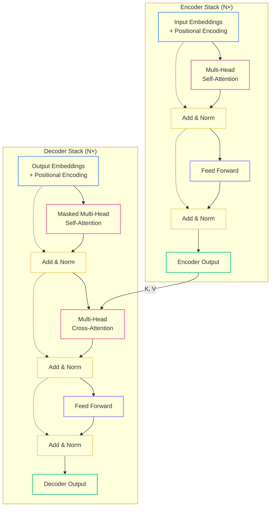
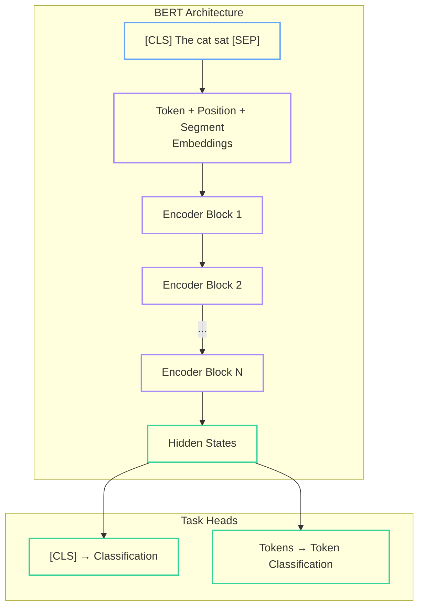
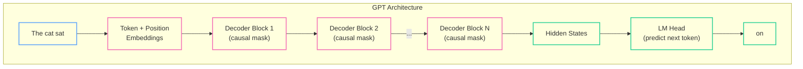

Throughout this series, we've built tensors with autodiff, layers and loss functions, optimizers that learn, and backends that run efficiently on different hardware. We have all the ingredients. Now the question becomes: *what do we actually build with them?*

This post explores neural network architectures — from simple feedforward networks to the attention-based transformers that power modern AI. We'll focus on building intuition first, then see how these architectures map to the components we've already built.

<!--more-->

## The Architecture Landscape

Neural network "architecture" is just a fancy word for *how we wire together our building blocks*. The same Linear layers, activations, and loss functions can be arranged into dramatically different structures:



Each architecture makes different tradeoffs. Feedforward networks are simple but can't handle sequences. Recurrent networks process sequences but struggle with long-range dependencies. Transformers handle both — at the cost of more computation.

## New Building Blocks

Before diving into architectures, we need a few primitives beyond Part 2's Linear layers and activations.

### Layer Normalization

Batch normalization normalizes across the batch dimension — problematic for variable-length sequences. Layer normalization normalizes across the feature dimension instead:

$$\text{LayerNorm}(x) = \gamma \cdot \frac{x - \mu}{\sqrt{\sigma^2 + \epsilon}} + \beta$$

Where $\mu$ and $\sigma^2$ are computed per-sample across features, and $\gamma$, $\beta$ are learnable.

```rust
pub struct LayerNorm<B: Backend> {
    gamma: Tensor<B>,  // [d_model]
    beta: Tensor<B>,   // [d_model]
    eps: f32,
}

impl<B: Backend> LayerNorm<B> {
    pub fn new(d_model: usize) -> Self {
        LayerNorm {
            gamma: Tensor::var("gamma", B::ones(&Shape::new(vec![d_model]))),
            beta: Tensor::var("beta", B::zeros(&Shape::new(vec![d_model]))),
            eps: 1e-5,
        }
    }

    pub fn forward(&self, x: &Tensor<B>) -> Tensor<B> {
        // x: [batch, seq_len, d_model]
        // Normalize over last dimension (d_model)
        let mean = x.mean(Some(&[x.ndim() - 1]), true);      // [batch, seq, 1]
        let var = x.var(Some(&[x.ndim() - 1]), true);        // [batch, seq, 1]
        let normalized = (x - &mean) / ((&var + self.eps).sqrt());
        &normalized * &self.gamma + &self.beta
    }
}
```

### Softmax (Numerically Stable)

Softmax converts logits to probabilities. The naive implementation overflows; we subtract the max first:

```rust
pub fn softmax<B: Backend>(x: &Tensor<B>, axis: isize) -> Tensor<B> {
    // x: [batch, seq_len, d_model] or any shape
    // Subtract max for numerical stability
    let max_x = x.max(Some(&[axis as usize]), true);  // keepdims=true
    let shifted = x - &max_x;
    let exp_x = shifted.exp();
    let sum_exp = exp_x.sum(Some(&[axis as usize]), true);
    &exp_x / &sum_exp
}
```

### Dropout

Dropout randomly zeros elements during training, scaling survivors to maintain expected values:

```rust
pub fn dropout<B: Backend>(x: &Tensor<B>, p: f32, training: bool) -> Tensor<B> {
    if !training || p == 0.0 {
        return x.clone();
    }
    // Generate random mask: 1 with probability (1-p), 0 with probability p
    let mask = B::random_uniform(x.shape()).gt(&B::scalar(p));
    let scale = 1.0 / (1.0 - p);
    x * &mask * scale
}
```

## Feedforward Networks (Quick Review)

The simplest architecture: stack Linear layers with activations.

```rust
// From Part 2 - unchanged
pub struct MLP<B: Backend> {
    layers: Vec<Linear<B>>,
}

impl<B: Backend> MLP<B> {
    pub fn forward(&self, x: &Tensor<B>) -> Tensor<B> {
        let mut h = x.clone();
        for (i, layer) in self.layers.iter().enumerate() {
            h = layer.forward(&h);
            if i < self.layers.len() - 1 {
                h = h.relu();  // Activation between layers, not after last
            }
        }
        h
    }
}
```

Feedforward networks are universal function approximators — given enough hidden units, they can approximate any continuous function. But they have fixed input/output sizes. A 784-input MLP for MNIST can't process a 1024-pixel image.

For variable-length sequences like text, we need something else.

## Recurrent Neural Networks (Historical Context)

RNNs introduced the idea of *hidden state* that persists across time steps:



At each time step:

$$h_t = \tanh(W_{xh} x_t + W_{hh} h_{t-1} + b_h)$$

The same weights $W_{xh}$ and $W_{hh}$ are reused at every step — this is called *weight sharing* or *parameter tying*.

```rust
pub struct RNNCell<B: Backend> {
    w_xh: Tensor<B>,  // [d_input, d_hidden]
    w_hh: Tensor<B>,  // [d_hidden, d_hidden]
    b_h: Tensor<B>,   // [d_hidden]
}

impl<B: Backend> RNNCell<B> {
    pub fn forward(&self, x: &Tensor<B>, h_prev: &Tensor<B>) -> Tensor<B> {
        // x: [batch, d_input], h_prev: [batch, d_hidden]
        let xh = x.matmul(&self.w_xh);           // [batch, d_hidden]
        let hh = h_prev.matmul(&self.w_hh);      // [batch, d_hidden]
        (&xh + &hh + &self.b_h).tanh()           // [batch, d_hidden]
    }
}
```

### The Vanishing Gradient Problem

RNNs have a fatal flaw. During backpropagation through time, gradients flow through the same $W_{hh}$ repeatedly:

$$\frac{\partial h_t}{\partial h_0} = \prod_{i=1}^{t} \frac{\partial h_i}{\partial h_{i-1}} = \prod_{i=1}^{t} W_{hh}^T \cdot \text{diag}(\tanh'(z_i))$$

If the largest eigenvalue of $W_{hh}$ is less than 1, gradients shrink exponentially. If greater than 1, they explode. Either way, learning long-range dependencies becomes nearly impossible.

LSTM and GRU cells mitigate this with *gating mechanisms* — learned gates that control information flow. But they're complex, and a simpler solution emerged.

## The Attention Mechanism

The key insight: instead of compressing all past information into a fixed-size hidden state, why not let the model *look back* at all previous positions directly?

### Intuition: A Lookup Table

Think of attention as a soft database query:

1. You have a **query** (what you're looking for)
2. You have **keys** (labels for stored items)
3. You have **values** (the actual stored data)

Regular lookup: find the key that exactly matches, return its value.

Attention: compute similarity between query and *all* keys, return a weighted average of values.

<div id="attention-intuition" style="margin: 2em 0;">
  <div id="attention-intuition-container" style="width: 100%; max-width: 700px; margin: 0 auto;"></div>
  <div id="attention-intuition-status" style="text-align: center; margin-top: 0.5em; min-height: 1.5em; color: #888; font-size: 13px;"></div>
</div>

<script src="https://d3js.org/d3.v7.min.js"></script>
<script>
(function() {
  const width = 700, height = 200;
  const margin = { top: 30, right: 20, bottom: 30, left: 20 };

  const themes = {
    light: { bg: '#fafaf9', text: '#333', muted: '#888', query: '#60a5fa', key: '#a78bfa', value: '#34d399', line: '#ddd' },
    dark: { bg: '#1f1f23', text: '#e4e4e7', muted: '#888', query: '#60a5fa', key: '#a78bfa', value: '#34d399', line: '#444' }
  };

  function getTheme() {
    return document.documentElement.getAttribute('data-theme') === 'dark' ? 'dark' : 'light';
  }
  function colors() { return themes[getTheme()]; }

  const svg = d3.select('#attention-intuition-container')
    .append('svg')
    .attr('viewBox', `0 0 ${width} ${height}`)
    .attr('width', '100%');

  const statusText = d3.select('#attention-intuition-status');

  const keys = ['cat', 'sat', 'on', 'mat'];
  const values = ['noun', 'verb', 'prep', 'noun'];
  const query = 'subject?';
  const weights = [0.7, 0.15, 0.05, 0.1];

  function draw() {
    svg.selectAll('*').remove();
    const c = colors();
    svg.style('background', c.bg);

    const keyX = 250, valueX = 450, queryX = 80;
    const startY = 50, stepY = 35;

    // Query
    svg.append('text').attr('x', queryX).attr('y', 30)
      .attr('text-anchor', 'middle').attr('font-size', 12).attr('fill', c.muted).text('Query');
    svg.append('rect').attr('x', queryX - 40).attr('y', startY)
      .attr('width', 80).attr('height', 30).attr('rx', 4)
      .attr('fill', 'none').attr('stroke', c.query).attr('stroke-width', 2);
    svg.append('text').attr('x', queryX).attr('y', startY + 20)
      .attr('text-anchor', 'middle').attr('font-size', 13).attr('fill', c.text).text(query);

    // Keys column
    svg.append('text').attr('x', keyX).attr('y', 30)
      .attr('text-anchor', 'middle').attr('font-size', 12).attr('fill', c.muted).text('Keys');

    // Values column
    svg.append('text').attr('x', valueX).attr('y', 30)
      .attr('text-anchor', 'middle').attr('font-size', 12).attr('fill', c.muted).text('Values');

    // Weighted output
    svg.append('text').attr('x', 600).attr('y', 30)
      .attr('text-anchor', 'middle').attr('font-size', 12).attr('fill', c.muted).text('Output');
    svg.append('rect').attr('x', 560).attr('y', startY + stepY)
      .attr('width', 80).attr('height', 30).attr('rx', 4)
      .attr('fill', 'none').attr('stroke', c.value).attr('stroke-width', 2);
    svg.append('text').attr('x', 600).attr('y', startY + stepY + 20)
      .attr('text-anchor', 'middle').attr('font-size', 13).attr('fill', c.text).text('0.7·noun+...');

    keys.forEach((key, i) => {
      const y = startY + i * stepY;
      const alpha = 0.3 + weights[i] * 0.7;

      // Key box
      svg.append('rect').attr('x', keyX - 30).attr('y', y)
        .attr('width', 60).attr('height', 28).attr('rx', 4)
        .attr('fill', 'none').attr('stroke', c.key).attr('stroke-width', 2)
        .attr('opacity', alpha);
      svg.append('text').attr('x', keyX).attr('y', y + 18)
        .attr('text-anchor', 'middle').attr('font-size', 13).attr('fill', c.text)
        .attr('opacity', alpha).text(key);

      // Value box
      svg.append('rect').attr('x', valueX - 30).attr('y', y)
        .attr('width', 60).attr('height', 28).attr('rx', 4)
        .attr('fill', 'none').attr('stroke', c.value).attr('stroke-width', 2)
        .attr('opacity', alpha);
      svg.append('text').attr('x', valueX).attr('y', y + 18)
        .attr('text-anchor', 'middle').attr('font-size', 13).attr('fill', c.text)
        .attr('opacity', alpha).text(values[i]);

      // Weight label
      svg.append('text').attr('x', keyX + 55).attr('y', y + 18)
        .attr('font-size', 11).attr('fill', c.muted).text(`${(weights[i]*100).toFixed(0)}%`);

      // Connecting lines
      svg.append('line').attr('x1', queryX + 40).attr('y1', startY + 15)
        .attr('x2', keyX - 30).attr('y2', y + 14)
        .attr('stroke', c.line).attr('stroke-width', weights[i] * 3 + 0.5)
        .attr('opacity', alpha);

      svg.append('line').attr('x1', valueX + 30).attr('y1', y + 14)
        .attr('x2', 560).attr('y2', startY + stepY + 15)
        .attr('stroke', c.line).attr('stroke-width', weights[i] * 3 + 0.5)
        .attr('opacity', alpha);
    });
  }

  draw();
  statusText.text('Attention = soft lookup: query matches keys, retrieves weighted values');
  window.addEventListener('themechange', draw);
})();
</script>

### Scaled Dot-Product Attention

The most common attention variant computes similarity using dot products:

$$\text{Attention}(Q, K, V) = \text{softmax}\left(\frac{QK^T}{\sqrt{d_k}}\right)V$$

Let's break this down step by step.

Given:
- Queries $Q$: `[batch, seq_q, d_k]` — what we're looking for
- Keys $K$: `[batch, seq_k, d_k]` — what we're matching against
- Values $V$: `[batch, seq_k, d_v]` — what we retrieve

The computation flows:



**Why scale by $\sqrt{d_k}$?** Dot products grow with dimension. If $q$ and $k$ are vectors with independent components of variance 1, their dot product has variance $d_k$. Large values push softmax into saturation where gradients vanish. Scaling by $\sqrt{d_k}$ keeps the variance at 1.

```rust
pub fn scaled_dot_product_attention<B: Backend>(
    q: &Tensor<B>,  // [batch, seq_q, d_k]
    k: &Tensor<B>,  // [batch, seq_k, d_k]
    v: &Tensor<B>,  // [batch, seq_k, d_v]
    mask: Option<&Tensor<B>>,  // [batch, seq_q, seq_k] or broadcastable
) -> Tensor<B> {
    let d_k = q.shape().dim(q.ndim() - 1) as f32;

    // scores = Q @ K^T / sqrt(d_k)
    // [batch, seq_q, d_k] @ [batch, d_k, seq_k] -> [batch, seq_q, seq_k]
    let scores = q.matmul(&k.transpose(-2, -1)) / d_k.sqrt();

    // Apply mask (for causal attention or padding)
    let scores = match mask {
        Some(m) => {
            // Where mask is 0, set scores to -inf (will become 0 after softmax)
            let neg_inf = B::scalar(f32::NEG_INFINITY);
            scores.where_cond(m, &neg_inf)
        }
        None => scores,
    };

    // Attention weights: softmax over keys dimension
    let weights = softmax(&scores, -1);  // [batch, seq_q, seq_k]

    // Output: weighted sum of values
    // [batch, seq_q, seq_k] @ [batch, seq_k, d_v] -> [batch, seq_q, d_v]
    weights.matmul(v)
}
```

### Visualizing Attention Weights

The attention weight matrix shows which positions attend to which. Here's an interactive visualization:

<div id="attention-weights-viz" style="margin: 2em 0;">
  <div style="display: flex; justify-content: center; gap: 0.5rem; margin-bottom: 1em; flex-wrap: wrap;">
    <button class="attn-btn active" data-mode="self">Self-Attention</button>
    <button class="attn-btn" data-mode="causal">Causal (Masked)</button>
  </div>
  <div id="attention-weights-container" style="width: 100%; max-width: 800px; margin: 0 auto;"></div>
  <div id="attention-weights-status" style="text-align: center; margin-top: 0.5em; color: #888; font-size: 13px;"></div>
</div>

<style>
.attn-btn {
  padding: 6px 16px;
  font-size: 13px;
  cursor: pointer;
  background: transparent;
  color: #888;
  border: 1px solid #ddd;
  border-radius: 4px;
  transition: all 0.15s ease;
}
.attn-btn.active {
  background: #f5f5f5;
  color: #333;
  border-color: #ccc;
}
.attn-btn:hover:not(.active) {
  background: #fafafa;
  color: #555;
}
@media (prefers-color-scheme: dark) {
  .attn-btn { color: #777; border-color: #444; }
  .attn-btn.active { background: #333; color: #ddd; border-color: #555; }
  .attn-btn:hover:not(.active) { background: #2a2a2a; color: #aaa; }
}
</style>

<script>
(function() {
  const width = 800, height = 340;
  const margin = { top: 60, right: 200, bottom: 40, left: 100 };

  const themes = {
    light: { bg: '#fafaf9', text: '#333', muted: '#888', grid: '#e5e5e5', highlight: '#f472b6' },
    dark: { bg: '#1f1f23', text: '#e4e4e7', muted: '#888', grid: '#3f3f46', highlight: '#f472b6' }
  };

  function getTheme() {
    return document.documentElement.getAttribute('data-theme') === 'dark' ? 'dark' : 'light';
  }
  function colors() { return themes[getTheme()]; }

  const svg = d3.select('#attention-weights-container')
    .append('svg')
    .attr('viewBox', `0 0 ${width} ${height}`)
    .attr('width', '100%');

  const statusText = d3.select('#attention-weights-status');

  const tokens = ['The', 'cat', 'sat', 'on', 'the', 'mat'];
  const n = tokens.length;

  // Simulated attention patterns
  const selfAttnWeights = [
    [0.40, 0.25, 0.10, 0.08, 0.10, 0.07],
    [0.15, 0.45, 0.15, 0.08, 0.10, 0.07],
    [0.10, 0.30, 0.35, 0.10, 0.08, 0.07],
    [0.08, 0.12, 0.20, 0.35, 0.15, 0.10],
    [0.25, 0.10, 0.08, 0.12, 0.30, 0.15],
    [0.10, 0.15, 0.10, 0.15, 0.20, 0.30],
  ];

  // Causal: mask future positions
  const causalWeights = selfAttnWeights.map((row, i) => {
    const masked = row.slice(0, i + 1);
    const sum = masked.reduce((a, b) => a + b, 0);
    const normalized = masked.map(w => w / sum);
    return [...normalized, ...Array(n - i - 1).fill(0)];
  });

  let mode = 'self';
  const cellSize = 40;

  function getWeights() {
    return mode === 'self' ? selfAttnWeights : causalWeights;
  }

  function draw() {
    svg.selectAll('*').remove();
    const c = colors();
    svg.style('background', c.bg);

    const weights = getWeights();
    const plotW = n * cellSize, plotH = n * cellSize;
    const g = svg.append('g').attr('transform', `translate(${margin.left}, ${margin.top})`);

    // Color scale
    const colorScale = d3.scaleSequential(d3.interpolateBlues).domain([0, 0.5]);

    // Draw cells
    const cells = g.selectAll('.cell')
      .data(d3.cross(d3.range(n), d3.range(n)))
      .enter().append('g')
      .attr('class', 'cell')
      .attr('transform', ([i, j]) => `translate(${j * cellSize}, ${i * cellSize})`);

    cells.append('rect')
      .attr('width', cellSize - 2)
      .attr('height', cellSize - 2)
      .attr('rx', 3)
      .attr('fill', ([i, j]) => {
        const w = weights[i][j];
        return w === 0 ? (getTheme() === 'dark' ? '#2a2a2a' : '#f0f0f0') : colorScale(w);
      })
      .attr('stroke', c.grid)
      .attr('stroke-width', 0.5);

    cells.append('text')
      .attr('x', cellSize / 2 - 1)
      .attr('y', cellSize / 2 + 4)
      .attr('text-anchor', 'middle')
      .attr('font-size', 10)
      .attr('fill', ([i, j]) => weights[i][j] > 0.25 ? '#fff' : c.text)
      .text(([i, j]) => weights[i][j] > 0 ? weights[i][j].toFixed(2) : '');

    // Row labels (query tokens)
    tokens.forEach((token, i) => {
      g.append('text')
        .attr('x', -10).attr('y', i * cellSize + cellSize / 2 + 4)
        .attr('text-anchor', 'end').attr('font-size', 12).attr('fill', c.text)
        .text(token);
    });

    // Column labels (key tokens)
    tokens.forEach((token, j) => {
      g.append('text')
        .attr('x', j * cellSize + cellSize / 2 - 1).attr('y', -10)
        .attr('text-anchor', 'middle').attr('font-size', 12).attr('fill', c.text)
        .text(token);
    });

    // Axis labels
    g.append('text').attr('x', plotW / 2).attr('y', -35)
      .attr('text-anchor', 'middle').attr('font-size', 13).attr('fill', c.muted)
      .text('Keys (what we attend to)');
    g.append('text').attr('transform', 'rotate(-90)')
      .attr('x', -plotH / 2).attr('y', -60)
      .attr('text-anchor', 'middle').attr('font-size', 13).attr('fill', c.muted)
      .text('Queries (positions doing the attending)');

    // Legend
    const legendX = plotW + 30;
    const legendG = g.append('g').attr('transform', `translate(${legendX}, 0)`);
    const gradientId = 'attn-gradient';

    const defs = svg.append('defs');
    const gradient = defs.append('linearGradient')
      .attr('id', gradientId).attr('x1', '0%').attr('y1', '100%').attr('x2', '0%').attr('y2', '0%');
    gradient.append('stop').attr('offset', '0%').attr('stop-color', colorScale(0));
    gradient.append('stop').attr('offset', '100%').attr('stop-color', colorScale(0.5));

    legendG.append('rect').attr('x', 0).attr('y', 0)
      .attr('width', 20).attr('height', 100)
      .attr('fill', `url(#${gradientId})`).attr('stroke', c.grid);

    legendG.append('text').attr('x', 25).attr('y', 8).attr('font-size', 10).attr('fill', c.text).text('0.5');
    legendG.append('text').attr('x', 25).attr('y', 104).attr('font-size', 10).attr('fill', c.text).text('0');
    legendG.append('text').attr('x', 10).attr('y', -10)
      .attr('text-anchor', 'middle').attr('font-size', 11).attr('fill', c.muted).text('Weight');

    // Interactivity: highlight row/col on hover
    cells.on('mouseenter', function([i, j]) {
      cells.selectAll('rect').attr('opacity', ([ci, cj]) => (ci === i || cj === j) ? 1 : 0.3);
      const desc = mode === 'causal' && j > i
        ? `"${tokens[i]}" cannot attend to future token "${tokens[j]}" (masked)`
        : `"${tokens[i]}" attends to "${tokens[j]}" with weight ${weights[i][j].toFixed(2)}`;
      statusText.text(desc);
    });

    svg.on('mouseleave', () => {
      cells.selectAll('rect').attr('opacity', 1);
      statusText.text(mode === 'self'
        ? 'Self-attention: each position can attend to all positions'
        : 'Causal attention: each position can only attend to past positions');
    });
  }

  // Mode toggle
  d3.selectAll('.attn-btn').on('click', function() {
    d3.selectAll('.attn-btn').classed('active', false);
    d3.select(this).classed('active', true);
    mode = d3.select(this).attr('data-mode');
    draw();
  });

  draw();
  statusText.text('Self-attention: each position can attend to all positions');
  window.addEventListener('themechange', draw);
})();
</script>

<p style="text-align: center; font-size: 12px; color: #999; margin-top: 0.5em;"><em>Hover over cells to see attention weights. Toggle between self-attention and causal (masked) attention.</em></p>

## Multi-Head Attention

One attention head learns one type of relationship. Multi-head attention runs several attention heads in parallel, each with its own learned projections:



Each head operates on a slice of dimension $d_k = d_{model} / h$. This doesn't increase parameter count versus a single head of the same total dimension.

```rust
pub struct MultiHeadAttention<B: Backend> {
    num_heads: usize,
    d_k: usize,       // d_model / num_heads
    w_q: Tensor<B>,   // [d_model, d_model]
    w_k: Tensor<B>,   // [d_model, d_model]
    w_v: Tensor<B>,   // [d_model, d_model]
    w_o: Tensor<B>,   // [d_model, d_model]
}

impl<B: Backend> MultiHeadAttention<B> {
    pub fn forward(
        &self,
        q: &Tensor<B>,  // [batch, seq_q, d_model]
        k: &Tensor<B>,  // [batch, seq_k, d_model]
        v: &Tensor<B>,  // [batch, seq_k, d_model]
        mask: Option<&Tensor<B>>,
    ) -> Tensor<B> {
        let batch = q.shape().dim(0);
        let seq_q = q.shape().dim(1);
        let seq_k = k.shape().dim(1);

        // Project to Q, K, V
        let q = q.matmul(&self.w_q);  // [batch, seq_q, d_model]
        let k = k.matmul(&self.w_k);  // [batch, seq_k, d_model]
        let v = v.matmul(&self.w_v);  // [batch, seq_k, d_model]

        // Reshape to [batch, num_heads, seq, d_k]
        let q = q.reshape(&[batch, seq_q, self.num_heads, self.d_k])
                 .transpose(1, 2);  // [batch, num_heads, seq_q, d_k]
        let k = k.reshape(&[batch, seq_k, self.num_heads, self.d_k])
                 .transpose(1, 2);  // [batch, num_heads, seq_k, d_k]
        let v = v.reshape(&[batch, seq_k, self.num_heads, self.d_k])
                 .transpose(1, 2);  // [batch, num_heads, seq_k, d_k]

        // Attention per head (batched)
        let attn_out = scaled_dot_product_attention(&q, &k, &v, mask);
        // [batch, num_heads, seq_q, d_k]

        // Concat heads: reshape back to [batch, seq_q, d_model]
        let concat = attn_out.transpose(1, 2)
                            .reshape(&[batch, seq_q, self.num_heads * self.d_k]);

        // Final projection
        concat.matmul(&self.w_o)  // [batch, seq_q, d_model]
    }
}
```

Why multiple heads? Different heads can learn different types of relationships — one might focus on syntax, another on semantics, another on positional patterns. The model decides which heads to use for each task.

## The Transformer Architecture

Now we can assemble the full transformer. The original architecture has both encoder and decoder stacks:



### The Transformer Block

Each layer (encoder or decoder) follows the same pattern:

1. **Self-attention**: each position attends to all positions
2. **Residual connection + LayerNorm**: add the input back, normalize
3. **Feed-forward network**: two linear layers with activation
4. **Another residual + LayerNorm**

```rust
pub struct TransformerBlock<B: Backend> {
    self_attn: MultiHeadAttention<B>,
    norm1: LayerNorm<B>,
    ff: FeedForward<B>,
    norm2: LayerNorm<B>,
    dropout_p: f32,
}

impl<B: Backend> TransformerBlock<B> {
    pub fn forward(&self, x: &Tensor<B>, mask: Option<&Tensor<B>>, training: bool) -> Tensor<B> {
        // Self-attention with residual
        let attn_out = self.self_attn.forward(x, x, x, mask);
        let attn_out = dropout(&attn_out, self.dropout_p, training);
        let x = self.norm1.forward(&(x + &attn_out));

        // FFN with residual
        let ff_out = self.ff.forward(&x);
        let ff_out = dropout(&ff_out, self.dropout_p, training);
        self.norm2.forward(&(&x + &ff_out))
    }
}

pub struct FeedForward<B: Backend> {
    linear1: Linear<B>,  // [d_model, d_ff]
    linear2: Linear<B>,  // [d_ff, d_model]
}

impl<B: Backend> FeedForward<B> {
    pub fn forward(&self, x: &Tensor<B>) -> Tensor<B> {
        // x: [batch, seq, d_model]
        // Typical d_ff = 4 * d_model
        self.linear2.forward(&self.linear1.forward(x).gelu())
    }
}
```

### Positional Encoding

Attention is permutation-invariant — "cat sat" and "sat cat" produce the same output without position information. We need to inject position awareness.

The original transformer uses sinusoidal encoding:

$$PE_{(pos, 2i)} = \sin(pos / 10000^{2i/d_{model}})$$
$$PE_{(pos, 2i+1)} = \cos(pos / 10000^{2i/d_{model}})$$

Each position gets a unique pattern of sines and cosines at different frequencies.

<div id="positional-encoding-viz" style="margin: 2em 0;">
  <div id="pe-container" style="width: 100%; max-width: 700px; margin: 0 auto;"></div>
  <div style="display: flex; justify-content: center; gap: 1rem; margin-top: 0.5em; flex-wrap: wrap;">
    <label style="cursor: pointer; font-size: 13px;">
      Positions: <input type="range" id="pe-positions" min="8" max="64" value="32" style="width: 100px; vertical-align: middle;">
      <span id="pe-pos-label">32</span>
    </label>
    <label style="cursor: pointer; font-size: 13px;">
      Dimensions: <input type="range" id="pe-dims" min="8" max="64" value="32" style="width: 100px; vertical-align: middle;">
      <span id="pe-dim-label">32</span>
    </label>
  </div>
  <div id="pe-status" style="text-align: center; margin-top: 0.5em; color: #888; font-size: 13px;"></div>
</div>

<script>
(function() {
  const width = 700, height = 280;
  const margin = { top: 40, right: 60, bottom: 50, left: 70 };
  const plotW = width - margin.left - margin.right;
  const plotH = height - margin.top - margin.bottom;

  const themes = {
    light: { bg: '#fafaf9', text: '#333', muted: '#888', grid: '#e5e5e5' },
    dark: { bg: '#1f1f23', text: '#e4e4e7', muted: '#888', grid: '#3f3f46' }
  };

  function getTheme() {
    return document.documentElement.getAttribute('data-theme') === 'dark' ? 'dark' : 'light';
  }
  function colors() { return themes[getTheme()]; }

  const svg = d3.select('#pe-container')
    .append('svg')
    .attr('viewBox', `0 0 ${width} ${height}`)
    .attr('width', '100%');

  const statusText = d3.select('#pe-status');

  function computePE(maxLen, dModel) {
    const pe = [];
    for (let pos = 0; pos < maxLen; pos++) {
      const row = [];
      for (let i = 0; i < dModel; i++) {
        const freq = 1 / Math.pow(10000, (2 * Math.floor(i / 2)) / dModel);
        const val = i % 2 === 0 ? Math.sin(pos * freq) : Math.cos(pos * freq);
        row.push(val);
      }
      pe.push(row);
    }
    return pe;
  }

  let maxLen = 32, dModel = 32;

  function draw() {
    svg.selectAll('*').remove();
    const c = colors();
    svg.style('background', c.bg);

    const pe = computePE(maxLen, dModel);
    const g = svg.append('g').attr('transform', `translate(${margin.left}, ${margin.top})`);

    const cellW = plotW / dModel;
    const cellH = plotH / maxLen;

    const colorScale = d3.scaleSequential(d3.interpolateRdBu).domain([1, -1]);

    // Draw heatmap
    pe.forEach((row, pos) => {
      row.forEach((val, dim) => {
        g.append('rect')
          .attr('x', dim * cellW).attr('y', pos * cellH)
          .attr('width', cellW).attr('height', cellH)
          .attr('fill', colorScale(val));
      });
    });

    // Axes
    g.append('text').attr('x', plotW / 2).attr('y', plotH + 35)
      .attr('text-anchor', 'middle').attr('font-size', 12).attr('fill', c.text)
      .text('Embedding Dimension');

    g.append('text').attr('transform', 'rotate(-90)')
      .attr('x', -plotH / 2).attr('y', -45)
      .attr('text-anchor', 'middle').attr('font-size', 12).attr('fill', c.text)
      .text('Position');

    // Title
    svg.append('text').attr('x', width / 2).attr('y', 20)
      .attr('text-anchor', 'middle').attr('font-size', 14).attr('fill', c.text)
      .text('Sinusoidal Positional Encoding');

    // Colorbar
    const cbW = 15, cbH = plotH;
    const cbG = g.append('g').attr('transform', `translate(${plotW + 15}, 0)`);

    const gradId = 'pe-gradient';
    const defs = svg.append('defs');
    const gradient = defs.append('linearGradient')
      .attr('id', gradId).attr('x1', '0%').attr('y1', '0%').attr('x2', '0%').attr('y2', '100%');
    gradient.append('stop').attr('offset', '0%').attr('stop-color', colorScale(1));
    gradient.append('stop').attr('offset', '50%').attr('stop-color', colorScale(0));
    gradient.append('stop').attr('offset', '100%').attr('stop-color', colorScale(-1));

    cbG.append('rect').attr('width', cbW).attr('height', cbH).attr('fill', `url(#${gradId})`);
    cbG.append('text').attr('x', cbW + 5).attr('y', 8).attr('font-size', 10).attr('fill', c.text).text('+1');
    cbG.append('text').attr('x', cbW + 5).attr('y', cbH / 2 + 3).attr('font-size', 10).attr('fill', c.text).text('0');
    cbG.append('text').attr('x', cbW + 5).attr('y', cbH).attr('font-size', 10).attr('fill', c.text).text('-1');

    // Interaction
    g.append('rect').attr('width', plotW).attr('height', plotH).attr('fill', 'transparent')
      .on('mousemove', function(event) {
        const [mx, my] = d3.pointer(event);
        const dim = Math.floor(mx / cellW);
        const pos = Math.floor(my / cellH);
        if (dim >= 0 && dim < dModel && pos >= 0 && pos < maxLen) {
          const val = pe[pos][dim];
          const freqIdx = Math.floor(dim / 2);
          const freq = 1 / Math.pow(10000, (2 * freqIdx) / dModel);
          statusText.text(`pos=${pos}, dim=${dim}: value=${val.toFixed(3)} (freq=${freq.toExponential(2)})`);
        }
      })
      .on('mouseleave', () => {
        statusText.text('Low dimensions vary quickly (high freq), high dimensions vary slowly (low freq)');
      });
  }

  // Controls
  d3.select('#pe-positions').on('input', function() {
    maxLen = +this.value;
    d3.select('#pe-pos-label').text(maxLen);
    draw();
  });
  d3.select('#pe-dims').on('input', function() {
    dModel = +this.value;
    d3.select('#pe-dim-label').text(dModel);
    draw();
  });

  draw();
  statusText.text('Low dimensions vary quickly (high freq), high dimensions vary slowly (low freq)');
  window.addEventListener('themechange', draw);
})();
</script>

<p style="text-align: center; font-size: 12px; color: #999; margin-top: 0.5em;"><em>Each position has a unique encoding pattern. Hover to see values.</em></p>

```rust
pub fn sinusoidal_positional_encoding<B: Backend>(max_len: usize, d_model: usize) -> Tensor<B> {
    let mut pe = vec![0.0; max_len * d_model];

    for pos in 0..max_len {
        for i in 0..d_model {
            let freq = 1.0 / (10000.0_f32).powf((2 * (i / 2)) as f32 / d_model as f32);
            pe[pos * d_model + i] = if i % 2 == 0 {
                (pos as f32 * freq).sin()
            } else {
                (pos as f32 * freq).cos()
            };
        }
    }

    B::from_vec(pe, Shape::new(vec![max_len, d_model]))
}
```

Modern models often use *learned* positional embeddings instead — just another embedding table indexed by position. Both work; learned embeddings are simpler but can't extrapolate to longer sequences than seen in training.

## Encoder-Only Models (BERT-style)

BERT keeps only the encoder stack. All positions can attend to all other positions (bidirectional), which is ideal for *understanding* tasks:



**Pre-training**: BERT is trained on two tasks:
1. **Masked Language Modeling (MLM)**: randomly mask 15% of tokens, predict them
2. **Next Sentence Prediction (NSP)**: predict if sentence B follows sentence A

**Fine-tuning**: Add a task-specific head on top of the pre-trained encoder:
- Classification: use [CLS] token's representation
- NER/tagging: use each token's representation
- Question answering: predict start/end spans

```rust
pub struct BertForClassification<B: Backend> {
    encoder: TransformerEncoder<B>,  // Stack of encoder blocks
    classifier: Linear<B>,            // [d_model, num_classes]
}

impl<B: Backend> BertForClassification<B> {
    pub fn forward(&self, input_ids: &Tensor<B>, attention_mask: Option<&Tensor<B>>) -> Tensor<B> {
        // input_ids: [batch, seq_len]
        let hidden = self.encoder.forward(input_ids, attention_mask);
        // hidden: [batch, seq_len, d_model]

        // Take [CLS] token (position 0)
        let cls_hidden = hidden.slice(1, 0, 1).squeeze(1);  // [batch, d_model]

        // Classify
        self.classifier.forward(&cls_hidden)  // [batch, num_classes]
    }
}
```

## Decoder-Only Models (GPT-style)

GPT keeps only the decoder stack, but with a key difference: **causal masking**. Each position can only attend to itself and *earlier* positions. This enables autoregressive generation.



**Why causal masking?** During training, we can compute loss for all positions in parallel — each position predicts its next token using only past context. Without the mask, the model could "cheat" by looking at the answer.

**Why this architecture dominates now:** Scaling laws. GPT-style models show consistent improvement with more parameters, data, and compute. They can also be prompted for diverse tasks without fine-tuning (few-shot learning).

```rust
pub struct GPT<B: Backend> {
    embedding: Embedding<B>,     // Token embeddings
    pos_embedding: Tensor<B>,    // Learned positional embeddings
    blocks: Vec<TransformerBlock<B>>,
    ln_final: LayerNorm<B>,
    lm_head: Linear<B>,          // [d_model, vocab_size]
}

impl<B: Backend> GPT<B> {
    pub fn forward(&self, input_ids: &Tensor<B>) -> Tensor<B> {
        // input_ids: [batch, seq_len]
        let seq_len = input_ids.shape().dim(1);

        // Embeddings
        let tok_emb = self.embedding.forward(input_ids);  // [batch, seq, d_model]
        let pos_emb = self.pos_embedding.slice(0, 0, seq_len);  // [seq, d_model]
        let mut h = &tok_emb + &pos_emb;

        // Create causal mask (lower triangular)
        let mask = create_causal_mask::<B>(seq_len);  // [seq, seq]

        // Transformer blocks
        for block in &self.blocks {
            h = block.forward(&h, Some(&mask), self.training);
        }

        // Final layer norm + LM head
        let h = self.ln_final.forward(&h);
        self.lm_head.forward(&h)  // [batch, seq, vocab_size]
    }
}

pub fn create_causal_mask<B: Backend>(seq_len: usize) -> Tensor<B> {
    // Lower triangular matrix: 1s where we CAN attend, 0s where we CAN'T
    let mut mask = vec![0.0; seq_len * seq_len];
    for i in 0..seq_len {
        for j in 0..=i {
            mask[i * seq_len + j] = 1.0;
        }
    }
    B::from_vec(mask, Shape::new(vec![seq_len, seq_len]))
}
```

### Autoregressive Generation

To generate text, we feed the model's output back as input:

```rust
pub fn generate<B: Backend>(
    model: &GPT<B>,
    prompt: &Tensor<B>,  // [1, prompt_len]
    max_new_tokens: usize,
    temperature: f32,
) -> Tensor<B> {
    let mut tokens = prompt.clone();

    for _ in 0..max_new_tokens {
        // Forward pass
        let logits = model.forward(&tokens);  // [1, seq, vocab]

        // Take logits for last position
        let seq_len = logits.shape().dim(1);
        let last_logits = logits.slice(1, seq_len - 1, seq_len).squeeze(1);  // [1, vocab]

        // Apply temperature
        let scaled = &last_logits / temperature;

        // Sample from distribution
        let probs = softmax(&scaled, -1);
        let next_token = categorical_sample(&probs);  // [1, 1]

        // Append to sequence
        tokens = B::concat(&[&tokens, &next_token], 1);
    }

    tokens
}
```

## Encoder-Decoder Models (T5-style)

For sequence-to-sequence tasks (translation, summarization), both encoder and decoder are useful:

- **Encoder**: processes the full input with bidirectional attention
- **Decoder**: generates output autoregressively, but also attends to encoder output

The key addition is **cross-attention**: the decoder's queries attend to the encoder's keys and values.

```rust
pub struct TransformerDecoderBlock<B: Backend> {
    self_attn: MultiHeadAttention<B>,
    norm1: LayerNorm<B>,
    cross_attn: MultiHeadAttention<B>,  // New: cross-attention
    norm2: LayerNorm<B>,
    ff: FeedForward<B>,
    norm3: LayerNorm<B>,
}

impl<B: Backend> TransformerDecoderBlock<B> {
    pub fn forward(
        &self,
        x: &Tensor<B>,              // Decoder hidden states
        encoder_out: &Tensor<B>,    // Encoder output
        self_attn_mask: Option<&Tensor<B>>,
        cross_attn_mask: Option<&Tensor<B>>,
        training: bool,
    ) -> Tensor<B> {
        // Causal self-attention
        let attn_out = self.self_attn.forward(x, x, x, self_attn_mask);
        let x = self.norm1.forward(&(x + &dropout(&attn_out, 0.1, training)));

        // Cross-attention to encoder
        // Q from decoder, K and V from encoder
        let cross_out = self.cross_attn.forward(&x, encoder_out, encoder_out, cross_attn_mask);
        let x = self.norm2.forward(&(&x + &dropout(&cross_out, 0.1, training)));

        // FFN
        let ff_out = self.ff.forward(&x);
        self.norm3.forward(&(&x + &dropout(&ff_out, 0.1, training)))
    }
}
```

## Choosing an Architecture

| Task | Architecture | Why |
|------|--------------|-----|
| Text classification | Encoder (BERT) | Needs full context understanding |
| Named entity recognition | Encoder (BERT) | Per-token classification with bidirectional context |
| Text generation | Decoder (GPT) | Autoregressive by nature |
| Translation | Encoder-Decoder (T5) | Needs to understand source, generate target |
| Summarization | Encoder-Decoder (T5) or Decoder (GPT) | Both work; E-D traditional, GPT simpler |
| Question answering | Encoder (BERT) or Decoder (GPT) | BERT for extractive, GPT for generative |
| Code completion | Decoder (GPT) | Autoregressive, like text generation |

The trend: decoder-only models are increasingly used for everything. With enough scale and prompting, GPT-style models can handle tasks previously requiring specialized architectures.

## Practical Considerations

### Computational Complexity

Self-attention has $O(n^2)$ complexity in sequence length — every position attends to every other position. For long sequences:

| Sequence length | Attention operations |
|-----------------|---------------------|
| 512 | 262K |
| 2048 | 4.2M |
| 8192 | 67M |
| 32768 | 1B |

This is why context windows were limited. Solutions:
- **Sparse attention**: only attend to nearby tokens + some distant ones
- **Flash attention**: memory-efficient implementation (still $O(n^2)$ but much faster)
- **Linear attention**: approximate attention with $O(n)$ complexity

### Memory Requirements

A forward pass stores activations for backprop. For a transformer:
- Each attention layer stores attention weights: $O(batch \times heads \times seq^2)$
- Each layer stores intermediate activations: $O(batch \times seq \times d_{model})$

With 32 layers, batch size 8, sequence length 2048, and d_model 4096 — that's ~25GB just for activations.

Techniques to reduce memory:
- **Gradient checkpointing**: recompute activations during backward instead of storing
- **Mixed precision**: use FP16/BF16 instead of FP32
- **Activation memory optimization**: fused kernels that don't store intermediates

## Connecting Back to Our Framework

Everything we've built in this series supports these architectures:

- **Part 1 (Tensors)**: All the shape manipulations, broadcasting, matmuls
- **Part 2 (Layers)**: Linear, activations — the building blocks
- **Part 3 (Optimizers)**: Adam trains transformers well with proper learning rate scheduling
- **Part 4 (Backends)**: Transformers are compute-intensive; GPU backends essential

The backward pass through attention? It just works. Our autodiff engine computes gradients for softmax, matmul, and all the shape operations automatically.

```rust
// This computes gradients through the entire transformer
let output = model.forward(&input_ids);
let loss = cross_entropy_loss(&output, &labels);
let grads = loss.backward();

// grads contains gradients for every parameter in every layer
```

## Summary

We've covered the progression from simple feedforward networks to modern transformers:

1. **Feedforward**: Fixed input/output, no sequence handling
2. **RNNs**: Handle sequences via hidden state, but vanishing gradients limit them
3. **Attention**: Direct access to all positions, weighted by relevance
4. **Transformers**: Attention + feed-forward, stacked with residuals and normalization
5. **Architecture variants**: Encoder-only (BERT), decoder-only (GPT), encoder-decoder (T5)

The transformer's power comes from:
- **Parallelization**: All positions computed simultaneously (unlike RNNs)
- **Direct connections**: Any position can attend to any other (no information bottleneck)
- **Flexibility**: Same architecture works across modalities (text, images, audio, code)

Understanding these architectures completes our deep learning toolkit. We can now not only implement and train models, but understand *why* they're structured the way they are.

---

*Part 5 of the "Deep Learning from Scratch in Rust" series. See [Part 1]() for tensor gradients, [Part 2]() for layers and loss functions, [Part 3]() for optimizers, and [Part 4]() for pluggable backends.*

## The Evolution of Neural Architectures

The components we've covered didn't emerge in isolation — each built on limitations discovered in prior work. Understanding this evolution helps explain why modern architectures look the way they do.

### The RNN Era and Its Limits

**Hochreiter & Schmidhuber (1997). [Long Short-Term Memory](https://www.bioinf.jku.at/publications/older/2604.pdf).** LSTMs introduced gating mechanisms to control information flow through time, allowing networks to learn when to remember and when to forget. This was the dominant architecture for sequence modeling for nearly two decades. However, LSTMs process tokens sequentially — you can't compute position 100 until you've computed positions 1-99. This made training slow and limited parallelization on GPUs.

### The Attention Revolution

**Bahdanau et al. (2014). [Neural Machine Translation by Jointly Learning to Align and Translate](https://arxiv.org/abs/1409.0473).** Before transformers, this paper introduced attention as an *addition* to RNNs for machine translation. The decoder could "look back" at encoder states rather than relying solely on a fixed context vector. This dramatically improved translation quality for long sentences and planted the seed for what came next.

**Vaswani et al. (2017). [Attention Is All You Need](https://arxiv.org/abs/1706.03762).** The breakthrough: attention doesn't need RNNs at all. By using self-attention (each position attends to all positions) plus positional encodings, transformers achieved state-of-the-art translation quality while being far more parallelizable. The key insight was that the sequential inductive bias of RNNs wasn't necessary — attention could learn positional relationships directly.

### Stabilizing Deep Networks

**Ba et al. (2016). [Layer Normalization](https://arxiv.org/abs/1607.06450).** Deep transformers (12+ layers) are hard to train. Layer normalization — normalizing across features rather than batch — stabilizes training by keeping activations in a reasonable range. Combined with residual connections, this allows gradients to flow through dozens of layers without vanishing or exploding. Every modern transformer uses this pattern: attention → add & norm → FFN → add & norm.

### The Pretraining Paradigm

**Radford et al. (2018). [Improving Language Understanding by Generative Pre-Training](https://cdn.openai.com/research-covers/language-unsupervised/language_understanding_paper.pdf).** GPT showed that pretraining a decoder-only transformer on next-token prediction, then fine-tuning on downstream tasks, outperformed training from scratch. This established the "pretrain then fine-tune" paradigm that dominates today.

**Devlin et al. (2018). [BERT: Pre-training of Deep Bidirectional Transformers](https://arxiv.org/abs/1810.04805).** BERT took a different approach: encoder-only with bidirectional attention, pretrained on masked language modeling (predict masked tokens) and next sentence prediction. For understanding tasks (classification, NER, QA), bidirectional context proved superior. BERT became the default for NLU benchmarks.

**Raffel et al. (2019). [Exploring the Limits of Transfer Learning with a Unified Text-to-Text Transformer](https://arxiv.org/abs/1910.10683).** T5 unified everything as text-to-text: classification becomes "classify: [input]" → "positive", translation becomes "translate English to German: [input]" → "[output]". This showed that a single encoder-decoder architecture with the right framing could handle any NLP task.

### Scale Changes Everything

**Radford et al. (2019). [Language Models are Unsupervised Multitask Learners](https://cdn.openai.com/better-language-models/language_models_are_unsupervised_multitask_learners.pdf).** GPT-2 (1.5B parameters) showed emergent capabilities: zero-shot task performance, coherent long-form generation, and basic reasoning — abilities not explicitly trained for. This suggested that scale itself might be a path to capability.

**Kaplan et al. (2020). [Scaling Laws for Neural Language Models](https://arxiv.org/abs/2001.08361).** This paper quantified the relationship: loss decreases predictably as a power law with model size, dataset size, and compute. Crucially, the returns don't diminish as fast as expected. This gave labs a roadmap: if you want better models, scale up — and you can predict how much better.

**Brown et al. (2020). [Language Models are Few-Shot Learners](https://arxiv.org/abs/2005.14165).** GPT-3 (175B parameters) demonstrated in-context learning: describe a task in the prompt with a few examples, and the model performs it without any gradient updates. This shifted the paradigm from "fine-tune for each task" to "prompt engineering."

### Making Scale Practical

**Dao et al. (2022). [FlashAttention: Fast and Memory-Efficient Exact Attention](https://arxiv.org/abs/2205.14135).** The $O(n^2)$ attention bottleneck limited context lengths. FlashAttention restructured the computation to be IO-aware — minimizing memory reads/writes by fusing operations and using tiling. This enabled 4-16x longer contexts at the same memory budget, making 100K+ token contexts practical.

### How Modern Systems Chain These Together

Today's frontier models combine all these insights into a unified recipe:

1. **Architecture**: Decoder-only transformer (GPT-style) dominates. Simpler than encoder-decoder, and bidirectional attention isn't necessary when you have enough scale and the right training objective.

2. **Scale**: 100B+ parameters, trained on trillions of tokens. The scaling laws paper showed this works; subsequent work refined the optimal ratio of parameters to data.

3. **Training stack**: Mixed-precision training (BF16), gradient checkpointing, tensor/pipeline parallelism across thousands of GPUs. FlashAttention for memory efficiency. Layer norm and residual connections for stability.

4. **The forward pass** at scale: Input tokens → embedding lookup → 80+ transformer blocks (each: multi-head attention with rotary embeddings → layer norm → FFN with SwiGLU activation → layer norm) → final layer norm → output projection → softmax over vocabulary.

5. **Post-training**: After pretraining, models undergo supervised fine-tuning (SFT) on high-quality examples, then reinforcement learning from human feedback (RLHF) or direct preference optimization (DPO) to align outputs with human preferences.

The remarkable thing: the core operations are still just matrix multiplications, softmax, and element-wise nonlinearities — exactly what we built in Parts 1-4. The magic is in how they're arranged (architecture), how many there are (scale), and what data flows through them (training).
