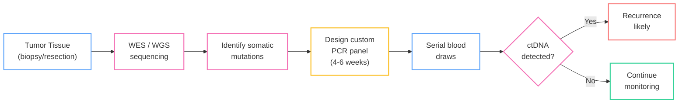
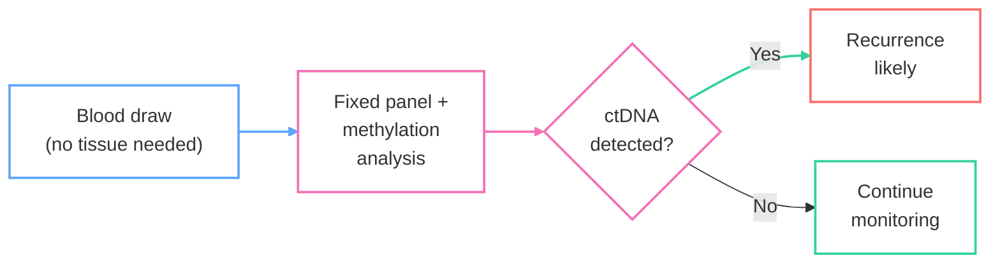

*TL;DR: 44 tests race to find one-in-a-million cancer DNA fragments in your blood after treatment --- only one has FDA clearance, and the rest are fighting over patents, payers, and parts-per-million.*

You've been declared cancer-free. The CT scans are clean. Your oncologist uses words like "complete response." But somewhere in your body, a few thousand cells may have survived chemotherapy, evaded the immune system, and are quietly dividing. Of the 44 tests on the market designed to find them, only one has FDA clearance. As I dug into the [OpenOnco](https://openonco.org) data for this category, MRD turned out to be the most fascinating corner of the landscape -- a field exploding with innovation, locked in patent wars, and racing toward a regulatory reckoning.

<!--more-->

*[Part 1: The Four Pillars](/biotech/2026/02/16/cancer-testing-landscape.html) |
Part 2: MRD (this post) |
[Part 3: Screening Wars](/biotech/2026/02/18/early-cancer-detection-screening-wars.html)*

## The problem imaging cannot solve

A CT scan cannot resolve a tumor smaller than about 5mm --- roughly 100 million cells. By the time imaging detects a recurrence, the cancer has had months, sometimes years, to re-establish itself.

The numbers here are sobering: **30--50% of Stage III colorectal cancer patients who achieve complete surgical resection will relapse.** They were "cured" by every metric available. The question that haunts oncology is: *can we catch recurrence when it is a few thousand cells instead of a hundred million?*

The answer, as best I understand it, is circulating tumor DNA (ctDNA). When cancer cells die, they shed fragments of their DNA into the bloodstream. A standard blood draw, processed through the right assay, can detect these fragments at concentrations as low as 1 part per million --- finding one cancer-derived molecule among a million healthy ones. A study in the *New England Journal of Medicine* (April 2025) showed ctDNA detected recurrence at a median of **1.4 months** post-surgery, compared to **6.1 months** for imaging. That's a 4.7-month head start on treatment.

## Two philosophies, one goal

What I found most interesting about the MRD space is that the 44 tests split into two camps defined by a single architectural decision: do you sequence the tumor first? As a software person, this felt like the classic build-vs-buy tradeoff, except the stakes are cancer recurrence.

### Tumor-informed: the custom fingerprint

The tumor-informed approach sequences the patient's actual tumor tissue via whole-exome or whole-genome sequencing, identifies 16 to 200+ somatic mutations unique to that cancer, and builds a custom PCR panel that tracks those exact mutations in subsequent blood draws. Because you're looking for a known fingerprint, sensitivity is high --- you know exactly what to amplify. This approach also filters out clonal hematopoiesis of indeterminate potential (CHIP), the age-related mutations in blood cells that plague tumor-agnostic tests with false positives.

The downside: building a custom panel takes **4--6 weeks** from tissue receipt. You need resected or biopsied tumor tissue. And if the cancer evolves significantly, the original panel may miss new driver mutations.

### Tumor-agnostic: the wide net

Tumor-agnostic tests skip the tissue entirely. They use a pre-built panel probing common mutation sites plus **20,000+** methylation signals to detect cancer-derived DNA without knowing the patient's specific mutational profile. Results come back in **7--10 days**. No tissue required. No custom panel build.

The tradeoff: you're casting a wider net, which means slightly lower sensitivity for any individual patient's cancer. You may also pick up CHIP signals that a tumor-informed approach would have filtered out by design.

## How they work

### Tumor-informed workflow

### Tumor-agnostic workflow

Simpler. Faster. But the performance data tells a more nuanced story.

## The performance showdown

The ROC scatter below plots every MRD test for which we have both sensitivity and specificity data from the [OpenOnco](https://openonco.org) dataset. Upper-left is ideal --- high sensitivity, high specificity. Blue dots are tumor-informed tests; red dots are tumor-agnostic. The gold star marks the only FDA-cleared test in the field.

The pattern is clear: **tumor-informed tests cluster in the upper-left**, with Signatera, NeXT Personal, and Pathlight leading. The tumor-agnostic approaches (Reveal MRD, Tempus xM, Latitude) trade sensitivity for the convenience of not requiring tissue. Note the outlier clonoSEQ --- FDA-cleared since 2018, but exclusively for hematologic malignancies (multiple myeloma, ALL, CLL), not solid tumors.

## The sensitivity spectrum

If the ROC chart shows who can find the signal, the limit of detection (LoD) chart shows *how faint a signal they can find*. LoD is measured in parts per million (ppm) --- the minimum detectable fraction of tumor-derived DNA in a blood sample.

The spread across the field is staggering: **three orders of magnitude** separate the most sensitive test (Foresight CLARITY at 0.7 ppm) from the least (Caris Assure at 500 ppm). All five of the top performers are tumor-informed. The best tumor-agnostic LoD is CancerDetect at 3.5 ppm --- impressive, but still 5x worse than the leader.

## The leaders

Based on the data, a few tests stood out. I am not endorsing any of these -- I'm just reporting what the numbers and coverage landscape look like.

**Signatera (Natera)** appears to be the de facto standard. 94% sensitivity, 98% specificity, validated in over 300,000 patients across 70+ cancer types. Natera submitted its PMA to the FDA in February 2026. With Signatera Genome (their WGS-based next-gen version), LoD drops to 1 ppm. Medicare covers Signatera for CRC and bladder cancer. Self-pay is \$349; financial assistance brings it to \$0--149.

**NeXT Personal (Personalis)** posts the best raw numbers: 100% sensitivity, 99.9% specificity --- but from a smaller validation cohort (n=493). LoD of 1.7 ppm. The TRACERx lung cancer study published in *Cell* (December 2025) showed ctDNA-positive patients had 5x higher relapse risk. Personalis is positioning aggressively in biopharma partnerships.

**clonoSEQ (Adaptive Biotechnologies)** is the only FDA-cleared MRD test, authorized via De Novo in September 2018 for multiple myeloma and B-ALL, expanded to CLL in 2020. It uses immunosequencing rather than ctDNA, tracking rearranged immunoglobulin or T-cell receptor gene sequences in bone marrow at a sensitivity of 10^-6 (one cell in a million). CE-IVDR certified in August 2024. The limitation: it only works for hematologic cancers with clonal rearrangements.

**Reveal MRD (Guardant Health)** is the tumor-agnostic leader for solid tumors. 81% sensitivity, 98% specificity. No tissue required, results in 7--10 days. The COSMOS study validated its utility for predicting CRC recurrence. For patients who can't provide tumor tissue or need rapid results, Reveal seems like the pragmatic choice --- trading some sensitivity for accessibility.

## The regulatory gap

Forty-four tests. One FDA clearance. The chart below shows the breakdown: the majority of MRD tests are CLIA-validated laboratory-developed tests (LDTs), operating in a regulatory gray zone that the FDA has been signaling it intends to close. Signatera's PMA submission in February 2026 could be the second FDA authorization --- eight years after clonoSEQ.

## The business side

The MRD market is not just a scientific race --- the more I researched, the more it looked like a legal and reimbursement minefield.

**Patent wars:** Natera won a preliminary injunction against NeoGenomics, restricting the sale of NeoGenomics' RaDaR test for certain uses. The dispute centers on patents covering tumor-informed ctDNA monitoring methods. This is not an isolated skirmish; the foundational IP in this space is being contested across multiple fronts.

**Coverage battles:** Medicare covers Signatera for colorectal and bladder cancer under specific CPT codes. But **Humana's liquid biopsy policy explicitly excludes Signatera** (CPT 0340U), and **Blue Cross Blue Shield of Michigan Policy 2002479** (effective January 1, 2026) lists MRD testing as investigational. UnitedHealthcare's 2026 Molecular Oncology Testing policy calls solid tumor MRD "unproven / not medically necessary." The gap between clinical evidence and payer acceptance remains wide.

**Pricing:** Signatera lists at \$349 self-pay with Natera's Patient Assistance Program offering financial assistance at \$0--149 on an income-based scale, plus interest-free 12-month payment plans. Most other tests do not publish patient-facing pricing, leaving costs opaque until the explanation of benefits arrives.

## What's next

MRD testing is the bridge between treatment and surveillance --- the molecular early warning system that imaging never was. The field seems to be consolidating around a few leaders, but the regulatory, reimbursement, and legal landscapes will shape which tests survive the next five years. As an outsider looking in, the gap between the science (which is remarkable) and the business reality (which is messy) is striking.

In **[Part 3: Screening Wars](/biotech/2026/02/18/early-cancer-detection-screening-wars.html)**, I look at the other end of the timeline: **early cancer detection** --- the tests trying to find cancer *before* you ever knew it was there. Multi-cancer early detection (MCED) tests like Galleri promise to screen for dozens of cancer types from a single blood draw, but Stage I sensitivity remains the hard problem. The data tells a complicated story.

