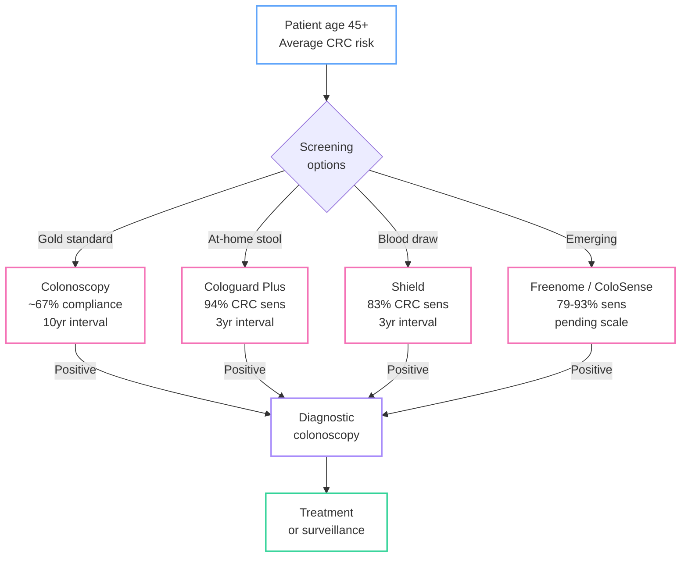

*TL;DR: 31 tests fight over stool vs. blood, single-cancer vs. multi-cancer, and sensitivity vs. compliance --- stool wins on accuracy, blood wins on uptake, and nobody has cracked Stage I detection for the cancers that kill the most.*

Seventy percent of cancer deaths occur in organs with no screening guideline. Pancreatic cancer, ovarian cancer, liver cancer -- by the time symptoms appear, the survival window has closed. A blood test that catches 50 cancers at once sounds like science fiction. It is not. But as I dug into the [OpenOnco](https://openonco.org) data for this category, the story turned out to be more complicated than the headlines suggest.

<!--more-->

*This is Part 3 of a 3-part series on cancer diagnostics in 2026:
[Part 1: The Four Pillars](/biotech/2026/02/16/cancer-testing-landscape.html) |
[Part 2: MRD](/biotech/2026/02/17/mrd-hunting-invisible-cancer.html) |
Part 3: Screening Wars (this post)*

I covered the [landscape overview in Part 1](/biotech/2026/02/16/cancer-testing-landscape.html) and [MRD in Part 2](/biotech/2026/02/17/mrd-hunting-invisible-cancer.html). This final post digs into the most publicly visible and commercially contested category: **Early Cancer Detection (ECD)**.

## The screening gap

As far as I can tell, the US medical system has established screening programs for exactly four cancers: colorectal (colonoscopy, stool tests), breast (mammography), cervical (Pap/HPV), and lung (low-dose CT for heavy smokers). These are the cancers where decades of randomized controlled trials proved that catching it early saves lives.

But the top cancer killers tell a different story. Pancreatic cancer has a 12% five-year survival rate. Ovarian cancer is caught late in 60% of cases. Liver cancer incidence has tripled in the US since 1980. None of these have a recommended screening test for the general population.

This gap -- between what we *can* screen for and what actually kills people -- is what drives the entire ECD industry. The OpenOnco database lists **31 ECD tests** across stool, blood, urine, and saliva modalities. Some are FDA-approved and covered by Medicare. Many are lab-developed tests operating in regulatory gray zones. And performance varies by an order of magnitude depending on what you measure and when you measure it.

## CRC screening: the most mature battleground

Colorectal cancer has the most diagnostic competition of any cancer type, and for good reason. It is the second-leading cause of cancer death in the US, but it is also one of the most preventable -- if you catch it early or at the precancerous polyp stage.

Three modalities are now fighting for market share.

**Stool-based: Cologuard Plus (Exact Sciences).** The reigning champion. FDA approved October 2024 with 93.9% CRC sensitivity and 91% specificity. But the real number that matters: 43.4% sensitivity for advanced adenomas -- precancerous polyps that haven't turned malignant yet. Finding and removing these prevents cancer entirely. No blood test comes close to this precancer detection rate.

**Blood-based: Shield (Guardant Health).** The first FDA-approved blood test for primary CRC screening (July 2024). 83.1% CRC sensitivity, 89.6% specificity. Its advanced adenoma sensitivity is just 13.2% -- a fraction of the stool-based tests. But Shield has a different advantage: *compliance*. One in three Americans eligible for CRC screening skip it entirely. A simple blood draw at a routine checkup catches the people who would never mail back a stool sample or schedule a colonoscopy.

**The tradeoff is real.** A test that catches 83% of cancers but is taken by everyone may prevent more deaths than a 94% test taken by 67% of the eligible population. This is the central tension of the blood-vs-stool debate, and it will not be resolved by sensitivity data alone -- it requires population-level outcome studies.

**Freenome (Freenome / Exact Sciences).** The multiomics entrant. Combines DNA methylation, protein biomarkers, and immune signals in a single blood draw. Their PREEMPT CRC study (n=48,995 enrolled, 27,010 analyzed) reported 79.2% CRC sensitivity with 91.5% specificity. Stage I sensitivity of 57.1% -- better than Shield's 54.5% but still well below stool-based tests. Exact Sciences acquired an exclusive US license in August 2025. PMA submitted; FDA review pending.

**ColoSense (Geneoscopy).** The RNA-based wildcard. FDA approved May 2024 with 93% CRC sensitivity and a remarkable 100% Stage I detection rate. Uses stool-derived RNA transcripts rather than DNA methylation. Still early in commercial rollout via Labcorp.

## CRC screening decision tree

Every screening pathway converges on the same endpoint: if the test is positive, the patient gets a diagnostic colonoscopy. The debate is about how many cancers get caught on the way in, and how many patients actually show up.

## Sensitivity vs. specificity across the ECD landscape

Before going further, here's the full picture. The scatter plot below places every ECD test with published performance data in ROC space -- sensitivity on the Y axis, false positive rate (1 - specificity) on the X axis. Upper-left is best. Gold stars mark FDA-approved tests.

A few patterns jumped out as I was putting this together:

- **CRC stool-based tests cluster in the upper-left** -- high sensitivity, high specificity. This is the most mature modality.
- **CRC blood-based tests trade sensitivity for compliance** -- they sit lower on the Y axis.
- **MCED tests push specificity to extremes** (Galleri at 99.5%, OverC at 98.9%) because when you screen millions of healthy people for dozens of cancers, even a 1% false positive rate generates an unacceptable number of false alarms.
- **Lung tests have notably lower specificity** -- FirstLook Lung at 58%, ProVue Lung at 55% -- because they are designed as pre-LDCT triage tools, not standalone screening tests.

## The Stage I problem

This is the chart that I think defines the entire ECD category.

Every test in this space exists to answer one question: *can you catch cancer before it spreads?* Stage I means the tumor is localized -- often curable with surgery alone. Stage IV means metastatic -- often fatal regardless of treatment. The clinical value of a screening test is almost entirely determined by its Stage I sensitivity.

And every single test shows a dramatic drop from Stage IV to Stage I detection. From what I've read, this is basically physics, not engineering failure -- early-stage tumors shed less DNA, fewer proteins, and fewer cells into the bloodstream. The signal-to-noise problem is immense.

The slope of each line tells the story:

- **ColoSense** achieves 100% Stage I sensitivity -- but only for CRC via stool, where tumor DNA is shed directly into the collection medium rather than diluted through the bloodstream.
- **Cologuard Plus** drops from 100% (Stage IV) to 87% (Stage I) -- a remarkably gentle slope for a non-invasive test.
- **Shield** drops from 100% to 54.5% -- the blood-based penalty for CRC detection.
- **Galleri** falls off a cliff: 90.1% at Stage IV to 16.8% at Stage I. This is the number that Galleri's critics cite most often. When only 1 in 6 Stage I cancers is detected, the clinical utility of "early detection" becomes debatable.
- **EPISEEK** shows a flatter profile (45% Stage I/II to 74% Stage IV) for an MCED test -- but at much lower overall sensitivity.

The fundamental challenge: the cancers that benefit most from early detection are the hardest to detect early.

## MCED: Multi-Cancer Early Detection

Two platforms are trying to solve the screening gap with a single blood test.

### Galleri (GRAIL)

Arguably the most ambitious test in oncology. Galleri analyzes cfDNA methylation patterns to detect signals from 50+ cancer types -- including pancreatic, ovarian, and liver cancers that have no screening guideline. It also predicts the cancer's tissue of origin with 93% accuracy, telling your doctor where to look.

The specificity story is strong: 99.5%. In population screening, this matters enormously. Screen one million healthy people with a 99% specific test and you get 10,000 false positives -- each requiring expensive, anxiety-inducing follow-up imaging and biopsies. At 99.5%, you cut that to 5,000. Still a lot, but the math works better.

The sensitivity story is complicated: 51.5% overall, 16.8% at Stage I. The PATHFINDER 2 study (n=23,000+) showed that Galleri detected cancers 7x more often than standard USPSTF screening -- but most detected cancers were later-stage. More than 50% of Galleri-detected cancers were early-stage in PATHFINDER 2, and 75% were cancer types without any recommended screening. That last number is the real argument for Galleri: it finds cancers that no other test is looking for.

The NHS-Galleri trial (140,000 participants) and a PMA submission filed January 29, 2026, will determine whether Galleri becomes the first FDA-approved MCED test. Price: ~$949 out-of-pocket. Medicare does not cover it.

### Cancerguard (Exact Sciences)

Launched September 2025 through Quest Diagnostics' 7,000-site network. Takes a different philosophical approach: rather than detecting every possible cancer, Cancerguard focuses on the deadliest ones -- pancreatic, ovarian, liver, lung, colorectal, and esophageal. These are the cancers where early detection has the highest impact on survival.

64% overall sensitivity. 68% for the six deadliest cancers. 97.4% specificity. Price: $689 -- notably cheaper than Galleri. Built on the CancerSEEK and DETECT-A study foundation (10,000 participants), now enrolling 25,000 more in the FALCON registry.

### The MCED paradox

This is where the math gets interesting (and where my software brain perks up). High specificity is non-negotiable for population screening. If you screen 100 million Americans annually and your false positive rate is 2.6% (Cancerguard) instead of 0.5% (Galleri), that's 2.1 million additional false alarms per year. Each false alarm means imaging, possible biopsies, patient anxiety, and healthcare costs. But if your sensitivity for the earliest stages remains below 50%, you're missing the cancers that matter most.

No MCED test has solved this paradox yet. From what I can tell, the field is converging on a layered approach: MCED as a complement to existing single-cancer screening, not a replacement.

## Geographic availability: ECD's international dimension

One of the more surprising things I found in the OpenOnco data is that ECD has the most international-only tests of any category. While MRD and CGP are dominated by US-based companies, the ECD space includes a significant non-US contingent.

Ten ECD tests are available internationally but not in the US. The biggest bloc: **Wuhan Ammunition Life Technology** from China, with five NMPA-approved tests covering CRC (IColocomf, IColohunter), esophageal (IEsohunter), liver (IHepcomf), and urothelial (IUrisure) cancer. Their published performance data is strong -- IColocomf reports 95.3% CRC sensitivity with 96.7% specificity, IHepcomf shows 92.3% liver cancer sensitivity -- though cohort sizes and study designs vary.

**Gene Solutions' SPOT-MAS** is the standout in Southeast Asia: a multi-cancer blood test validated in the K-DETEK trial (n=9,024) with 70.8% sensitivity and 99.7% specificity, available across Singapore, Vietnam, Malaysia, Thailand, Indonesia, and the Philippines. It is the first clinically validated MCED test in Asia.

**Burning Rock's OverC** holds a unique distinction: it is the only MCED test to receive Breakthrough Device Designation from both the US FDA and the Chinese NMPA. 69.1% sensitivity, 98.9% specificity across six cancer types, available in China and the EU.

This geographic fragmentation means the global ECD landscape looks very different depending on where you are standing. A patient in Shenzhen has access to organ-specific methylation tests that don't exist in the US. A patient in Ho Chi Minh City can get a 10-cancer blood test that isn't available in Europe. Regulatory harmonization is nowhere on the horizon.

## What is coming

Based on what I've seen in the data and filings, the next 12-18 months could reshape this category.

**Galleri's PMA review** is the biggest regulatory event in ECD history. If the FDA approves an MCED test for population screening, it opens the floodgates for Medicare coverage and commercial payer adoption. Congressional bills (H.R. 2407, S. 2085) are already pending to mandate Medicare MCED coverage.

**Freenome's CRC blood test** is headed for FDA review through its Exact Sciences partnership. If approved, it would be the second blood-based CRC screening option alongside Shield, intensifying the compliance-vs-sensitivity debate.

**Shield MCD** -- Guardant is expanding from CRC to multi-cancer detection using the same blood draw. Already launched nationally (October 2025) with FDA Breakthrough Device Designation and selected for the NCI Vanguard Study (24,000 participants). 60% sensitivity across 10 tumor types, 98.5% specificity.

**The blood-vs-stool war will intensify.** Cologuard Plus has better numbers. Shield has better compliance. The resolution will come from population outcome studies, not head-to-head sensitivity comparisons. The test that prevents the most deaths wins, and that depends as much on who takes the test as on what the test can detect.

## Series conclusion

I started this project because I stumbled onto OpenOnco and thought the dataset was too interesting not to explore. Three posts later, here's what stands out to me as a software person looking in from the outside.

Across the four pillars -- CGP for profiling, HCT for inherited risk, MRD for recurrence monitoring, and ECD for early detection -- every category seems to be converging on the same patient: a person whose molecular profile is tracked continuously from inherited risk assessment through screening, diagnosis, treatment, and survivorship.

The technical barriers are falling fast. Sub-1 ppm MRD detection. 50-cancer blood tests. Stool RNA with 100% Stage I CRC sensitivity. The remaining barriers are regulatory (only 1 FDA-approved MRD test, zero approved MCED tests), economic (Medicare coverage drives adoption), and infrastructural (integrating results from a dozen tests into a coherent clinical workflow).

That last one is where I think people like me might eventually have something to contribute. A patient who gets a Galleri MCED screen, a Cologuard Plus CRC screen, a Shield blood draw, and annual MRD monitoring after treatment is generating a stream of molecular data that no EHR system is designed to handle. The next wave of cancer diagnostics innovation may not come from the lab at all -- it may come from the data layer that connects everything together. That's a software problem.

*All data in this series comes from [OpenOnco](https://openonco.org) (v. Feb 15, 2026) -- an open-access database of 155 cancer diagnostic tests, 75 vendors, and 6,743 data points. Domain research was done with the help of Claude and Gemini, cross-referenced against published papers and FDA filings. Corrections welcome -- I am learning in public here.*

---

*[Part 1: The Four Pillars](/biotech/2026/02/16/cancer-testing-landscape.html) |
[Part 2: MRD](/biotech/2026/02/17/mrd-hunting-invisible-cancer.html) |
Part 3: Screening Wars (this post)*

