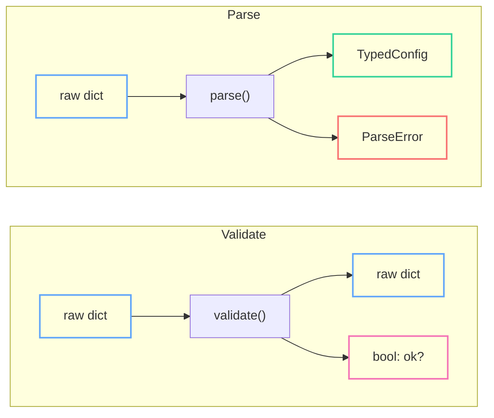
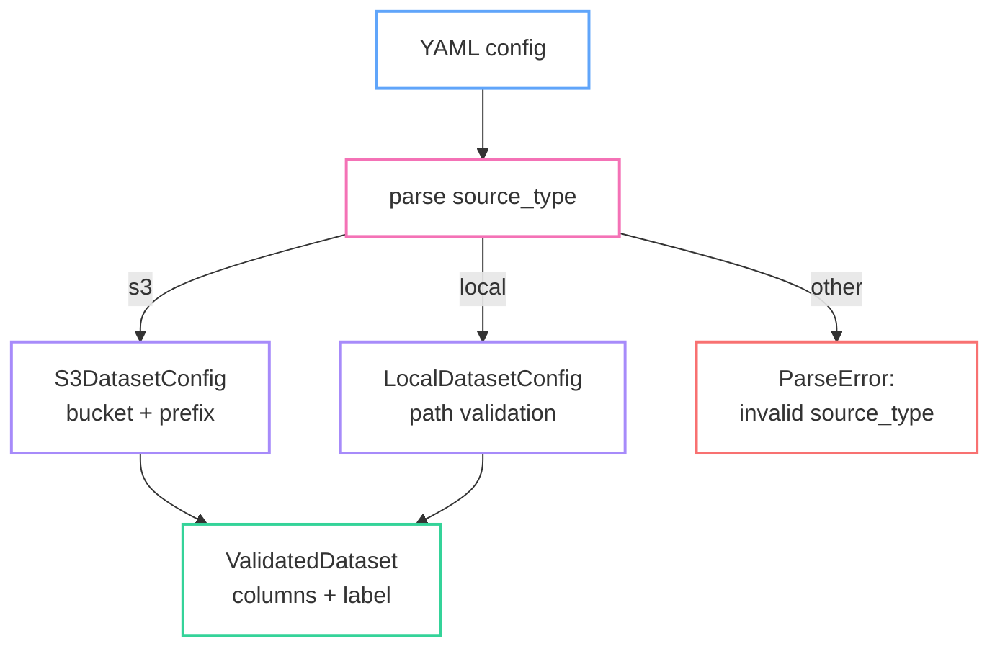
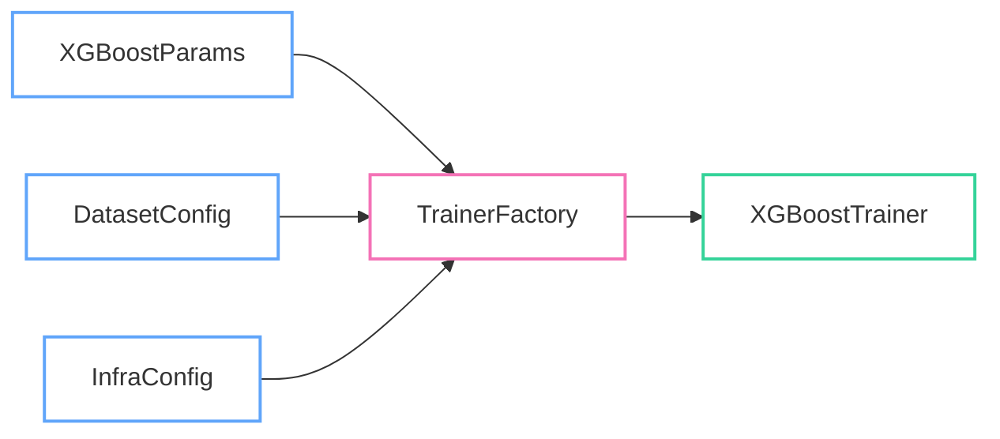
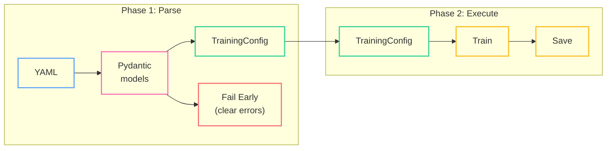
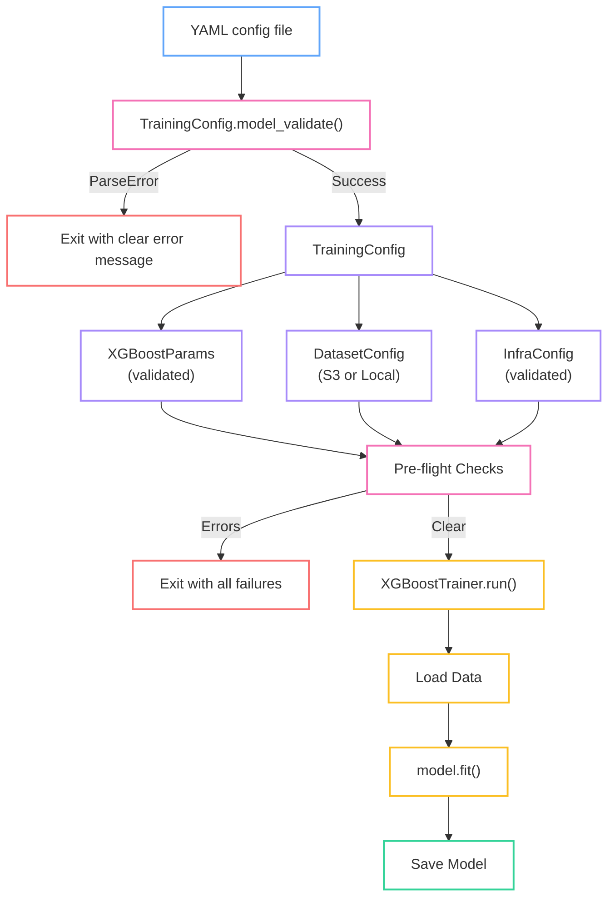

It's 2 AM. Your XGBoost training job has been churning through 200GB of data on a 8-GPU cluster for the last four hours. You get paged. The job crashed with a cryptic C++ stack trace from somewhere deep in XGBoost internals. After 45 minutes of squinting at logs, you find the culprit: someone wrote `"binary_logistic"` instead of `"binary:logistic"` in the training config YAML. A single misplaced underscore, and four hours of GPU time went up in smoke.

Your first instinct is to add a validation check. Maybe an `if objective not in VALID_OBJECTIVES` somewhere early in the pipeline. But here's the thing -- that's playing whack-a-mole. There are hundreds of config keys, each with their own constraints. The real fix is to make it structurally impossible for a bad config to reach your training code in the first place.

This is the core idea behind "Parse, Don't Validate" -- a philosophy from the typed functional programming world that translates beautifully to Python ML pipelines.

<!--more-->

## The Problem: Death by Dictionary

If you've worked on any ML training pipeline of moderate complexity, this pattern will look painfully familiar:

```python
def load_config(path: str) -> dict:
    with open(path) as f:
        return yaml.safe_load(f)


def setup_data(config: dict):
    source = config.get("data", {}).get("source", "local")
    if source == "s3":
        bucket = config["data"]["s3_bucket"]  # KeyError if missing
        prefix = config["data"].get("s3_prefix", "")
        # ... download from S3
    elif source == "local":
        path = config["data"]["local_path"]  # KeyError if missing
        # ... load from disk
    else:
        raise ValueError(f"Unknown source: {source}")

    columns = config["data"].get("feature_columns")
    if columns is None:
        raise ValueError("feature_columns is required")
    label = config["data"].get("label_column", "target")
    return load_dataframe(path, columns, label)


def train_model(config: dict, data):
    params = {
        "objective": config["model"]["objective"],
        "max_depth": config["model"].get("max_depth", 6),
        "learning_rate": config["model"].get("learning_rate", 0.3),
        "n_estimators": config["model"].get("n_estimators", 100),
        "subsample": config["model"].get("subsample", 1.0),
        "colsample_bytree": config["model"].get("colsample_bytree", 1.0),
        "eval_metric": config["model"].get("eval_metric", "logloss"),
        # ... 20 more parameters
    }

    # Somewhere deep in here, XGBoost will throw a C++ error
    # if objective is "binary_logistic" instead of "binary:logistic"
    model = xgb.XGBClassifier(**params)
    model.fit(data.X, data.y)
    return model


def main():
    config = load_config("config.yaml")
    data = setup_data(config)
    model = train_model(config, data)
    save_model(model, config["output"]["path"])
```

The `dict` is doing all the heavy lifting. Every function receives the same blob and picks out the keys it needs with `.get()` calls. There is no single place that declares what the config looks like. Validation is scattered across files and functions, and some of it doesn't happen at all -- it just crashes eventually.

The error you get at 2 AM looks something like:

```
XGBoostError: [10:43:21] /workspace/src/learner.cc:1115:
  Unknown objective function: `binary_logistic`
```

Good luck tracing that back to a YAML key typo from your CI/CD pipeline config. The dict passed every check you wrote, because you didn't write a check for that particular key's value. You can't write checks for everything -- and even if you could, the checks themselves become a maintenance burden that drifts out of sync with reality.


## Parse, Don't Validate

The phrase "Parse, Don't Validate" comes from [Alexis King's excellent 2019 blog post](https://lexi-lambda.github.io/blog/2019/11/05/parse-don-t-validate/) written in the context of Haskell. The core idea is deceptively simple:

- **Validation** checks that data satisfies some property, then passes through the *original untyped data*. The type system forgets you ever checked.
- **Parsing** checks the same properties, but produces a *new, typed value* as output. The type system remembers.
- The difference: after parsing, invalid states are **unrepresentable**. You cannot construct a `TrainingConfig` with an invalid objective, because the parser won't let you.

This is not a Haskell thing. Between Pydantic, dataclasses, and `typing.Literal`, Python gives you the same superpower. I've written before about [building a strong type system with Python typehints](/python/programming/2023/12/01/typehints.html) -- this post takes those ideas and applies them to a concrete ML problem.



With validation, you get a `dict` in and a `dict` out. The function returns a boolean (or throws), but the data itself is unchanged. Every downstream consumer still works with the raw dict and has to trust that someone, somewhere, already validated the keys it cares about.

With parsing, you get a `dict` in and a **typed object** out. The function either succeeds and hands you a `TrainingConfig` that is structurally guaranteed to be valid, or it fails with a clear error explaining exactly what's wrong. There is no in-between state.


## Boundary 1: Parsing Training Parameters

### The Pydantic Approach

Pydantic is the go-to choice for parsing in modern Python. Here's what our XGBoost config looks like as a Pydantic model:

```python
from pydantic import BaseModel, Field
from typing import Literal, Annotated


class XGBoostParams(BaseModel):
    model_config = {"extra": "forbid"}

    objective: Literal[
        "binary:logistic",
        "binary:logitraw",
        "multi:softmax",
        "multi:softprob",
        "reg:squarederror",
        "reg:logistic",
        "reg:pseudohubererror",
    ]

    max_depth: Annotated[int, Field(ge=1, le=20)] = 6
    learning_rate: Annotated[float, Field(gt=0, le=1)] = 0.3
    n_estimators: Annotated[int, Field(ge=1, le=50_000)] = 100
    subsample: Annotated[float, Field(gt=0, le=1)] = 1.0
    colsample_bytree: Annotated[float, Field(gt=0, le=1)] = 1.0
    min_child_weight: Annotated[float, Field(ge=0)] = 1.0
    gamma: Annotated[float, Field(ge=0)] = 0.0
    reg_alpha: Annotated[float, Field(ge=0)] = 0.0
    reg_lambda: Annotated[float, Field(ge=0)] = 1.0

    eval_metric: Literal[
        "logloss", "mlogloss", "auc", "aucpr", "rmse", "mae", "error"
    ] = "logloss"

    early_stopping_rounds: Annotated[int, Field(ge=1)] | None = None
    seed: int = 42
```

Now try passing `"binary_logistic"`:

```
ValidationError: 1 validation error for XGBoostParams
objective
  Input should be 'binary:logistic', 'binary:logitraw', 'multi:softmax',
  'multi:softprob', 'reg:squarederror', 'reg:logistic' or
  'reg:pseudohubererror' [type=literal_error]
```

Compare that to the C++ stack trace from XGBoost internals. The Pydantic error tells you exactly which field is wrong, what the valid values are, and what you passed. This fires immediately at config load time, before any data is touched or any GPU is allocated.

The `extra = "forbid"` setting is doing critical work here: if someone types `leraning_rate` instead of `learning_rate`, Pydantic will reject it instead of silently ignoring the typo and using the default value. This catches an entire class of bugs that validation-style approaches miss entirely.


### The Dataclass Alternative

Not every project needs Pydantic's full power. If you want something lighter, `dataclasses` with `__post_init__` works well for simpler cases:

```python
from dataclasses import dataclass


VALID_OBJECTIVES = frozenset({
    "binary:logistic", "binary:logitraw",
    "multi:softmax", "multi:softprob",
    "reg:squarederror", "reg:logistic",
})


@dataclass(frozen=True)
class XGBoostParams:
    objective: str
    max_depth: int = 6
    learning_rate: float = 0.3
    n_estimators: int = 100
    subsample: float = 1.0

    def __post_init__(self):
        if self.objective not in VALID_OBJECTIVES:
            raise ValueError(
                f"Invalid objective '{self.objective}'. "
                f"Valid options: {sorted(VALID_OBJECTIVES)}"
            )
        if not (0 < self.learning_rate <= 1):
            raise ValueError(
                f"learning_rate must be in (0, 1], got {self.learning_rate}"
            )
        if not (1 <= self.max_depth <= 20):
            raise ValueError(
                f"max_depth must be in [1, 20], got {self.max_depth}"
            )
```

The dataclass approach is more verbose for validation logic, but has zero dependencies and is easier to reason about for smaller models. `frozen=True` gives you immutability for free -- once parsed, the config can't be accidentally mutated downstream.

Use Pydantic when you have complex nested configs, discriminated unions, or want schema generation. Use dataclasses when you have flat configs and want minimal dependencies. In both cases, the key insight is the same: the type signature **is** the documentation. Anyone reading `def train(params: XGBoostParams)` knows exactly what shape of data this function expects without reading a single docstring.


## Boundary 2: Parsing Dataset Sources

Training pipelines typically support multiple data sources. A common pattern in YAML configs:

```yaml
# S3 source
data:
  source_type: s3
  bucket: my-ml-datasets
  prefix: training/v3/
  feature_columns: [age, income, score]
  label_column: target

# Local source
data:
  source_type: local
  path: /data/training/dataset.parquet
  feature_columns: [age, income, score]
  label_column: target
```

This is a natural fit for Pydantic's discriminated unions:

```python
import re
from pathlib import Path

from pydantic import BaseModel, Field, field_validator
from typing import Literal, Annotated


class S3DatasetConfig(BaseModel):
    source_type: Literal["s3"]
    bucket: str
    prefix: str = ""
    feature_columns: list[str] = Field(min_length=1)
    label_column: str = "target"

    @field_validator("bucket")
    @classmethod
    def validate_bucket_name(cls, v: str) -> str:
        if not re.match(r"^[a-z0-9][a-z0-9.\-]{1,61}[a-z0-9]$", v):
            raise ValueError(
                f"Invalid S3 bucket name: '{v}'. "
                "Must be 3-63 chars, lowercase alphanumeric, hyphens, or dots."
            )
        return v


class LocalDatasetConfig(BaseModel):
    source_type: Literal["local"]
    path: Path
    feature_columns: list[str] = Field(min_length=1)
    label_column: str = "target"

    @field_validator("path")
    @classmethod
    def validate_path_exists(cls, v: Path) -> Path:
        if not v.exists():
            raise ValueError(f"Dataset path does not exist: {v}")
        return v


DatasetConfig = Annotated[
    S3DatasetConfig | LocalDatasetConfig,
    Field(discriminator="source_type"),
]
```

The `source_type` field acts as the discriminator -- Pydantic inspects its value to decide which model to parse into. If `source_type` is `"s3"`, you get an `S3DatasetConfig` with bucket validation. If it's `"local"`, you get a `LocalDatasetConfig` with path existence checks. If it's anything else, you get a clear error.

Both branches validate `feature_columns` -- requiring at least one column. This catches the "oops, I forgot to list any features" mistake before your pipeline silently trains on zero features (yes, XGBoost will happily do this and produce a model that predicts the prior for every input).



After parsing, downstream code works with `DatasetConfig` -- it doesn't need to know or care whether the data came from S3 or local disk. The union type gives you exhaustive pattern matching if you need it, or you can just call common methods that both variants share.


## Boundary 3: Composing the Training Pipeline

Now we have typed configs for model parameters and dataset sources. Let's compose them into a full training pipeline. This is where [dependency injection](/python/programming/2022/08/17/python-dep-inj.html) meets parsing -- the factory takes only typed, validated inputs.



The `TrainerFactory` is deliberately boring. It takes typed configs and wires them together. No validation, no `.get()` calls, no `if` guards -- just construction:

```python
from dataclasses import dataclass


@dataclass
class InfraConfig(BaseModel):
    model_config = {"extra": "forbid"}

    n_gpus: Annotated[int, Field(ge=0)] = 0
    n_workers: Annotated[int, Field(ge=1)] = 1
    output_dir: Path = Path("./output")
    checkpoint_every_n: Annotated[int, Field(ge=1)] = 10


class XGBoostTrainer:
    def __init__(
        self,
        params: XGBoostParams,
        dataset: DatasetConfig,
        infra: InfraConfig,
    ):
        self.params = params
        self.dataset = dataset
        self.infra = infra

    def run(self):
        data = self._load_data()
        model = self._train(data)
        self._save(model)

    def _load_data(self):
        match self.dataset:
            case S3DatasetConfig(bucket=bucket, prefix=prefix):
                return download_and_load(bucket, prefix, self.dataset.feature_columns)
            case LocalDatasetConfig(path=path):
                return load_parquet(path, self.dataset.feature_columns)

    def _train(self, data):
        # self.params is guaranteed valid -- just use it
        model = xgb.XGBClassifier(
            objective=self.params.objective,
            max_depth=self.params.max_depth,
            learning_rate=self.params.learning_rate,
            n_estimators=self.params.n_estimators,
            subsample=self.params.subsample,
            colsample_bytree=self.params.colsample_bytree,
            eval_metric=self.params.eval_metric,
            early_stopping_rounds=self.params.early_stopping_rounds,
            random_state=self.params.seed,
            n_jobs=self.infra.n_workers,
            device="cuda" if self.infra.n_gpus > 0 else "cpu",
        )
        model.fit(data.X, data.y)
        return model

    def _save(self, model):
        self.infra.output_dir.mkdir(parents=True, exist_ok=True)
        model.save_model(self.infra.output_dir / "model.json")
```

Notice how `_train` has zero defensive checks. It doesn't verify that `objective` is valid, or that `learning_rate` is positive, or that `max_depth` is reasonable. It doesn't need to -- the type system guarantees these properties. The `XGBoostParams` object *cannot exist* in an invalid state.

Now the `main()` entrypoint ties it all together with a clean two-phase structure:

```python
import sys
import yaml
from pydantic import ValidationError


class TrainingConfig(BaseModel):
    model_config = {"extra": "forbid"}

    model: XGBoostParams
    data: DatasetConfig
    infra: InfraConfig = InfraConfig()


def main():
    # === Phase 1: Parse (fast, fails clearly) ===
    try:
        raw = yaml.safe_load(open(sys.argv[1]))
        config = TrainingConfig.model_validate(raw)
    except ValidationError as e:
        print(f"Config validation failed:\n{e}", file=sys.stderr)
        sys.exit(1)
    except (FileNotFoundError, yaml.YAMLError) as e:
        print(f"Could not load config: {e}", file=sys.stderr)
        sys.exit(1)

    # === Phase 2: Execute (expensive, safe) ===
    trainer = XGBoostTrainer(
        params=config.model,
        dataset=config.data,
        infra=config.infra,
    )
    trainer.run()
```

The two-phase pattern is the key architectural insight:



Phase 1 takes milliseconds and catches every structural error in your config. Phase 2 takes hours and costs real money on GPU clusters. By the time you enter Phase 2, every config value is typed, bounded, and guaranteed valid. The 2 AM page never happens.


## Pushing Parse to CI/CD: The Compile Step Python Doesn't Have

Statically typed languages have a built-in safety net: if your types are wrong, the compiler catches it before your code ever runs. Python doesn't have a compiler, but we can simulate one using pytest and our Pydantic models.

The idea is simple: glob all your training config YAML files and parse them through the models in a test. Bad config = failed build, not failed training run.

```python
from pathlib import Path
import pytest
import yaml


CONFIG_DIR = Path("configs/training")


def discover_configs():
    return sorted(CONFIG_DIR.glob("**/*.yaml"))


@pytest.mark.parametrize(
    "config_path",
    discover_configs(),
    ids=lambda p: str(p.relative_to(CONFIG_DIR)),
)
def test_training_config_parses(config_path: Path):
    """Every training config YAML must parse into a valid TrainingConfig."""
    raw = yaml.safe_load(config_path.read_text())
    config = TrainingConfig.model_validate(raw)

    # Sanity: parsed config should round-trip cleanly
    assert config.model.objective is not None
    assert len(config.data.feature_columns) > 0
```

Now your CI pipeline catches the `binary_logistic` typo before it ever reaches a training cluster. The test output is clear:

```
FAILED configs/training/prod/classifier_v3.yaml -
  ValidationError: objective - Input should be 'binary:logistic', ...
```

You can go further and add this as a pre-commit hook:

```yaml
# .pre-commit-config.yaml
repos:
  - repo: local
    hooks:
      - id: validate-training-configs
        name: Validate training configs
        entry: pytest tests/test_config_parse.py -x -q
        language: system
        files: 'configs/training/.*\.yaml$'
        pass_filenames: false
```

This means a developer literally cannot commit a bad training config. The parse boundary has moved from "2 AM on a GPU cluster" all the way to "before the code leaves your laptop."


## Runtime Pre-flight Checks

CI catches structural errors -- wrong types, missing keys, invalid values. But some things can only be checked at runtime: Does the S3 bucket exist and do we have read permissions? Are GPUs actually available? Is the dataset fresh enough?

These checks belong in a pre-flight phase that runs after parsing but before any expensive work:

```python
@dataclass
class PreflightError:
    check: str
    message: str


def preflight_checks(config: TrainingConfig) -> list[PreflightError]:
    """Run all runtime pre-flight checks. Returns accumulated errors."""
    errors: list[PreflightError] = []

    # Check GPU availability
    if config.infra.n_gpus > 0:
        import torch
        available = torch.cuda.device_count()
        if available < config.infra.n_gpus:
            errors.append(PreflightError(
                check="gpu_availability",
                message=f"Requested {config.infra.n_gpus} GPUs, "
                        f"but only {available} available",
            ))

    # Check data source accessibility
    match config.data:
        case S3DatasetConfig(bucket=bucket, prefix=prefix):
            if not check_s3_access(bucket, prefix):
                errors.append(PreflightError(
                    check="s3_access",
                    message=f"Cannot read s3://{bucket}/{prefix}",
                ))
        case LocalDatasetConfig(path=path):
            if not path.exists():
                errors.append(PreflightError(
                    check="local_data",
                    message=f"Dataset not found: {path}",
                ))

    # Check output directory is writable
    try:
        config.infra.output_dir.mkdir(parents=True, exist_ok=True)
        test_file = config.infra.output_dir / ".preflight_check"
        test_file.touch()
        test_file.unlink()
    except OSError as e:
        errors.append(PreflightError(
            check="output_writable",
            message=f"Cannot write to {config.infra.output_dir}: {e}",
        ))

    return errors
```

The key detail here is **error accumulation**. Instead of failing on the first problem, we collect all failures and report them at once. If your S3 credentials are wrong *and* you requested too many GPUs, you want to know about both in a single pass -- not fix one, re-run, wait 30 seconds, and discover the other.

The updated `main()` becomes:

```python
def main():
    # Phase 1: Parse
    try:
        raw = yaml.safe_load(open(sys.argv[1]))
        config = TrainingConfig.model_validate(raw)
    except ValidationError as e:
        print(f"Config validation failed:\n{e}", file=sys.stderr)
        sys.exit(1)

    # Phase 1.5: Pre-flight
    errors = preflight_checks(config)
    if errors:
        print("Pre-flight checks failed:", file=sys.stderr)
        for err in errors:
            print(f"  [{err.check}] {err.message}", file=sys.stderr)
        sys.exit(1)

    # Phase 2: Execute
    trainer = XGBoostTrainer(
        params=config.model,
        dataset=config.data,
        infra=config.infra,
    )
    trainer.run()
```


## Practical Notes

A few battle-tested observations from applying this pattern across multiple ML projects:

- **Start at the edges, not the middle.** CLI arguments, config files, API requests -- these are your system boundaries. Parse them into typed objects on entry. Don't try to retrofit types into the middle of an existing pipeline all at once.

- **`extra="forbid"` is your best friend.** It catches YAML key typos that would otherwise silently fall back to defaults. A typo like `leraning_rate: 0.01` gets rejected instead of training at the default 0.3 for 12 hours.

- **Use `Annotated[float, Field(gt=0, le=1)]` for range constraints.** This is cleaner than `__post_init__` validation and shows up in generated JSON schemas -- useful if your configs are also served via an API.

- **Parse feature schemas early.** If your pipeline does column renaming or feature engineering, encode the expected column names in the config model. A missing column should fail at parse time, not inside `model.fit()` after two hours of preprocessing.

- **Don't parse in hot loops.** Pydantic model construction has overhead. Parse once at the boundary, then pass the typed object everywhere. This is the natural outcome of boundary-focused design anyway.

- **Compose models, don't nest dicts.** `TrainingConfig` contains `XGBoostParams`, `DatasetConfig`, and `InfraConfig` as typed fields. Each can be tested independently, reused across pipelines, and documented by its own schema.

- **Use `model_validate` for external data, direct construction for internal data.** When building a config in test code, just call `XGBoostParams(objective="binary:logistic", ...)` directly -- Pydantic still validates. Reserve `model_validate` for untrusted inputs like YAML files and API payloads.


## The Full Picture

Here's the end-to-end flow from raw YAML to trained model, with every parse boundary marked:



The raw YAML enters the system exactly once at the top. By the time we reach the expensive operations -- downloading data, allocating GPUs, training models -- every config value has been parsed, typed, range-checked, and pre-flight verified. The `dict` is gone. The training code works exclusively with typed objects that cannot represent invalid states.

Back to our 2 AM scenario. With this architecture in place, the developer who writes `binary_logistic` gets stopped at one of three checkpoints:

1. **Pre-commit hook** rejects the config before it's committed
2. **CI test** catches it if the hook was bypassed
3. **Parse phase** catches it in the first 100ms of the training job, before any GPU is touched

You sleep through the night. The config typo becomes a Slack message you see over coffee in the morning: "CI failed on your config change, here's what to fix." That's the power of pushing validation to the boundary and letting the type system carry the proof forward.