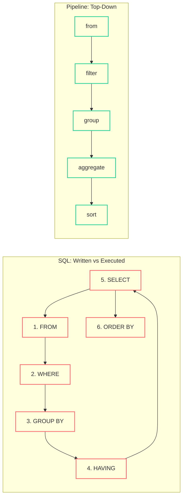

Here's a query I wrote last week against the [Kaggle Spaceship Titanic](https://www.kaggle.com/competitions/spaceship-titanic) dataset. The ask was simple: average spending per deck for non-cryosleep passengers over 25, ranked highest first.

```sql
SELECT
    SUBSTR(Cabin, 1, 1) AS Deck,
    AVG(RoomService + FoodCourt + ShoppingMall + Spa + VRDeck) AS avg_spend,
    COUNT(*) AS n_passengers
FROM passengers
WHERE CryoSleep = FALSE
  AND Age > 25
  AND Cabin IS NOT NULL
  AND RoomService IS NOT NULL
  AND FoodCourt IS NOT NULL
  AND ShoppingMall IS NOT NULL
  AND Spa IS NOT NULL
  AND VRDeck IS NOT NULL
GROUP BY SUBSTR(Cabin, 1, 1)
HAVING COUNT(*) > 10
ORDER BY avg_spend DESC;
```

Try reading that top to bottom. `SELECT` declares the output columns -- but you don't know what table they come from until you hit `FROM` six lines down. The `WHERE` clauses filter rows, but you need to mentally jump back up to `SELECT` to understand what `avg_spend` means. `GROUP BY` references an expression that was defined in `SELECT`, and `HAVING` filters groups using an aggregate that looks nothing like the `WHERE` above it. You're reading a story where the conclusion comes first, the setup is in the middle, and the plot is told in reverse order.

This isn't a SQL skill issue. The language fundamentally separates the order you write things from the order they execute. Every SQL user eventually builds the mental compiler to translate between the two, and we stop noticing the tax. But it's there -- every code review where someone asks "wait, what does this query do?" is evidence of it.

A language called [PRQL](https://prql-lang.org) (pronounced "prequel") figured out the right abstractions for this. You don't need to adopt PRQL. I don't use it in production. But the five ideas it crystallized are worth stealing, because they show up naturally in pandas method chaining and even more naturally in Polars. This series is about those ideas and how to apply them with tools you already have.

<!--more-->

*This is Part 1 of a 3-part series on pipeline thinking for data:
Part 1: What PRQL Got Right (this post) |
[Part 2: Pipeline Patterns](/programming/2026/02/25/pipeline-thinking-part2-patterns.html) |
Part 3: From Pipeline to Prediction (coming soon)*

## PRQL in 60 Seconds

PRQL is a query language that compiles to SQL. It's not something I'm going to ask you to install or adopt -- it's more interesting as a design document than as a tool. The project's contribution is naming and isolating the things that make SQL awkward, then showing what the alternative looks like.

Here's that same Spaceship Titanic query in PRQL:

```prql
from passengers
filter !CryoSleep && Age > 25 && Cabin != null
derive total_spend = RoomService + FoodCourt + ShoppingMall + Spa + VRDeck
filter total_spend != null
derive Deck = (Cabin | text.substr 0 1)
group Deck (
  aggregate {
    avg_spend = average total_spend,
    n_passengers = count this
  }
)
filter n_passengers > 10
sort {-avg_spend}
```

Read that top to bottom: start with a table, filter rows, create a new column, group, aggregate, filter groups, sort. Each line takes the result of the previous line as input. The mental model is a pipeline -- data flows through a sequence of transforms, and each transform does one thing.

PRQL compiles this to roughly the same SQL I wrote above. The insight isn't that PRQL is shorter (it isn't, really). It's that reading order matches execution order, and each concept gets its own verb. That's the idea worth stealing. If you want to explore PRQL further, the [playground at prql-lang.org](https://prql-lang.org) lets you write PRQL and see the compiled SQL side-by-side. For the rest of this post, we'll focus on the ideas, not the language.

## Idea 1: Pipelines Read Top-to-Bottom

SQL has a specific execution order that's different from its written order. You write `SELECT` first, but the engine executes `FROM` first. This is the root cause of most SQL readability issues.



On the left, SQL's execution order forms a loop -- `SELECT` references columns that only exist after `FROM`, `HAVING` filters on aggregates defined in `SELECT`, and `ORDER BY` sorts on aliases that `SELECT` created. On the right, the pipeline is a straight line. Each step consumes the output of the previous step. No forward references, no loops.

Let's make this concrete. Here's the Spaceship Titanic "average spend per deck" query in four syntaxes:

**SQL** -- you already saw this. Read bottom-up, mentally rearrange.

**PRQL** -- read top-to-bottom. Already shown above.

**pandas** (method chaining):

```python
(
    df
    .query("CryoSleep == False and Age > 25")
    .assign(
        total_spend=lambda d: d[["RoomService", "FoodCourt", "ShoppingMall", "Spa", "VRDeck"]].sum(axis=1),
        Deck=lambda d: d["Cabin"].str[0],
    )
    .groupby("Deck")
    .agg(avg_spend=("total_spend", "mean"), n_passengers=("total_spend", "count"))
    .query("n_passengers > 10")
    .sort_values("avg_spend", ascending=False)
)
```

**Polars**:

```python
(
    df
    .filter(~pl.col("CryoSleep") & (pl.col("Age") > 25))
    .with_columns(
        total_spend=pl.sum_horizontal("RoomService", "FoodCourt", "ShoppingMall", "Spa", "VRDeck"),
        Deck=pl.col("Cabin").str.slice(0, 1),
    )
    .group_by("Deck")
    .agg(
        avg_spend=pl.col("total_spend").mean(),
        n_passengers=pl.col("total_spend").count(),
    )
    .filter(pl.col("n_passengers") > 10)
    .sort("avg_spend", descending=True)
)
```

All three Python versions read top-to-bottom. Start with the data, filter, derive new columns, group, aggregate, filter again, sort. The pandas and Polars versions are *pipelines* -- each method call takes the DataFrame from the previous step and returns a new one. This is the same pattern PRQL formalized, and it's the most important idea to internalize: when you write data transformations as pipelines, the code reads in the order you think about the problem.

## Idea 2: Group Does Not Mean Aggregate

In SQL, `GROUP BY` and aggregate functions (`SUM`, `AVG`, `COUNT`) are welded together. You can't write `GROUP BY` without selecting aggregates. This conflation makes a whole class of problems harder than they should be.

Consider: "find the highest spender per deck." You want to group by deck, then within each group, find the row with the maximum spending. In SQL, this requires a window function inside a CTE or subquery:

```sql
WITH ranked AS (
    SELECT *,
        ROW_NUMBER() OVER (
            PARTITION BY SUBSTR(Cabin, 1, 1)
            ORDER BY (RoomService + FoodCourt + ShoppingMall + Spa + VRDeck) DESC
        ) AS rn
    FROM passengers
    WHERE CryoSleep = FALSE
)
SELECT * FROM ranked WHERE rn = 1;
```

You need `ROW_NUMBER`, `PARTITION BY`, a `CTE`, and a second `SELECT` just to express "top 1 per group." The reason is structural: SQL's `GROUP BY` can only produce one row per group, and that row must be made of aggregates. If you want to select non-aggregate columns, you need the window-function escape hatch.

PRQL separates grouping from aggregation. Groups are contexts -- you can do anything inside a group, not just aggregate:

```prql
from passengers
filter !CryoSleep
derive total_spend = RoomService + FoodCourt + ShoppingMall + Spa + VRDeck
derive Deck = (Cabin | text.substr 0 1)
group Deck (
    sort {-total_spend}
    take 1
)
```

That's it. Group by deck, sort within each group, take the first row. No window functions, no subquery, no second pass. The group is a scope, not an aggregation trigger.

In pandas, the equivalent uses `.groupby().apply()`, which technically works but has quirks -- it can change your index, it's slower than vectorized operations, and the lambda functions are hard to compose:

```python
(
    df
    .query("CryoSleep == False")
    .assign(total_spend=lambda d: d[["RoomService", "FoodCourt", "ShoppingMall", "Spa", "VRDeck"]].sum(axis=1))
    .sort_values("total_spend", ascending=False)
    .groupby(df["Cabin"].str[0])
    .head(1)
)
```

Polars handles this more cleanly with `over()` and `rank()`, which we'll build out in Part 2. The takeaway here is conceptual: grouping and aggregation are two separate operations. A language (or API) that fuses them forces you into workarounds for the many problems where you want to group without collapsing rows.

## Idea 3: Window Functions Are Just Columns

Here's a natural question: "find passengers who spent more than the average." In English, this is one sentence. In SQL, it's a subquery:

```sql
SELECT *
FROM passengers
WHERE (RoomService + FoodCourt + ShoppingMall + Spa + VRDeck) > (
    SELECT AVG(RoomService + FoodCourt + ShoppingMall + Spa + VRDeck)
    FROM passengers
)
```

The problem is that `AVG()` in SQL is either an aggregate (collapses rows) or a window function (requires `OVER()`). You can't just use it inline in a `WHERE` clause against the same table without a subquery. The aggregate needs its own `SELECT` context.

PRQL treats windowed computations as expressions that can appear anywhere:

```prql
from passengers
derive total_spend = RoomService + FoodCourt + ShoppingMall + Spa + VRDeck
filter total_spend > (average total_spend)
```

No subquery, no `OVER()` clause. The `average total_spend` is a scalar expression that gets computed across the relevant scope and used inline. The compiled SQL still uses a subquery or window function under the hood, but the programmer doesn't need to think about it.

In pandas, this requires a multi-step dance with `.transform()`:

```python
df["total_spend"] = df[["RoomService", "FoodCourt", "ShoppingMall", "Spa", "VRDeck"]].sum(axis=1)
avg_spend = df["total_spend"].mean()
above_avg = df[df["total_spend"] > avg_spend]
```

It's not terrible, but the intermediate variable `avg_spend` is a code smell -- you're manually doing what the query engine should handle. And it gets worse when the window is partitioned (e.g., "passengers who spent more than their deck's average"), because then you need `.groupby().transform('mean')` to broadcast the group mean back to each row.

Polars gets closest to the PRQL ideal:

```python
df.filter(pl.col("total_spend") > pl.col("total_spend").mean())
```

One line. The `.mean()` is an expression that Polars evaluates as a scalar and broadcasts automatically. Partitioned windows are just as clean: `pl.col("total_spend").mean().over("Deck")`. The insight here is that windowed computations -- averages, ranks, running totals, lags -- are conceptually just new columns derived from existing data. A good API should let you use them anywhere you'd use a column, without forcing you into a different syntactic context.

## Idea 4: Null Is a Value

SQL has three-valued logic: `TRUE`, `FALSE`, and `NULL`. The expression `NULL = NULL` evaluates to `NULL`, not `TRUE`. This means `WHERE x = NULL` matches nothing -- you need `WHERE x IS NULL`. Every SQL beginner hits this, and every SQL veteran still occasionally forgets it in complex predicates.

PRQL makes `null == null` evaluate to `true`. This isn't a quirk -- it's a deliberate design choice. Null represents "unknown" in SQL's model, but in data analysis, null almost always represents "missing" or "not applicable," and you want to be able to pattern-match on it directly.

The Spaceship Titanic dataset makes this painfully concrete. About 2,000 passengers have `CryoSleep = True`, and their spending columns (`RoomService`, `FoodCourt`, `ShoppingMall`, `Spa`, `VRDeck`) are all null. This isn't missing data -- it's semantically meaningful. These passengers were in suspended animation; they didn't spend anything because they *couldn't* spend anything. The null means "undefined for this row," not "we forgot to record it."

In pandas, `NaN` is the null sentinel for numeric columns. And `NaN` has a nasty property: comparisons with `NaN` return `False`. So `df[df["RoomService"] > 0]` silently drops all 2,000 cryosleep passengers. No error, no warning -- they just vanish. If you're computing average spending and forget to handle this, your denominator is wrong, and the result looks plausible enough that you might not catch it.

```python
# pandas: NaN silently excluded
df[df["RoomService"] > 0]  # cryosleep passengers gone -- no warning

# pandas: explicit NaN handling needed
df[df["RoomService"].fillna(0) > 0]
# or
df[df["RoomService"].gt(0) | df["RoomService"].isna()]
```

Polars takes a different approach. Null is a first-class value, distinct from any number. Comparisons with null propagate null -- `null > 0` evaluates to `null`, not `False` -- and `.filter()` only keeps rows where the predicate is `true`. This means null rows are excluded, but *explicitly* so. You can see it in the type system, and Polars will warn you if you're unexpectedly dropping nulls.

```python
# Polars: null propagates, explicitly excluded by filter
df.filter(pl.col("RoomService") > 0)  # cryosleep rows get null predicate, excluded

# Polars: include nulls explicitly
df.filter((pl.col("RoomService") > 0) | pl.col("RoomService").is_null())
```

The practical pattern is: treat null as data, not as absence. When you see null spending for a cryosleep passenger, that's a fact about the world -- this passenger's spending is undefined because of their cryosleep status. Your code should handle that fact explicitly, not let it silently disappear through comparison semantics. PRQL's choice to make `null == null` true pushes you toward this mindset by making nulls visible instead of slippery.

## Idea 5: Composable Transforms

The last idea is about code reuse. In SQL, there's no way to define a reusable fragment of a query and snap it into different contexts. You can create views, but those are static -- you can't parameterize them or compose them on the fly.

PRQL has first-class functions that return pipeline fragments:

```prql
let top_n = n -> (
    sort {-total_spend}
    take n
)

let spending_cols = (
    derive total_spend = RoomService + FoodCourt + ShoppingMall + Spa + VRDeck
)

from passengers
spending_cols
group Deck (top_n 3)
```

The function `top_n` takes a number and returns a pipeline fragment: "sort descending by spend, take the first n rows." `spending_cols` is a zero-argument pipeline fragment that derives the total spend column. You snap them together like LEGO bricks. The same `top_n` function works whether you're inside a group context or at the top level.

In Python, the analogous tools are `functools.partial` and the `.pipe()` method. Here's how this looks in pandas:

```python
def parse_cabin(df):
    return df.assign(
        Deck=lambda d: d["Cabin"].str[0],
        CabinNum=lambda d: d["Cabin"].str.split("/").str[1].astype(float),
        Side=lambda d: d["Cabin"].str[-1],
    )

def total_spending(df):
    spend_cols = ["RoomService", "FoodCourt", "ShoppingMall", "Spa", "VRDeck"]
    return df.assign(total_spend=lambda d: d[spend_cols].sum(axis=1))

# Snap them together
(
    df
    .pipe(parse_cabin)
    .pipe(total_spending)
    .query("CryoSleep == False and Age > 25")
    .groupby("Deck")["total_spend"]
    .mean()
    .sort_values(ascending=False)
)
```

Each `.pipe()` call takes a function that receives a DataFrame and returns a DataFrame. The functions are independent -- `parse_cabin` doesn't know or care about `total_spending` -- and they compose by chaining. You write them once, test them in isolation, and plug them into any pipeline.

Polars takes this further because expressions themselves are composable values. You can store a Polars expression in a variable and reuse it:

```python
total_spend = pl.sum_horizontal("RoomService", "FoodCourt", "ShoppingMall", "Spa", "VRDeck")
deck = pl.col("Cabin").str.slice(0, 1)

(
    df
    .with_columns(total_spend=total_spend, Deck=deck)
    .filter(~pl.col("CryoSleep") & (pl.col("Age") > 25))
    .group_by("Deck")
    .agg(avg_spend=pl.col("total_spend").mean())
    .sort("avg_spend", descending=True)
)
```

The variables `total_spend` and `deck` aren't computed values -- they're *descriptions* of computations. Polars evaluates them lazily when the query executes. This means you can define a library of common expressions and compose them without any performance penalty. That's the key insight: composability comes from treating transforms as values, not as imperative steps.

## What's Next

These five ideas -- top-to-bottom pipelines, group without aggregate, windows as columns, null as a value, and composable transforms -- aren't tied to any one language. They're patterns that show up whenever data processing tools are designed well. SQL buries them under historical syntax choices. pandas supports most of them, but with enough sharp edges that you have to know the tricks. Polars makes them natural.

In Part 2, we'll implement all five ideas on real Spaceship Titanic data -- pandas vs Polars, side by side -- and see which stack makes these patterns feel like the default rather than the exception.

---

And because every good series needs a napkin sketch -- here's Gemini's xkcd-style take on why your SQL reads inside-out.


*TL;DR: Read top-to-bottom. Separate group from aggregate. Treat windows as columns, nulls as values, and transforms as composable functions.*
