In [Part 1](/programming/2026/02/24/pipeline-thinking-part1-ideas.html), we extracted five ideas from PRQL: top-to-bottom pipelines, group without aggregate, windows as columns, null as a value, and composable transforms. Five ideas. Two stacks. One dataset. Let's see which Python data library makes pipeline thinking natural -- and where the abstractions leak.

The dataset is Kaggle's [Spaceship Titanic](https://www.kaggle.com/competitions/spaceship-titanic): 8,693 passengers on an interstellar liner, some of whom got teleported to an alternate dimension during a collision. Your job is to predict who gets transported. The raw CSV has nulls scattered across most columns, a `Cabin` field packed as `"B/0/P"` that needs parsing into three separate features, and five spending columns (`RoomService`, `FoodCourt`, `ShoppingMall`, `Spa`, `VRDeck`) that are null whenever `CryoSleep` is true. It's messy in exactly the right ways to stress-test pipeline patterns.

<!--more-->

*Part 2 of a 3-part series:
[Part 1: What PRQL Got Right](/programming/2026/02/24/pipeline-thinking-part1-ideas.html) |
Part 2: Pipeline Patterns (this post) |
Part 3: From Pipeline to Prediction (coming soon)*

## Setup -- Loading the Data

Three ways to get the data into memory. pandas reads into a `DataFrame` backed by NumPy arrays. Polars reads into its own Arrow-backed `DataFrame`. DuckDB reads directly from the file and gives you a relation you can query.

```python
import pandas as pd
import polars as pl
import duckdb

# pandas
df_pd = pd.read_csv("spaceship_titanic/train.csv")

# Polars
df_pl = pl.read_csv("spaceship_titanic/train.csv")

# DuckDB
con = duckdb.connect()
con.execute("CREATE TABLE passengers AS SELECT * FROM read_csv_auto('spaceship_titanic/train.csv')")
```

The first thing I do with any CSV is convert it to Parquet. CSV parsing is slow, schema inference is fragile, and string columns waste memory. Parquet encodes types, compresses well, and both Polars and DuckDB read it significantly faster. The nice thing is that your downstream pipeline doesn't change at all -- just swap `read_csv` for `read_parquet`:

```python
# Convert once
df_pl.write_parquet("spaceship_titanic/train.parquet")

# Then use Parquet everywhere
df_pd = pd.read_parquet("spaceship_titanic/train.parquet")
df_pl = pl.read_parquet("spaceship_titanic/train.parquet")
con.execute("CREATE TABLE passengers AS SELECT * FROM 'spaceship_titanic/train.parquet'")
```

Here's the pipeline we'll build across this post, one transform at a time:

```mermaid
graph LR
    csv["CSV / Parquet"] --> raw["Raw DataFrame"]
    raw --> cabin["Parse Cabin"]
    cabin --> spend["Total Spending"]
    spend --> deck["Deck Stats"]
    deck --> nulls["Null Handling"]
    nulls --> features["Feature Matrix"]
    classDef input fill:none,stroke:#60a5fa,stroke-width:2px
    classDef progress fill:none,stroke:#fbbf24,stroke-width:2px
    classDef output fill:none,stroke:#34d399,stroke-width:2px
    class csv input
    class cabin,spend,deck,nulls progress
    class features output
```



Some quick orientation on the data. The five spending columns -- `RoomService`, `FoodCourt`, `ShoppingMall`, `Spa`, `VRDeck` -- are floats with nulls. `Cabin` is a string in `"Deck/Num/Side"` format: `"B/0/P"` means Deck B, cabin number 0, port side. About 200 rows have `Cabin` as null entirely. `CryoSleep` is boolean -- when true, all five spending columns are null (these passengers were in suspended animation and couldn't spend). Understanding these null patterns is the difference between a pipeline that works and one that silently eats your data.

## Parsing Cabin into Deck, Num, and Side

The `Cabin` column packs three features into one string. `"B/0/P"` encodes Deck (a letter, A through T), cabin number (integer), and Side (P for port, S for starboard). Splitting this into three columns is the first real transform in our pipeline, and it's a good test of how each library handles string operations.

In pandas, you split the string and then manually rename the resulting columns:

```python
# pandas: split → rename → assign
cabin_split = df_pd["Cabin"].str.split("/", expand=True)
cabin_split.columns = ["Deck", "CabinNum", "Side"]
df_pd = df_pd.assign(
    Deck=cabin_split["Deck"],
    CabinNum=cabin_split["CabinNum"].astype(float),
    Side=cabin_split["Side"],
)
```

This works, but read it carefully. You create an intermediate DataFrame `cabin_split`, name its columns manually, then feed those columns back into the original via `.assign()`. The logic reads inside-out: the data flows from `df_pd["Cabin"]` to `str.split()` to column assignment, but the *code* reads as a sequence of imperative mutations on temporary variables. If you want to chain this, you'd wrap it in a function and use `.pipe()` -- which we'll do later -- but the fundamental operation isn't chainable out of the box.

In Polars, the same transform is a set of expressions:

```python
# Polars: expressions compose directly
df_pl = df_pl.with_columns(
    pl.col("Cabin").str.split("/").list.get(0).alias("Deck"),
    pl.col("Cabin").str.split("/").list.get(1).cast(pl.Float64).alias("CabinNum"),
    pl.col("Cabin").str.split("/").list.get(2).alias("Side"),
)
```

Each line is a self-contained expression: take the `Cabin` column, split it, grab the nth element, optionally cast it, and name the result. All three expressions run inside a single `with_columns` call, which means Polars can parallelize them. There's no intermediate variable, no manual column renaming, and the transform reads left-to-right -- source column to output column.

The key difference isn't syntax sugar. In Polars, the transform *is* the expression. `pl.col("Cabin").str.split("/").list.get(0).alias("Deck")` is a value you can assign to a variable, pass to a function, or combine with other expressions. In pandas, the transform is a series of method calls on the DataFrame -- the DataFrame is the unit of composition, not the column operation. This distinction gets more important as the pipeline grows.

Both produce identical output: three new columns (`Deck`, `CabinNum`, `Side`), with null rows wherever `Cabin` was null.

## Group Without Aggregate -- Top Spender per Deck

Now for a question that sounds simple: which passenger spent the most on each deck? You want one row per deck -- but not an *aggregate* row. You want the actual passenger record. This is the "group without aggregate" pattern from Part 1, and it's where pandas starts to show friction.

First, let's add a `total_spending` column:

```python
# pandas
SPEND_COLS = ["RoomService", "FoodCourt", "ShoppingMall", "Spa", "VRDeck"]
df_pd["total_spending"] = df_pd[SPEND_COLS].sum(axis=1)

# Polars
df_pl = df_pl.with_columns(
    total_spending=pl.sum_horizontal("RoomService", "FoodCourt", "ShoppingMall", "Spa", "VRDeck"),
)
```

Now, find the top spender per deck. In pandas, the standard approach uses `.groupby().apply()`:

```python
# pandas: groupby + apply
top_per_deck_pd = (
    df_pd
    .groupby("Deck")
    .apply(lambda g: g.nlargest(1, "total_spending"))
    .reset_index(drop=True)
)
```

This works, but it has three problems. First, the lambda is opaque -- it's a black box that operates on each group DataFrame. Second, `.apply()` returns a DataFrame with a MultiIndex (the group key plus the original index), so you need `.reset_index(drop=True)` to get something usable. Third, it's slow. `.apply()` is Python-level iteration over groups; for a dataset this size it's fine, but on millions of rows it becomes a bottleneck.

Polars solves this with window functions, specifically `rank()` combined with `.over()`:

```python
# Polars: window + filter
top_per_deck_pl = df_pl.filter(
    pl.col("total_spending").rank(descending=True).over("Deck") == 1
)
```

One expression. Rank each passenger's spending within their deck, keep only rank 1. No lambda, no index gymnastics, no Python-level looping. The `.over("Deck")` clause is the window partition -- it tells Polars to compute the rank separately for each deck. The result is a regular DataFrame with the original columns intact.

DuckDB expresses the same idea with `QUALIFY`, which is essentially a `WHERE` clause that can reference window functions:

```sql
-- DuckDB: QUALIFY filters on window result
SELECT *
FROM passengers
QUALIFY ROW_NUMBER() OVER (
    PARTITION BY Deck ORDER BY total_spending DESC
) = 1
```

Three approaches, same result. The insight from Part 1 holds: PRQL's "group without aggregate" maps to window-plus-filter in both Polars and DuckDB. pandas can get there, but it forces you through `.apply()`, which breaks the vectorized execution model. Polars keeps the whole thing as a single optimizable expression.

## Window as a Regular Column

A slightly different question: find all passengers whose total spending exceeds their deck's average. This isn't a top-N problem -- you're comparing each row to a group statistic and keeping the rows that pass. The group statistic needs to exist as a column (or a broadcast value) so you can filter on it.

In pandas, you compute the group average, broadcast it back to each row using `.transform()`, then filter:

```python
# pandas: transform broadcasts the group mean, then filter
deck_avg = df_pd.groupby("Deck")["total_spending"].transform("mean")
above_avg_pd = df_pd[df_pd["total_spending"] > deck_avg]
```

Two steps. The first creates a temporary Series `deck_avg` that has the same index as `df_pd` -- each row gets its deck's mean spending. The second uses that Series as a boolean mask. This works, but the temporary variable breaks the pipeline. You can't chain `.transform()` into a filter in a single expression because `.transform()` returns a Series, not a DataFrame. You've been forced out of the pipeline and into imperative land.

You could wrap this in a function and use `.pipe()`, but the fundamental issue remains: pandas doesn't have a way to express "group aggregate as an inline column" within a method chain. The DataFrame API separates the computation (`.transform()`) from the consumption (boolean indexing) into two distinct steps.

Polars collapses this into one line:

```python
# Polars: window aggregate inline
above_avg_pl = df_pl.filter(
    pl.col("total_spending") > pl.col("total_spending").mean().over("Deck")
)
```

Read it left to right: filter rows where `total_spending` is greater than the mean of `total_spending` computed over each deck. The `.mean().over("Deck")` is a window expression that Polars evaluates and broadcasts automatically -- no temporary variable, no break in the chain. The window function is just another expression, usable anywhere you'd put a column reference.

This is the concrete payoff of treating windows as columns. In pandas, the answer to "compare each row to its group's statistic" requires you to leave the pipeline, compute the statistic, store it in a variable, and then re-enter the pipeline with boolean indexing. In Polars, the group statistic is an inline expression and the pipeline keeps flowing. For one comparison it's a minor annoyance. Across a feature engineering pipeline with twenty such computations, the difference between a flat chain and a tangle of temporary variables is the difference between readable code and code that nobody wants to touch.

## Null Handling -- The Silent Data Loss Bug

This section is about a bug I've seen in three separate Kaggle notebooks for this exact competition, and it comes from how pandas handles `NaN`.

Remember the null pattern: passengers with `CryoSleep == True` have null values in all five spending columns. There are about 2,000 of them -- roughly a quarter of the dataset. Now watch what happens when you compute total spending in pandas:

```python
# pandas: sum with NaN
SPEND_COLS = ["RoomService", "FoodCourt", "ShoppingMall", "Spa", "VRDeck"]
df_pd["total_spending"] = df_pd[SPEND_COLS].sum(axis=1)
```

If *all* five spending columns are `NaN` for a row, `.sum(axis=1)` returns `0.0` by default -- not `NaN`. pandas skips `NaN` values in the sum, and since all values are `NaN`, the sum of nothing is zero. This means cryosleep passengers look like they spent zero, which is technically true (they didn't spend anything), but it's semantically wrong. Spending zero is different from spending being undefined. The distinction matters when you later compute averages or ratios involving spending.

But here's the worse version of the bug. Some notebooks set `min_count=1` to avoid this:

```python
# pandas: sum with min_count — now NaN rows stay NaN
df_pd["total_spending"] = df_pd[SPEND_COLS].sum(axis=1, min_count=1)
```

Now cryosleep rows correctly get `NaN` for total spending. But then:

```python
# pandas: filter silently drops NaN rows
high_spenders = df_pd[df_pd["total_spending"] > 100]
```

This filter silently excludes all rows where `total_spending` is `NaN`. No warning, no error -- the 2,000 cryosleep passengers just vanish. If you're building a classifier that predicts `Transported`, you've just dropped 25% of your training data without realizing it. The model trains on a biased subset, and you might never notice because the accuracy on the remaining 75% looks fine.

Polars handles this differently. `pl.sum_horizontal` with null inputs produces null (not zero):

```python
# Polars: nulls propagate
df_pl = df_pl.with_columns(
    total_spending=pl.sum_horizontal("RoomService", "FoodCourt", "ShoppingMall", "Spa", "VRDeck"),
)

# Filter: null rows explicitly excluded
high_spenders_pl = df_pl.filter(pl.col("total_spending") > 100)

# You can see exactly how many rows were null
print(df_pl["total_spending"].null_count())  # ~2000
```

The behavior is the same -- null rows are excluded by the filter -- but it's *explicit*. You can inspect `.null_count()` at any point in the pipeline. The null doesn't silently become zero and then silently get dropped by a comparison; it stays null throughout, and you decide what to do with it.

The deeper fix is validating at the ingestion boundary. Pydantic models let you encode null semantics directly in the schema:

```python
from pydantic import BaseModel
from typing import Optional

class Passenger(BaseModel):
    PassengerId: str
    HomePlanet: Optional[str] = None
    CryoSleep: Optional[bool] = None
    Cabin: Optional[str] = None
    Destination: Optional[str] = None
    Age: Optional[float] = None
    VIP: Optional[bool] = None

    # Spending: null when CryoSleep is True (expected)
    # null when CryoSleep is False/None (unexpected — data quality issue)
    RoomService: Optional[float] = None
    FoodCourt: Optional[float] = None
    ShoppingMall: Optional[float] = None
    Spa: Optional[float] = None
    VRDeck: Optional[float] = None

    Name: Optional[str] = None
    Transported: Optional[bool] = None

    @property
    def spending_is_expected_null(self) -> bool:
        """Spending should be null only when CryoSleep is True."""
        return self.CryoSleep is True

    @property
    def has_unexpected_nulls(self) -> bool:
        """Flag rows where spending is null but CryoSleep isn't True."""
        spend_fields = [self.RoomService, self.FoodCourt, self.ShoppingMall,
                        self.Spa, self.VRDeck]
        any_null = any(v is None for v in spend_fields)
        return any_null and not self.spending_is_expected_null
```

The model distinguishes between "null because the passenger was in cryosleep" (expected, part of the data semantics) and "null because something went wrong" (unexpected, needs investigation). You validate each row at ingestion time, flag the unexpected nulls, and handle them explicitly in your pipeline. This is overkill for a Kaggle competition, but for production data pipelines, it's the difference between a system that silently degrades and one that fails loudly.

## Composable Feature Functions

Let's pull the previous sections together into reusable transforms. The goal: write functions that each do one thing, test them independently, and snap them together into a pipeline.

Here are three transforms -- cabin parsing, total spending, and deck-level statistics:

```python
# pandas: functions that take and return DataFrames
def parse_cabin(df):
    cabin_split = df["Cabin"].str.split("/", expand=True)
    cabin_split.columns = ["Deck", "CabinNum", "Side"]
    return df.assign(
        Deck=cabin_split["Deck"],
        CabinNum=cabin_split["CabinNum"].astype(float),
        Side=cabin_split["Side"],
    )

SPEND_COLS = ["RoomService", "FoodCourt", "ShoppingMall", "Spa", "VRDeck"]

def add_total_spending(df):
    return df.assign(total_spending=lambda d: d[SPEND_COLS].sum(axis=1, min_count=1))

def add_deck_stats(df):
    return df.assign(
        deck_avg_spending=lambda d: d.groupby("Deck")["total_spending"].transform("mean"),
        deck_rank=lambda d: d.groupby("Deck")["total_spending"].rank(ascending=False),
    )
```

Chain them with `.pipe()`:

```python
# pandas: pipeline via .pipe()
features_pd = (
    df_pd
    .pipe(parse_cabin)
    .pipe(add_total_spending)
    .pipe(add_deck_stats)
)
```

This works and reads cleanly. Each `.pipe()` call takes a function `DataFrame → DataFrame`, and the chain flows top to bottom. You can comment out `.pipe(add_deck_stats)` and everything above it still works. The functions are independent -- `parse_cabin` doesn't know about `add_total_spending` -- and they compose by contract: as long as each returns a DataFrame with the expected columns, the pipeline holds together.

Polars offers a different composition model. Instead of functions that transform DataFrames, you build expressions that describe column-level computations:

```python
# Polars: expressions are composable values
SPEND_COLS = ["RoomService", "FoodCourt", "ShoppingMall", "Spa", "VRDeck"]

# Reusable expressions
total_spending = pl.sum_horizontal(SPEND_COLS).alias("total_spending")
deck = pl.col("Cabin").str.split("/").list.get(0).alias("Deck")
cabin_num = pl.col("Cabin").str.split("/").list.get(1).cast(pl.Float64).alias("CabinNum")
side = pl.col("Cabin").str.split("/").list.get(2).alias("Side")
deck_avg = pl.col("total_spending").mean().over("Deck").alias("deck_avg_spending")
deck_rank = pl.col("total_spending").rank(descending=True).over("Deck").alias("deck_rank")

# Pipeline: apply expressions in groups
features_pl = (
    df_pl
    .with_columns(deck, cabin_num, side)
    .with_columns(total_spending)
    .with_columns(deck_avg, deck_rank)
)
```

The expressions `total_spending`, `deck`, `deck_avg` are not computed values -- they're *descriptions* of computations, stored as Python objects. You can put them in a list, pass them to functions, combine them. The `with_columns` call takes multiple expressions and evaluates them in parallel. Two expressions in the same `with_columns` call can't depend on each other (they execute simultaneously), which is why `total_spending` is in its own step before `deck_avg` and `deck_rank` that reference it.

The payoff is composability at two levels. At the DataFrame level, you can chain `.with_columns()` and `.filter()` just like pandas's `.pipe()`. At the expression level, you can mix and match individual column transforms without wrapping them in functions. Want to drop the deck statistics? Remove `deck_avg` and `deck_rank` from the last `with_columns` -- everything else stays unchanged. Want to add a new feature? Define an expression and add it to the appropriate step. The pipeline stays flat and each piece is independently testable.

## DuckDB as the Bridge

If you already think in SQL, DuckDB gives you pipeline thinking with familiar syntax. DuckDB's Python API reads Parquet directly, supports window functions natively, and integrates with both pandas and Polars DataFrames. It's the bridge for teams where some people write SQL and others write Python.

Here's the top-spender-per-deck query from earlier, expressed in DuckDB:

```python
import duckdb

result = duckdb.sql("""
    SELECT *
    FROM 'spaceship_titanic/train.parquet'
    QUALIFY ROW_NUMBER() OVER (
        PARTITION BY SPLIT_PART(Cabin, '/', 1)
        ORDER BY
            COALESCE(RoomService, 0) + COALESCE(FoodCourt, 0) +
            COALESCE(ShoppingMall, 0) + COALESCE(Spa, 0) +
            COALESCE(VRDeck, 0) DESC
    ) = 1
""").df()  # .df() converts to pandas, .pl() converts to Polars
```

`QUALIFY` is DuckDB's answer to the "filter on window function" problem. Standard SQL forces you to wrap the window in a CTE or subquery; `QUALIFY` lets you write the filter inline, right after the `SELECT`. It's the same pattern as Polars's `.filter()` with `.over()`, just in SQL syntax.

DuckDB also plays well with in-memory DataFrames. You can query a Polars or pandas DataFrame directly without copying:

```python
# Query a Polars DataFrame with SQL
df_pl = pl.read_parquet("spaceship_titanic/train.parquet")
result = duckdb.sql("SELECT * FROM df_pl WHERE CryoSleep = TRUE").pl()
```

This is genuinely useful for mixed teams. The data engineer writes feature pipelines in Polars. The analyst who knows SQL can query those DataFrames directly with DuckDB. No serialization, no file exports -- just a different syntax for the same underlying data. For window functions and `QUALIFY` in particular, DuckDB's SQL is cleaner than the CTE-heavy standard SQL you'd write in Postgres or BigQuery.

## Scoreboard

How do the three stacks compare across the five pipeline patterns from Part 1?

<script src="https://cdn.jsdelivr.net/npm/d3@7"></script>
<script src="/assets/js/pipeline-charts.js"></script>
<div id="scoreboard" style="width:100%;max-width:700px;margin:0 auto"></div>
<script>
document.addEventListener('DOMContentLoaded', function() {
  PipelineCharts.renderScoreboard('scoreboard', [
    { pattern: 'Top-to-bottom', pandas: { score: 2, label: '.pipe() — verbose but works' }, polars: { score: 3, label: 'Native chaining' }, duckdb: { score: 2, label: 'CTEs — verbose' } },
    { pattern: 'Group w/o agg', pandas: { score: 1, label: '.apply() — fragile' }, polars: { score: 3, label: '.over() — clean' }, duckdb: { score: 3, label: 'QUALIFY — clean' } },
    { pattern: 'Window as col', pandas: { score: 1, label: '.transform() — breaks flow' }, polars: { score: 3, label: '.over() — inline' }, duckdb: { score: 2, label: 'Subquery needed' } },
    { pattern: 'Null handling', pandas: { score: 1, label: 'NaN traps — silent' }, polars: { score: 3, label: 'Explicit nulls' }, duckdb: { score: 2, label: '3-valued logic' } },
    { pattern: 'Composability', pandas: { score: 2, label: '.pipe() + functions' }, polars: { score: 3, label: 'Expressions as values' }, duckdb: { score: 2, label: 'Views/CTEs' } }
  ]);
});
</script>

Hover over each bar for details. Here's the same data as a reference table:

| Pattern | pandas | Polars | DuckDB |
|---|---|---|---|
| Top-to-bottom pipeline | .pipe() -- verbose | Native chaining | CTEs -- verbose |
| Group w/o aggregate | .apply() -- fragile | .over() -- clean | QUALIFY -- clean |
| Window as column | .transform() -- breaks flow | .over() -- inline | Subquery needed |
| Null handling | NaN traps -- silent | Explicit nulls | 3-valued logic |
| Composability | .pipe() + functions | Expressions as values | Views/CTEs |

Polars sweeps the board -- not because pandas can't do these things, but because Polars makes the pipeline patterns *the default*. pandas gets you there with `.pipe()`, `.transform()`, and careful `NaN` handling, but you're always working against the grain. DuckDB is the strongest choice when your team already thinks in SQL, especially for window functions and `QUALIFY`.

## What's Next

In Part 3, we'll take these patterns end-to-end: raw Parquet to validated schema to composable features to XGBoost classifier. The pipeline from ideas to predictions.

---

Gemini's xkcd take on the pandas vs Polars showdown.


*TL;DR: Polars nails pipeline thinking natively -- expressions compose, nulls are explicit, windows are just columns. pandas gets you there with .pipe() and workarounds. DuckDB splits the difference if you think in SQL.*
