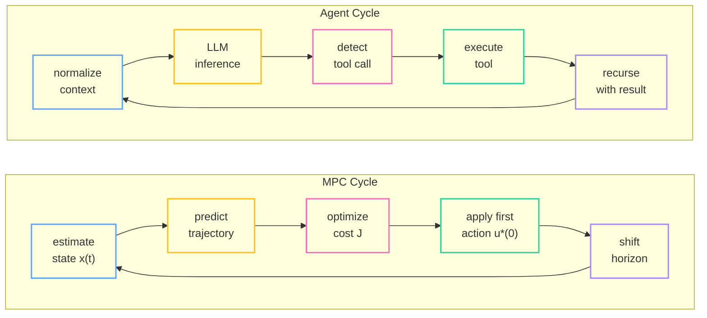

Back in grad school, I built a linear state-space MPC controller for my control theory class -- the classic quadratic-cost-over-a-finite-horizon setup. You model the plant dynamics as $x_{k+1} = Ax_k + Bu_k$, define a cost function that penalizes deviations from your target state and excessive control effort, then solve a quadratic program at each timestep to get the optimal sequence of future inputs. But here's the key: you only apply the *first* input. Then you measure the new state, shift the horizon forward, and solve the whole thing again from scratch.

The professor called this "receding horizon control." At the time I thought it was a neat trick for keeping chemical reactors from exploding. A decade later, I'm watching Claude Code do *exactly the same thing* -- observe state, predict outcomes, pick the best next action, re-evaluate -- except the "plant" is a codebase and the "control inputs" are bash commands.

This isn't a metaphor. It's the same math.

<!--more-->

## The Mapping: MPC Concepts in Agent Architectures

Let's make the translation explicit. Every component of a Model Predictive Controller has a direct counterpart in an AI coding agent:

| MPC Concept | Agent Equivalent | What It Means |
|:---|:---|:---|
| **Plant** | Execution environment | The bash shell, Python REPL, or IDE where actions get executed |
| **State vector** $x(t)$ | Context window | Everything the agent currently "knows" -- files read, errors seen, plan state |
| **Internal model** $f$ | LLM world model | The model's learned ability to predict what happens when you run a command |
| **Control input** $u(t)$ | Tool call / generated token | The specific action the agent takes to change the environment |
| **Prediction horizon** $N$ | Planning depth | How many steps ahead the agent reasons before committing |
| **Stage cost** $\ell$ | Process reward model | How good or bad each intermediate step looks |
| **Terminal cost** $V_f$ | Outcome reward model | Did the final result actually satisfy the user's goal? |
| **Moving Horizon Estimation** | Context folding / compaction | Compressing old history into a summary so the window doesn't overflow |

The core MPC optimization problem is:

$$
\min_{u_0, \ldots, u_{N-1}} \sum_{k=0}^{N-1} \ell(x_k, u_k) + V_f(x_N)
$$

$$
\text{subject to} \quad x_{k+1} = f(x_k, u_k)
$$

In plain English: find the sequence of actions that minimizes total cost (bad intermediate states + bad final outcome), subject to the constraint that each state follows from the previous one through the system dynamics.

For a coding agent, this translates to: *find the sequence of tool calls that minimizes wasted effort and errors, subject to the constraint that each state of the codebase follows logically from the previous edit*. The LLM's "world model" -- its understanding of how code, compilers, and file systems behave -- serves as $f$. The reward signal (did the tests pass? did the user accept the change?) serves as $\ell$ and $V_f$.

## The Agentic Loop = Receding Horizon Control

Let's look at how real agents implement this.

### Claude Code's Recursive Loop

Claude Code runs a tight five-step cycle that maps directly onto the MPC control loop:

1. **Normalize** -- compact and summarize the conversation history (= Moving Horizon Estimation)
2. **Infer** -- the LLM generates its predicted response given the current state (= forward prediction)
3. **Detect tool use** -- pause if the model wants to invoke a tool (= compute optimal control action)
4. **Execute** -- run the tool and collect output (= apply first control action)
5. **Recurse** -- feed results back, re-enter the loop (= shift horizon, re-solve)

The structure is isomorphic. The agent only returns control to the user when it decides the objective is met or when it hits a compute budget (the `maxTurns` cap -- analogous to a hard constraint on total actuation effort). Between those endpoints, it's a closed-loop controller running autonomously.

### The Bellman Connection

This loop is doing something deeper than it first appears. In optimal control, the Bellman equation defines the best possible cost-to-go from any state:

$$
V^*(x) = \min_u \Big[\ell(x, u) + V^*\big(f(x, u)\big)\Big]
$$

This says: the optimal value of being in state $x$ equals the cost of the best immediate action plus the optimal value of wherever that action takes you. It's recursive all the way down.

MPC *approximates* this by rolling the dynamics forward $N$ steps and optimizing over that finite window. Pure RL tries to learn $V^\ast$ globally from data. The agentic loop does a bit of both: the LLM's pre-training gives it an implicit $V^\ast$ (it "knows" what good code looks like), while the receding-horizon structure gives it the MPC-style finite lookahead to course-correct in real time.

### Devin's State-Passing Planner

Devin (and its open-source counterpart OpenHands) takes the MPC analogy even more literally. At every iteration, a planner function evaluates the current state vector -- working directory, open files, remaining step budget -- and decides whether to query the model, invoke a tool, or terminate. This is an explicit discrete-time MPC controller, with the state vector defined as a struct rather than a context window.

### The Ralph Wiggum Loop: Degenerate MPC

And then there's the Ralph Wiggum loop -- the stubbornly persistent pattern where you feed a fresh agent instance the same static prompt, let it try, check if the tests pass, and if not, feed the error logs to a *new* fresh instance. No memory. No prediction. No planning horizon. Just brute-force persistence verified by deterministic tests.

In control theory terms, this is a degenerate MPC with $N = 0$: zero prediction horizon, no internal model, pure reactive feedback. It works surprisingly well for tasks with strong external verifiers (compilers, test suites) because those verifiers act as a perfect cost function. But without a prediction horizon, it has no formal convergence guarantee. It's the control-theoretic equivalent of closing your eyes and repeatedly stomping the gas pedal until you're pointed in the right direction. Sometimes you get there. Sometimes you spin.

## Context Folding = Moving Horizon Estimation

Every Transformer-based LLM has a hard context limit. As the working history fills with code, error logs, and intermediate reasoning, performance degrades -- a phenomenon known as "context rot." It's the informational equivalent of mechanical friction: the more history you drag along, the harder it is to move forward.

In classical control, the dual problem to MPC is Moving Horizon Estimation. Instead of looking *forward* to plan optimal actions, MHE looks *backward* over a sliding window to estimate the current state from noisy observations. The math:

$$
\hat{x}_t = \arg\min_{x_{t-M:t}} \left[ \Gamma(x_{t-M}) + \sum_{k=t-M}^{t} \|y_k - h(x_k)\|^2 \right]
$$

Here $M$ is the estimation window and $\Gamma(x_{t-M})$ is the "arrival cost" -- a compressed summary of everything that happened *before* the window. You don't keep the full history. You keep a good-enough prior and a sliding window of recent data.

Context folding in agent systems does exactly this. Claude Code monitors the active token count. When it hits roughly 13,000 tokens below the context limit, it triggers a compaction protocol: the model summarizes the entire conversation history into a dense summary, preserving critical state (file modifications, active directory, unresolved tasks) while discarding the verbose intermediate steps.

A more sophisticated version is literal context folding: the agent branches into an isolated sub-trajectory to handle a localized subtask (fix a bug, install a dependency), then "folds" the entire branch into a single-sentence summary that gets injected back into the main planning thread. The main thread never sees the 50 tool calls it took to resolve a broken import -- it just sees "resolved dependency conflict in package X."

This is the arrival cost $\Gamma$. You don't need a perfect transcript of everything that happened. You need a *good enough prior* so the sliding window of recent context can do its job. Research on context folding shows it can reduce the active context footprint by 10x while matching or exceeding the performance of agents that try to keep everything in memory.

## When the Controller Fails

Here's where control theory really earns its keep. When you wrap an LLM in a recursive loop, it stops being a function and becomes a *discrete dynamical system* evolving through semantic space. And dynamical systems can exhibit distinct failure modes that map cleanly from classical control theory.

### Three Regimes

**Convergent (stable):** The agent systematically narrows toward the solution. Each iteration reduces the semantic distance to the goal. The diff gets smaller. The error count drops. The agent converges to a fixed point -- working code that passes all tests. This is the happy path: contractive dynamics.

**Oscillatory (underdamped):** The agent toggles between two competing fixes. It patches function A, which breaks test B. It patches test B, which re-breaks function A. The system cycles between two attractors without ever settling. In control theory, this is an underdamped oscillator -- there's a restoring force, but it overshoots on every cycle.

**Divergent (unstable):** The agent's attempts to fix errors introduce *more* errors. Each iteration pushes the state further from the goal. Hallucinated imports, phantom APIs, code that addresses errors which don't exist. This is the "hallucination spiral" -- an unstable system with no Lyapunov guarantee, diverging exponentially from the truth.

### The Lyapunov Lens

In classical control, you prove stability by finding a Lyapunov function $V(x)$ -- a scalar measure of "energy" in the system -- and showing it decreases at every step:

$$
\Delta V(x) = V(x_{k+1}) - V(x_k) < 0
$$

If you can prove $\Delta V < 0$ everywhere, the system is guaranteed to converge to the equilibrium. No exceptions.

For an AI agent, think of $V(x)$ as the "semantic distance" between the current codebase state and the goal state. If every agent action reduces this distance -- fewer failing tests, smaller diffs, cleaner error logs -- you have a stable system. The moment $\Delta V$ goes positive (an edit that introduces more problems than it solves), you've lost your stability guarantee.

This framing explains *why* the Ralph Wiggum loop sometimes works: the external test suite acts as a perfect Lyapunov function. Each iteration either passes (distance drops to zero) or fails (distance stays positive, but the fresh context prevents *accumulation* of errors). The statelessness is a feature -- it prevents the divergent spiral by resetting the system state each iteration, at the cost of discarding all momentum.

It also explains the "epistemic speed limit": if you iterate too fast without sufficient planning depth, minor semantic errors accumulate faster than the feedback loop can correct them. The agent enters a regime of *agentic collapse* -- iterating furiously, accomplishing nothing. MPC's prediction horizon is the antidote: think before you act, and *only then* commit.

## Computational Physics

There's a deeper pattern here that I find genuinely beautiful. MPC was invented to manage the physics of chemical reactors -- momentum, inertia, friction, disturbances. Context rot *is* friction, degrading performance over time. Token generation *is* momentum, driving the system forward along a vector that's hard to arrest. Bugs and missing dependencies *are* external disturbances, randomly deflecting the planned trajectory.

An AI agent navigating a million-line undocumented codebase to implement a new feature is mathematically indistinguishable from a drone navigating a dense, unpredictable forest. The trajectory is semantic rather than spatial, but the optimization problem is identical: minimize cost, respect constraints, re-plan continuously, don't crash.

The future of AI agents isn't prompt engineering -- it's control engineering. The frameworks that will win aren't the ones with the cleverest system prompts. They're the ones with the tightest feedback loops, the deepest prediction horizons, and the most rigorous guarantees that $\Delta V < 0$ at every step.

---

## References

1. "Model predictive control," Wikipedia. [Link](https://en.wikipedia.org/wiki/Model_predictive_control)
2. J. B. Rawlings, D. Q. Mayne, and M. M. Diehl, *Model Predictive Control: Theory, Computation, and Design*, 2nd ed. Nob Hill Publishing, 2017. [PDF](https://sites.engineering.ucsb.edu/~jbraw/mpc/MPC-book-2nd-edition-1st-printing.pdf)
3. "LLM-Based World Models," Emergent Mind. [Link](https://www.emergentmind.com/topics/llm-based-world-models)
4. Y. Feng et al., "Scaling Long-Horizon LLM Agent via Context-Folding," arXiv:2510.11967, 2025. [Link](https://arxiv.org/abs/2510.11967)
5. "Claude Code: Behind-the-scenes of the master agent loop," PromptLayer Blog. [Link](https://blog.promptlayer.com/claude-code-behind-the-scenes-of-the-master-agent-loop/)
6. "Effective context engineering for AI agents," Anthropic. [Link](https://www.anthropic.com/engineering/effective-context-engineering-for-ai-agents)
7. G. L. Bailo, "Why AI Agents Fail: The Stochastic Convergence Spiral," Medium, 2025. [Link](https://medium.com/@gianlucabailo/why-ai-agents-fail-the-stochastic-convergence-spiral-4ab5a8aa0ef4)
8. Z. Chen et al., "Geometric Dynamics of Agentic Loops in Large Language Models," arXiv:2512.10350, 2025. [Link](https://arxiv.org/abs/2512.10350)
9. H. Kim et al., "Test-Time Alignment for Large Language Models via Textual Model Predictive Control," arXiv:2502.20795, 2025. [Link](https://arxiv.org/abs/2502.20795)
10. "Multi-Dimensional Constraint Integration Method for Large Language Models via Lyapunov Stability Theory," OpenReview, 2025. [Link](https://openreview.net/forum?id=rbl8fHjLuF)
11. "Agentic Collapse: A Time-Delayed Cybernetic Framework for Epistemic Stability in Autonomous AI Systems," ResearchGate, 2025. [Link](https://www.researchgate.net/publication/399368003)
12. A. Gekov, "2026 -- The year of the Ralph Loop Agent," DEV Community. [Link](https://dev.to/alexandergekov/2026-the-year-of-the-ralph-loop-agent-1gkj)
13. "Ralph Wiggum Loop," beuke.org. [Link](https://beuke.org/ralph-wiggum-loop/)
14. F. Wang et al., "When control meets large language models: From words to dynamics," arXiv:2602.03433, 2026. [Link](https://arxiv.org/html/2602.03433v1)
15. "Recursive Language Models: the paradigm of 2026," Prime Intellect. [Link](https://www.primeintellect.ai/blog/rlm)
