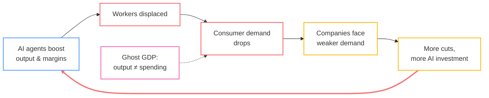

Something shifted last Thursday and I'm still trying to figure out how much it matters.

Jack Dorsey cut 4,000 people from Block — not buried in an 8-K, but in a public letter explaining that AI had changed how the company works and most of the workforce wasn't needed anymore. Over 10,000 down to just under 6,000.

His words on X: "We're already seeing that the intelligence tools we're creating and using, paired with smaller and flatter teams, are enabling a new way of working which fundamentally changes what it means to build and run a company."

Then, in his shareholder letter: "I think most companies are late. Within the next year, I believe the majority of companies will make similar structural changes."

He's not alone. Microsoft AI chief Mustafa Suleyman gave white-collar workers "a year to 18 months." Jamie Dimon at JPMorgan has been saying similar things. Andrew Yang has been on this since his presidential campaign — but now the CEOs are nodding along, and they're the ones with the authority to act on it.

I don't know if Dorsey is right about the timeline. Maybe it's two years, not one. Maybe most companies won't be this aggressive. But a research outfit called Citrini Research took his premise seriously — *what if* the majority of large companies make similar cuts within 12-18 months? — and the stress-test scenario they published in February 2026 is worth sitting with. Not as a prediction, but as a map of a failure mode we should understand before we're in the middle of it.

What strikes me most is the pace. I've been in tech for over a decade and I can't remember a period where the ground moved this fast. By the time you finish processing one development — a new model release, a wave of layoffs, a startup that didn't exist six months ago eating an incumbent's lunch — three more have happened. It feels like trying to read a book while someone keeps turning the pages.

<!--more-->

## The Citrini Thesis: Ghost GDP

Citrini Research's February 2026 piece, "The 2028 Global Intelligence Crisis," sketches a feedback loop that's simple enough to fit on a napkin — which is part of what makes it unsettling.

The loop, as they frame it:

1. AI agents boost corporate output and margins while drastically reducing headcount
2. Displaced workers have less to spend, so aggregate consumer demand drops
3. GDP looks strong on paper — productivity is up — but the gains don't circulate through real consumer spending
4. Weaker demand pressures companies to cut *more* labor and invest *more* in AI
5. Repeat

They call the gap between measured output and actual spending power **"ghost GDP."** The economy produces more than ever, but the money doesn't flow back to consumers as wages, so it doesn't return as demand. A productivity boom that could, in theory, eat its own tail.

The self-reinforcing part is what makes it worth thinking about. Each round of cuts looks rational from any individual firm's perspective — you'd be crazy *not* to automate when your competitors are doing it — but the aggregate effect could be a classic fallacy of composition. What's locally optimal might be systemically destructive.

In Citrini's stress-test scenario, this cascades into 10%+ unemployment, mortgage distress, and a significant market correction by 2028. They're careful to frame it as a plausible scenario, not a forecast. But when I look at Block — step 1 of the loop, playing out in real time — I find myself wondering how far-fetched the rest really is.

A fair counterpoint: an Oxford Economics report from January 2026 found that many layoffs CEOs *called* AI-related were actually cleaning up COVID-era overhiring. Dorsey himself nods at this. But honestly, the distinction feels increasingly academic. Whether the initial trigger is efficiency correction or genuine AI displacement, the trajectory points the same direction — and the tools to accelerate it get better every quarter.

## The Four Phases

I asked Gemini 3.1 Pro Thinking to synthesize the Citrini report with current labor trends, and it came back with a four-phase framework for how this might play out. Take it with a grain of salt — this is speculation built on speculation. But I found it useful as scaffolding for thinking about where we might be headed, even if the specific timelines are almost certainly wrong.

Hover over each phase for details. Red markers show recent events.

### Phase I: The Efficiency Divergence (2024–2027)

This seems to be where we are now. The emerging pattern: senior people with deep domain expertise direct fleets of AI agents that handle execution. The throughput gains appear to be real — possibly 10x to 100x in some workflows — but they're concentrated at the top. Junior and mid-tier roles — paralegals, entry-level analysts, associate developers — are getting squeezed because their output volume can be matched by agents at near-zero marginal cost.

Block might be the clearest signal yet, but I doubt it's the last. The competitive logic is hard to argue with: if your competitor runs a 6,000-person operation with AI where you're running 10,000, your cost structure is worse. You either adopt or get undercut.

What makes this moment feel different from previous automation waves is the speed. Manufacturing automation, call center offshoring — those played out over decades. What we're seeing now is measured in quarters. The institutions that are supposed to absorb the shock — retraining programs, safety nets, new industries absorbing displaced workers — don't operate on that timescale. It's like watching a river change course while the levees are still being planned.

### Phase II: The Commodity Plateau (2027–2030)

This is where Gemini's framework gets more speculative, but the logic holds together. Once state-of-the-art agents are widely available — not just to early adopters but to every company and solo operator — we could hit what you might call the zero-marginal-cost trap. If everyone can generate a "perfectly coded app" or a "perfectly written legal brief" for effectively nothing, the market value of that output trends toward zero.

This is the scenario where the SaaS revenue model gets seriously challenged. The entire industry rests on the premise that software does something your customer can't easily do themselves. What happens when an AI agent can replicate most SaaS functionality on demand?

One possible counter-move: the emergence of "Human-Signed" outputs — work explicitly marked as human-created. Think of it as the "organic" label for intellectual labor. It sounds niche now, but in a world potentially drowning in AI-generated content, verified human authorship could become a real signal. The market might start paying for *provenance*, not just *quality*, because quality would no longer be the scarce resource.

### Phase III: Trust & Taste Bifurcation (2030–2035)

Now we're deep in speculation territory. But the shape of this phase is interesting to think about.

The idea is that the economy splits into two spheres with fundamentally different rules. A **Synthetic Sphere** — maybe handling 90% of economic activity — where logistics, infrastructure, routine healthcare, and standard legal work run on high-speed machine-to-machine commerce. Invisible, cheap, autonomous. You wouldn't notice it, the same way you don't notice packet routing.

Then an **Organic Sphere** where human value persists, organized around *shared experience* and *accountability*. Two thought experiments:

- **Wedding dresses:** The garment itself could be trivially manufactured by AI-optimized production. But the value was never really in the fabric — it's in the ceremony, the emotion, the human witness. The industry might transition from "garment production" to "ceremonial artistry," where human involvement *is* the product.
- **Real estate:** Property management could become fully automated — maintenance, tenant communication, lease optimization. But asset stewardship — the discretionary judgment, the social nuance of a neighborhood, the trust involved in a multi-million dollar transaction — might stay stubbornly human. The agent (real estate agent, not AI agent) would survive by selling accountability, not efficiency.

### Phase IV: Post-Labor Equilibrium (2035+)

The most speculative phase — and honestly, trying to predict 2035 from 2026 feels a bit like trying to predict the iPhone from a 1997 Nokia. But the thought experiment is worth running.

The idea: labor becomes structurally decoupled from survival. Not because we solved poverty, but because the economy simply wouldn't need most human labor to function. Wealth would be generated through capital ownership (compute, IP, data) or strategic intent (deciding *what to build*, not building it).

The counterintuitive punchline: in a world where AI provides personalized everything to everyone, the true luxury might become *human inefficiency*. A meal cooked slowly by a person. A letter written by hand. A doctor who spends an hour with you when the AI diagnosis took 30 seconds. The scarce resource wouldn't be intelligence — it would be the willingness to be present, accountable, and slow.

## What Does This All Mean?

Change is coming, whether you like it or not. Sticking your head in the sand like an ostrich is not the solution. Due to the exponential nature of these breakthroughs, this change will be incredibly fast. We are likely facing a painful transition period before we reach the next equilibrium—think of it as a sigmoidal curve where the vertical ascent is steep and disorienting.

Within this transition, the fundamental structures of our society are being tested. Everything from labor and economics to how we build products and provide services at scale is being rewritten. In this chaotic, high-entropy process of finding the next equilibrium, everything will be amplified: the inequality, the successes, the failures, the pain, and the joy.

To make matters more complex, this AI shift coincides with major historical cycles. As Ray Dalio observes regarding the American empire cycle, and with the geopolitical power cycle shifting as China challenges US hegemony, this technological transition will be all the more turbulent. We are navigating a technological revolution during a period of profound global restructuring.

## So What Do You Actually Do?

I've spent a lot of words on scenarios that might not happen, timelines that are probably wrong, and frameworks borrowed from an AI model. If you're feeling a little dizzy, that's appropriate — I am too. The honest answer is that nobody really knows how this plays out.

But that uncertainty cuts both ways. It's unsettling, sure. It also means the future is more up for grabs than it's been in a long time. And there's an asymmetry worth noticing: the systemic problems I described above are *slow*. They grind through quarters, fiscal years, election cycles, institutional inertia. You, as an individual, can move much faster than that.

Here's how I'm thinking about it.

### Pick up the tools — actually pick them up

Not "be aware of AI trends." Not "take an online course about prompt engineering." I mean: use the tools, today, on real work. Build something with an AI agent. Ship a side project where the AI wrote 80% of the code and you steered the other 20%. Write a report where an LLM did the literature review in an afternoon instead of a week.

The people who seem to be doing well in Phase I aren't the ones who read about AI — they're the ones developing *taste* for what it does well and *intuition* for where it falls apart. That intuition only comes from reps. You can't develop it from blog posts (including this one).

### Be good at more than one thing

If the four-phase model is even directionally right, the most exposed position is "I'm the person who does X." Single-skill specialists have the cleanest task boundaries — and clean task boundaries are exactly what agents are best at learning. "I write SQL queries." "I review contracts." "I build React components."

The harder-to-automate position seems to be "I understand *both* X and Y and can make judgment calls at the intersection." The biologist who can code. The engineer who understands the business model. The designer who can read a P&L. Combinatorial skill sets are harder to replicate because the AI has to get multiple domains right simultaneously *and* navigate the ambiguity between them.

This isn't new advice — "T-shaped people" has been a hiring cliché for decades. What might be new is that the horizontal bar of the T matters more than ever, because the vertical bar (deep single-domain execution) is exactly what's getting commoditized.

### If you've got an idea, now is the time

Here's the flip side of everything I described above: the same forces that make the macro picture scary make the micro picture *incredibly* fertile. The cost of building something just fell off a cliff. A product that would have taken a team of five engineers six months can now be prototyped by one person in a weekend. The barriers to entry haven't been this low since the early web.

If you've been sitting on an idea — a tool, a service, a business — the calculus has changed. The incumbents you'd be competing against are slow, bloated, and mid-reorganization. Their AI strategy is a slide deck and a committee. You, with a laptop and an agent, can ship before they've finished their quarterly planning cycle.

This isn't "move fast and break things" startup romanticism. It's a structural observation: during periods of disruption, the advantage tilts toward small, fast, and opinionated. The big companies are busy figuring out how to cut costs with AI. The opportunity is in figuring out how to *create something new* with it. Disrupt or be disrupted — except right now, the disrupting is cheaper and more accessible than it's ever been.

### Be willing to change your mind

The hardest part of adaptation isn't learning new skills. It's letting go of identity attached to old ones.

I've watched senior engineers resist AI tools because "I didn't spend 15 years learning to code just to let a machine do it." I get it. But those 15 years didn't become worthless — they became the *judgment layer* that sits on top of the machine's output. The value shifted from "I can write this code" to "I know whether this code is correct, and I know what to build in the first place." That's a promotion, not a demotion. But it only works if you let go of the old identity.

The same pattern might play out everywhere. The financial analyst whose value shifts from building models to interrogating assumptions. The lawyer whose value shifts from drafting contracts to identifying what risks a contract *should* address. The scientist whose value shifts from running experiments to designing experiments worth running.

In each case, the transition means saying: "the thing I was proud of doing manually? I'm going to let the machine handle it, and I'm going to focus on the thing it can't do yet." That "yet" matters — the frontier keeps moving, and the willingness to keep reassessing might be the most durable skill of all.

### Hold your convictions loosely

The four phases might be wrong. The timelines almost certainly are. The mechanisms — Ghost GDP, M2M commerce, Proof of Liability — could play out in ways nobody has imagined yet. I could reread this post in two years and wince at how much I got wrong.

But the *direction* feels real: the relationship between human labor and economic value is changing, fast, and the change probably isn't going to reverse. The people who navigate it well won't be the ones who predicted the future correctly. They'll be the ones who stayed curious, kept building, held their models of the world loosely, and moved when the ground shifted under them.

We're living through something that I think people will study in textbooks — one of those rare moments where the structure of work itself is getting rewritten in real time. It's disorienting. It's also, if you squint, kind of thrilling. The game isn't over. It's just changing faster than any of us expected.

---

*Sources: Citrini Research, ["The 2028 Global Intelligence Crisis"](https://www.citriniresearch.com/p/2028gic) (Feb 2026). Block/Jack Dorsey layoff announcement and shareholder letter. Oxford Economics report on AI-related layoffs (Jan 2026).*

As always, I asked Gemini to generate an infographic TLDR: 

