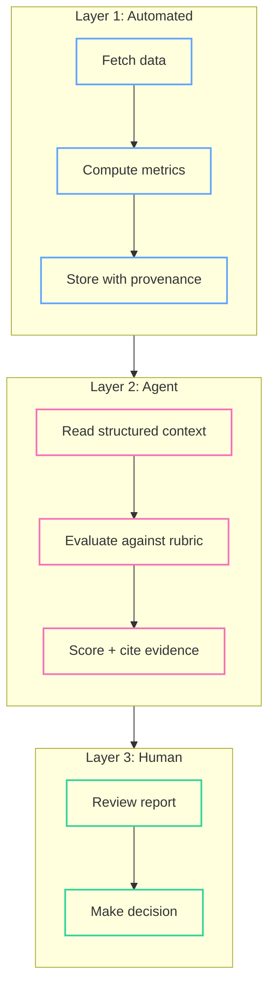
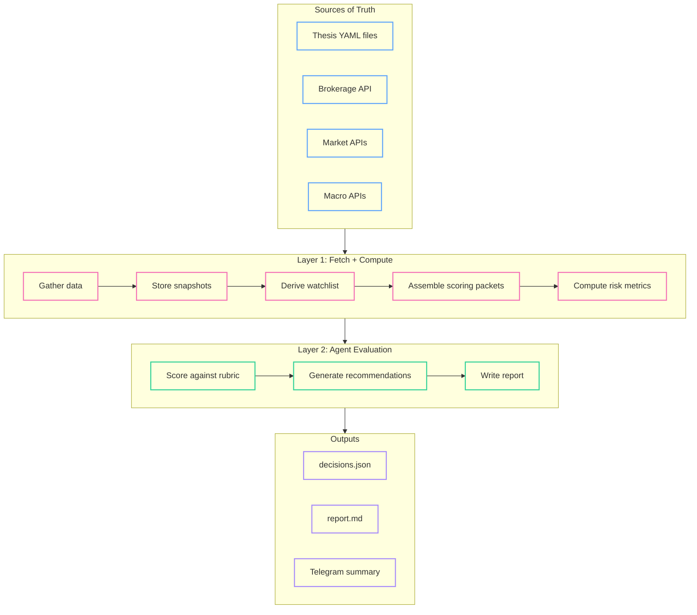

It's tax season again, and I just realized I forgot to do tax loss harvesting. Again. I had unrealized losses in December that would have offset gains from earlier in the year, and I just... didn't act on them. Not because I didn't know how — I've done it before. I forgot because the information was sitting in E-Trade, and I didn't look at E-Trade at the right time, and by the time I filed, the window had closed.

This is a $2,000 mistake that a calendar reminder wouldn't have fixed. The problem isn't remembering that tax loss harvesting exists. The problem is that in mid-December, I would have needed to pull up my positions, check which lots had unrealized losses, verify the holding periods, check for wash sale rules against recent purchases, and decide which ones were worth selling. That's 45 minutes of context assembly for a decision that takes 5 minutes once you have the data in front of you.

It's the same story with my portfolio reviews. I try to do them monthly — that's all I can realistically sustain. I open E-Trade, pull up positions, check what moved. I open the earnings calendar to see what reported and what's coming up. I scan macro indicators — Fed rate expectations, VIX, sector rotation. I read through any SEC filings for companies I hold. I check insider transaction data. I compare my sector allocation against my targets. By the time I've gathered all the context, I've spent two hours and my attention is shot. The actual thinking — "should I add to NVDA given the earnings beat?" — gets 20 minutes of tired reasoning. Then I jot some notes in a doc that I'll half-remember next month.

This isn't an analysis problem. I know how to evaluate a position. It's a *context assembly* problem. The data exists across six different sources, none of them talk to each other, and by the time I've manually stitched it together, I've burned my cognitive budget on logistics. And the things that fall through the cracks — like December's tax loss harvesting — aren't edge cases. They're the predictable result of a process that depends on me remembering to look at the right data at the right time.

I'm building a system to fix this. Not a robo-advisor. Not an auto-trader. A structured data pipeline that gathers everything, an AI agent that does the evaluation, and me making the final call. This post explains why that middle ground is interesting and what it looks like when you design software for an agent instead of a human.

<!--more-->

*This is the first post in a series where I share my journey and learnings building this system. More to come.*

## The Inspiration

A few weeks ago I wrote about [the AI end game](/machine-learning/2026/03/01/the-end-game.html) — the Phase I productivity divergence where senior people with domain expertise direct fleets of AI agents and throughput gains hit 10-100x. I meant it abstractly. Then Karpathy open-sourced [autoresearch](https://github.com/karpathy/autoresearch) and I watched it run 50 experiments overnight — no human in the loop — by giving an agent raw access to a training script, a clean objective metric (validation bits per byte), and a 5-minute wall clock per experiment. The agent edits, runs, measures, commits what works, reverts what doesn't. Twelve experiments per hour, all night.

That's Phase I in 630 lines of Python. Not a theoretical productivity gain — a working one.

Then [OpenClaw](https://github.com/openClaw) hit — the fastest project to a million GitHub stars, and for good reason. It crystallized a design philosophy that was already in the air: stop building tools for humans to click through and start building tools for agents to *operate*. CLI-first. Structured JSON envelopes. Progressive context disclosure. Navigable action spaces. The interface isn't a dashboard — it's a control surface.

The pattern clicked. My monthly portfolio review — the one I can barely sustain by hand — is the same shape as autoresearch. Except the system can run it *weekly*:

- A **cron trigger** kicks off the process (every Sunday night, or on-demand)
- A **deterministic pipeline** gathers all the inputs (positions, market data, news, SEC filings — the equivalent of autoresearch's `prepare.py`)
- An **agent** evaluates the evidence against a structured rubric (the equivalent of editing `train.py` and measuring val_bpb)
- **Version control and audit logs** track every decision and its provenance (the equivalent of git commits on successful experiments)

The difference is the domain. Instead of optimizing a neural network architecture, the agent evaluates investment theses. Instead of bits per byte, the objective is a rubric composite score. But the control loop is identical: gather context → reason within constraints → measure → persist what works.

I'd been doing this manually for years — badly, inconsistently, in a way that didn't compound. Autoresearch showed me what it looks like when you take the human out of the *execution* loop and keep them in the *judgment* loop. That's the system I'm building.

## The Two Extremes

Tools for personal investors cluster at two ends of a spectrum, and neither end actually works.

**The manual extreme.** Spreadsheets, Notion boards, note-taking apps. You maintain a watchlist by hand, copy-paste price data, write freeform notes. You own the reasoning — every conclusion traces back to something you read and thought about. The problem is sustainability. Your notes from two months ago lack context. You forget what you concluded about AMD's competitive position. The data gathering is so tedious that you skip months, and each skipped month makes the next review harder because there's more to catch up on.

**The automated extreme.** Robo-advisors, algorithmic trading platforms, black-box signal services. The data gathering is handled. The reasoning is... somewhere inside the model. You can't inspect why it recommended trimming a position. When the market environment changes — say a tariff shock rearranges your sector thesis — you can't adjust the model's beliefs. You can only turn it off and go back to spreadsheets.

The failure mode of manual tools is inconsistency. The failure mode of automated tools is opacity. I want consistency *and* transparency, which means the system needs to be structured enough for automation but legible enough for human reasoning.

## Three Layers

The architecture has three layers, and the boundaries between them are load-bearing:



**Layer 1 is deterministic.** It fetches portfolio positions, market quotes, earnings data, SEC filings, news, insider transactions, and macro indicators. It computes risk metrics — portfolio beta, Sharpe ratio, max drawdown, position concentration, sector allocation drift. It stores everything with timestamps, source provenance, and batch IDs. No judgment, no LLM calls. Just data gathering and math.

**Layer 2 is the agent.** It reads the structured context Layer 1 produced, evaluates each position against a scoring rubric, assigns dimension scores with evidence citations, and produces recommendations: `BUY_MORE`, `HOLD`, `TRIM`, or `EXIT`. This is where reasoning happens, but it's channeled — the rubric defines what to evaluate and how to anchor the scores. The agent fills in the judgment, not the framework.

**Layer 3 is me.** I read the report, inspect the evidence, check whether the agent's reasoning makes sense, and decide what to actually do. The system is advisory-only. It never executes trades.

This separation might seem obvious, but it has a non-obvious consequence: **there is no LLM SDK anywhere in the codebase.**

The system doesn't call OpenAI or Anthropic APIs. All AI reasoning happens in the *calling* agent session — whether that's Claude Code, a custom Agent SDK app, or a human filling in scores by hand. The system is a structured data tool. The intelligence is pluggable.

This means fallback is natural. Without an agent, Layer 1 still produces a complete report with all the data gathered, all the metrics computed, and all the scoring prompts rendered — just with empty scores. A human can fill them in. The system degrades gracefully to a very thorough data dashboard.

## Designing for the Agent

Here's where it gets interesting. When the primary consumer of your software is an AI agent rather than a human reading a screen, almost every conventional design instinct is wrong.

### Modular, navigable output

An agent can read an ASCII table just fine. Modern models have no trouble parsing formatted text. The format isn't the problem — the problem is what happens when your CLI dumps a wall of data with no structure for navigation.

Consider two ways to return portfolio positions. A flat table:

```
Symbol  Shares   Value      Change   Sector        Thesis          Cost Basis
NVDA      150   $21,300     +3.2%   Semiconductor  AI Infra        $14,200
AAPL      200   $41,800     -0.8%   Technology     (none)          $38,500
AMZN       50   $10,100     +1.5%   Consumer       Cloud Growth    $9,800
... 44 more rows ...
```

The agent reads this, extracts what it needs, moves on. No problem — until the table has 47 rows and the agent only cares about three of them. Or until it needs to drill into NVDA's cost basis breakdown by tax lot. Or until it finishes reading the positions and has to figure out what command to run next. The table is a dead end. It shows data but doesn't connect to anything.

Now compare a structured, navigable response:

```json
{
  "data": [
    {"symbol": "NVDA", "shares": 150, "value": 21300.00, "change_pct": 3.2,
     "sector": "Semiconductor", "thesis": "ai-infra"},
    {"symbol": "AAPL", "shares": 200, "value": 41800.00, "change_pct": -0.8,
     "sector": "Technology", "thesis": null}
  ],
  "meta": {"showing": 5, "total": 47, "truncated": true},
  "next_actions": [
    {"command": "bof position detail --symbol {symbol}", "description": "Cost basis, tax lots, and thesis for a position"},
    {"command": "bof thesis list --symbol {symbol}", "description": "Active theses involving this symbol"},
    {"command": "bof position list --sector {sector}", "description": "Filter positions by sector"},
    {"command": "bof review run", "description": "Start a full weekly review"}
  ]
}
```

The data is the same. The difference is navigability. The response tells the agent how much it's seeing versus how much exists (`showing: 5` of `total: 47`), and it provides contextual commands for drilling deeper. The agent doesn't need to memorize CLI syntax or consult help docs — the available actions are right there, parameterized with values from the current response.

This is the key idea: **agent-friendly output isn't about format, it's about making data modular and self-navigating.** Each response is a node in a graph, with explicit edges to related data. The agent can traverse the graph efficiently instead of front-loading everything into one massive dump.

### HATEOAS for the terminal

The `next_actions` pattern borrows from a REST concept called HATEOAS (Hypermedia as the Engine of Application State), adapted for CLIs. The idea: the application state is always self-describing. Every response includes contextual commands that are valid *given the current state*.

This matters because agents start every session with zero procedural memory of your CLI. A human builds muscle memory over weeks of use. An agent doesn't carry that forward. If a portfolio fetch fails because credentials expired, the error response includes:

```json
{
  "error": "brokerage_auth_expired",
  "message": "E-Trade API token expired",
  "next_actions": [
    {"command": "bof auth refresh --broker schwab", "description": "Refresh authentication token"},
    {"command": "bof auth status", "description": "Check all broker auth status"}
  ]
}
```

The agent never needs to know that `bof auth refresh` exists ahead of time. The system tells it exactly when and how to recover. Each `next_actions` entry can include parameter metadata — `enum` fields that constrain valid choices (preventing the agent from hallucinating invalid options), `default` values, and semantic descriptions that ground the parameter's meaning.

### Protecting the context window

A single SEC 10-K filing can be 200 pages. A full stack trace from a failed API call might be 10,000 lines. If any of that gets dumped raw into the agent's context window, you've essentially lobotomized it.

This isn't a minor efficiency concern. Transformer attention is $O(n^2)$ — every additional token degrades the model's attention on every *other* token. Stuffing a 10-K filing into context doesn't just waste tokens. It actively drowns out the scoring rubric, the thesis definitions, the investment policy, and the agent's own prior reasoning. The technical term is context rot, and in practice it means the agent forgets its instructions.

The design rule: **all outputs truncate by default.** Logs show the last 30 lines. Lists show the top 5 items. Filing summaries show the executive overview. Every truncated response includes metadata:

```json
{
  "data": ["...first 5 items..."],
  "meta": {
    "showing": 5,
    "total": 47,
    "truncated": true,
    "full_output": "/var/data/reviews/2026-03-16/positions_full.json"
  },
  "next_actions": [
    {"command": "bof position list --limit 47", "description": "Show all positions"}
  ]
}
```

The agent can request the full data with `--limit` if it specifically needs a deeper look. But the default path is progressive disclosure — just enough context to reason, with a pointer to more if needed. This pattern comes directly from how well-designed agentic tools manage their finite attention budget: lightweight identifiers first, full data on demand.

### The credit assignment insight

Here's a subtle problem with tool-heavy agent setups. Say an agent uses a web scraping tool to research NVDA, then produces a bad recommendation. Was the reasoning flawed, or did the scraper return outdated data? You can't tell. The tool is a black box that sits between the data and the agent's reasoning.

In reinforcement learning, this is called the credit assignment problem — figuring out which action in a sequence actually caused the outcome. In compound AI systems where an LLM, a retriever, and multiple tool wrappers are all interconnected, the problem is exponentially harder.

This system sidesteps it entirely. Layer 1 is deterministic and fully auditable. Every data point has a source URL, a fetch timestamp, and a batch ID. The agent receives a structured scoring packet — not raw web results, not tool outputs, but curated context with provenance. If the agent makes a bad call, I can inspect the exact context it saw and determine whether the data was bad or the reasoning was bad. Clean signal in, measurable judgment out.

The agent doesn't search the web for "NVDA analysis." It doesn't call APIs or scrape sites. Layer 1 already gathered the specific data (earnings, SEC filings, price action, insider transactions) and packaged it into a scoring packet with the relevant thesis narrative. The agent evaluates what it's given. Its job is narrow: read context, evaluate against rubric, assign scores, cite evidence.

This is the same insight behind Karpathy's [autoresearch](https://github.com/karpathy/autoresearch): give the agent a clean objective function (validation bits per byte, in his case; rubric composites, in mine) and a constrained action space (edit train.py and measure; read context and score). The agent's contribution is isolated and measurable.

## How Data Flows

Here's the full picture of how a weekly review works:



Data flows top to bottom. Sources of truth (thesis files, brokerage data, market APIs, macro indicators) feed into the automated pipeline. The pipeline stores everything as snapshots, derives a watchlist from active theses and current holdings, assembles per-symbol scoring packets, and computes portfolio-level risk metrics.

The agent reads those packets, evaluates each symbol against the scoring rubric, and produces a set of recommendations with evidence citations. The output goes three places: a structured JSON file for programmatic consumption, a Markdown report for human reading, and a Telegram summary for quick mobile review.

Every step in Layer 1 persists its output with a batch ID. If something looks wrong downstream, you can trace it back to the exact data the pipeline fetched. No black boxes, no hidden state.

## What's Next

There's a lot packed into the boxes above that I've glossed over. As I build this out, I'm planning to write about the pieces I find most interesting — likely thesis-driven investing as a data structure (why stories, not tickers, are the right unit of reasoning), how scoring rubrics make agent judgment consistent, and the path from CLI to Telegram bot. We'll see what actually makes it to the page.

The system is called `bof` (short for Bo Finance — naming is hard). It's in active development. If you're a software engineer who manages your own portfolio and has felt the same context assembly frustration, I think the patterns here generalize well beyond investing. Structured data pipelines with pluggable agent reasoning apply anywhere you have tedious data gathering followed by judgment calls.
