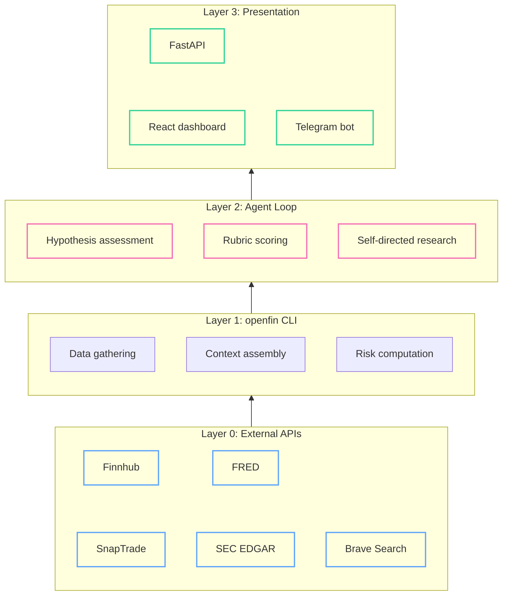
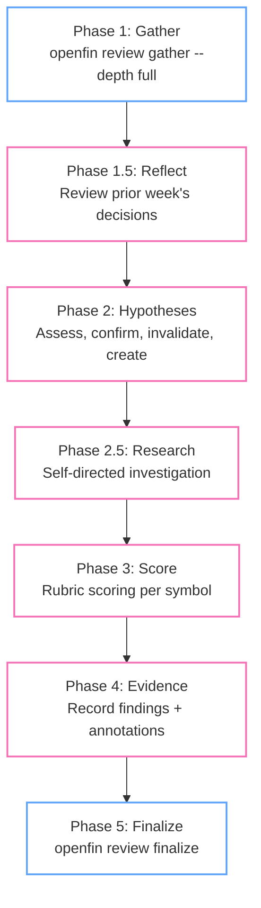

Open your brokerage app. Look at your watchlist. AAPL, NVDA, TSLA, AMZN, GOOG — a flat list of tickers sorted by... whatever the default is. Now try to answer: why is NVDA on this list? Is it a core holding or a speculative bet? What would make you sell it? What specific piece of evidence would confirm or disconfirm whatever thesis got it onto the list in the first place?

If you're like me, you don't remember. The ticker is there because you added it six months ago when you read something about data center spending. The reasoning is gone. The list is a graveyard of forgotten convictions.

The usual diagnosis is that you need better tools — a smarter screener, a faster news feed, a dashboard with more charts. But the problem isn't tooling. It's that there's no *structure* for your reasoning. No place where your beliefs are written down, no criteria for when you'd change your mind, no way to tell whether last month's conviction still holds. The information exists. The reasoning framework doesn't.

That's what this post is about. Not the data pipeline or the agent architecture — I covered those in the [first post](/programming/2026/03/18/agents-dont-read-dashboards-part1.html). This one is about encoding investment reasoning as data structures: theses, hypotheses, scoring rubrics. The kind of structure that makes your thinking consistent whether an AI agent is evaluating it or you're doing it by hand on a Sunday night.

<!--more-->

*Part 2 of the "Agents Don't Read Dashboards" series. [Part 1 here](/programming/2026/03/18/agents-dont-read-dashboards-part1.html).*

## Theses Are Stories, Not Tickers

Every investment tool I've used organizes around tickers. Your portfolio is a list of symbols. Your watchlist is a list of symbols. Your alerts fire on symbols. But you don't invest in tickers — you invest in *stories*. "AI infrastructure spending will extend as models get larger and inference scales out" is a thesis. NVDA, AMD, AVGO, MRVL, and TSM are symbols that play different roles in that story. The thesis is the unit of reasoning. The ticker is just an implementation detail.

Here's what a thesis looks like as a data structure:

```yaml
slug: ai-compute-hardware
title: AI Drives Compute Hardware Demand
narrative: |
  Hyperscaler and enterprise AI training/inference workloads
  continue to grow, driving sustained demand for GPUs, custom
  silicon, and networking chips. The capex cycle extends as
  models get larger and inference scales out.
status: active
symbols: [NVDA, MRVL, AVGO, AMD, TSM]
time_horizon: "12-18 months"
notes: >
  Core AI hardware thesis. NVDA is the bellwether;
  MRVL and AVGO are the custom silicon angle.
created: '2026-03-18'
updated: '2026-04-01T14:22:31+00:00'
```

Five symbols, one story. Each symbol plays a distinct role — NVDA is the bellwether GPU play, MRVL and AVGO are the custom silicon angle, AMD is the competitive challenger, TSM is the foundry layer. The thesis captures *why* these tickers are on your radar, not just *that* they are.

Compare this to a different thesis:

```yaml
slug: oil-shock-travel
title: "Oil Price Shock — Airlines Pressured, Producers Benefit"
narrative: |
  A sustained oil price spike creates a temporary divergence:
  airlines face margin compression from jet fuel costs while
  upstream producers capture windfall pricing. The trade is
  short-to-medium term — eventually demand destruction or
  supply response normalizes prices.
status: active
symbols: [XOM, OXY, DAL, UAL, COP, CVX, AAL]
time_horizon: "6-12 months"
```

Same data structure, totally different story. Airlines and oil producers are on opposite sides of the same macro event. DAL and XOM would never appear on the same flat watchlist for the same reason — but here, the thesis makes the relationship explicit. When oil spikes, you already know what to look at and from which direction.

Why YAML? Because it's human-editable, version-controlled, and diffable. The agent and I edit the same file. Git history shows exactly when a thesis changed and why. There's no database migration for updating a conviction — you edit text and commit. And the act of writing the thesis is itself valuable — it forces you to articulate what you believe and why, which is harder than it sounds when your conviction was formed from half-remembered headlines.

## Derived Watchlists

Once your beliefs are encoded as theses, something interesting falls out: you don't need a manually-maintained watchlist anymore. The watchlist is *computed* — the union of all symbols from active theses plus everything you currently hold in your portfolio.

```json
{
  "NVDA": ["ai-compute-hardware", "portfolio"],
  "MRVL": ["ai-compute-hardware"],
  "AVGO": ["ai-compute-hardware", "portfolio"],
  "AMD":  ["ai-compute-hardware"],
  "TSM":  ["ai-compute-hardware"],
  "MU":   ["agentic-memory-expansion"],
  "AAPL": ["portfolio"],
  "XOM":  ["oil-shock-travel"]
}
```

Every symbol carries provenance — a list of *why* it's being tracked. NVDA appears because it's in the AI compute thesis *and* you hold it. AAPL appears only because you hold it — there's no active thesis for it.

That last case is a flag. The system surfaces it: "AAPL has no active thesis. Consider creating one or reviewing the position." A symbol without a thesis is a position without a reason. Maybe you have a reason and just haven't written it down. Maybe you forgot why you bought it. Either way, the system forces the question.

The YAML files are the source of truth for reading. But every time a thesis is saved, it also writes a snapshot to a `thesis_snapshots` table in the database — append-only, timestamped, with the full payload. YAML gives you current state. The DB gives you history. "What did this thesis look like three months ago?" "When did we add MRVL?" "How has the narrative evolved?" You can answer all of these by querying the snapshot trail.

## The Hypothesis Layer

A thesis tells you *what* you believe. But it doesn't tell you *what would change your mind*. That's the gap most investors never close — they have convictions but no criteria for abandoning them.

Hypotheses close that gap. A hypothesis is a falsifiable, time-bounded prediction derived from a thesis:

```
[active, 2w old, horizon: 6 months]
  Claim: If NVDA Q2 data center revenue exceeds $35B,
         confirms enterprise AI adoption acceleration
  Invalidated by: Data center revenue below $30B or
                  sequential decline in Q2 report
```

The claim is specific — not "NVDA will do well" but "data center revenue exceeds $35B." The invalidation criteria are concrete — a number, not a vibe. And it's time-bounded — we'll know by the Q2 earnings date.

Every thesis also needs at least one bear-case hypothesis:

```
[active, 1w old, horizon: 12 months]
  Claim: BEAR: If hyperscaler capex pulls back 20% QoQ,
         AI compute demand thesis fails as training
         workloads consolidate
  Invalidated by: Sustained QoQ capex growth across 3+
                  hyperscalers for 2 consecutive quarters
```

Bear-case hypotheses follow the same lifecycle — they can be confirmed (thesis risk realized), invalidated (risk cleared), or revised. The `BEAR:` prefix makes them visually distinct. The discipline of maintaining at least one bear case per thesis is the part most people skip — and the part that matters most. It's easy to collect confirming evidence for something you already believe. It's much harder to write down the specific conditions under which you'd be wrong.

As hypotheses resolve over time, they produce a signal. The system computes **thesis health** — a recency-weighted ratio of confirmed to invalidated hypotheses. Recent resolutions count more (half-life of ~30 days). Three invalidations in 14 days trigger "failing" status. The health score is one of five levels: `untested → strong → mixed → weakening → failing`.

Alongside health, the system tracks **time pressure** — how much of the thesis's time horizon has elapsed. A 12-18 month thesis created 3 months ago is "early." At 10 months, it's "late." Past 16 months, it's "overdue."

Health and time pressure together answer the question you'd otherwise avoid: *is this thesis still working, and how much runway does it have left?* A thesis with "failing" health and "late" time pressure gets a much lower bar for TRIM or EXIT recommendations — the structure forces the hard conversation.

Here's what this looks like in the dashboard. The thesis detail view shows the narrative, health and pressure badges, all active hypotheses with their invalidation criteria, and per-symbol composite scores with action recommendations:


The hypotheses aren't buried in a database — they're front and center. Each one has a concrete invalidation condition visible right below the claim. The health and pressure badges at the top give you a thesis-level pulse check without reading every hypothesis.

## The Tiered Architecture

So we have theses, hypotheses, and health scores — a structured representation of what you believe and how it's holding up. Now the question is: how does this structure get *evaluated*? The system has four layers, and each boundary exists for a specific reason:



**Layer 0** is the external world — brokerage APIs, market data providers, government data (FRED for macro indicators), SEC EDGAR for filings, Brave Search for web research. These are unreliable by nature: rate-limited, occasionally down, variable in response quality.

**Layer 1** is the openfin CLI — the deterministic pipeline. It handles all communication with Layer 0: authentication, rate limiting, retries, caching, response normalization. It stores every fetch as a timestamped snapshot in the database. It computes derived data (watchlists, risk metrics, context packets). Everything here is reproducible — same inputs, same outputs, no LLM calls.

**Layer 2** is the agent loop. The agent never touches Layer 0 directly. It interacts exclusively through Layer 1's CLI commands. This is the boundary that matters most: the agent gets clean, structured, provenance-tagged data. When it needs to investigate something, it calls `openfin research news MRVL`, not a raw HTTP request to Finnhub. The CLI handles the messy parts.

**Layer 3** is presentation — a FastAPI server, a React dashboard, a Telegram bot. All three read from the same data layer. The agent's scores, evidence records, and annotations show up in the dashboard the same way they show up in a CLI `openfin review show` command. Adding a new interface means writing a thin adapter over the same application services.

The timeline view shows this in action — score reviews and hypothesis creation events interleaved chronologically, all produced by the agent loop and rendered by the presentation layer:


Every score review card links to the full report. Every hypothesis shows its invalidation criteria inline. The timeline is a read-only view over the same data the agent wrote through CLI commands — Layer 3 doesn't add any logic, it just renders what Layers 1 and 2 produced.

## The Agent Loop

The thesis structure described above isn't just context for an agent — it's what makes an agent *possible*. Without it, you'd be asking an LLM to "analyze my portfolio," which is the equivalent of handing someone a phone book and asking for investment advice. With it, the agent has a clear job: evaluate specific hypotheses against specific evidence, score along specific dimensions, and produce recommendations grounded in the criteria you defined.

Here's how that plays out — the five-phase weekly review:



The deterministic bookends — Phase 1 and Phase 5 — are the blue nodes. The agent's judgment fills the middle. This is the same pattern from [the first post](/programming/2026/03/18/agents-dont-read-dashboards-part1.html): deterministic pipeline gathers context, agent reasons within constraints, deterministic math produces the final output.

**Phase 1** is fully automated. `openfin review gather --depth full` fetches positions from the brokerage, market quotes, news, SEC filings, macro indicators, earnings calendars, and search results for every symbol on the derived watchlist. It assembles everything into **context packets** — per-thesis Markdown files that contain the narrative, hypothesis state, health score, time pressure, and all the gathered data for each symbol in the thesis. It also generates per-holding packets with position details, cost basis, P&L, tax status, and prior scores.

These context packets are what the agent actually reads. Not raw API responses. Not a database dump. Structured, bounded documents with provenance metadata on every data point.

**Phase 1.5** is where the agent builds continuity. Before scoring anything new, it reviews the prior week's output — were the scores calibrated? Did a BUY_MORE call lead to gains? Were any hypotheses poorly formed? This reflection directly informs the current week's analysis. The agent doesn't start fresh each session.

**Phase 2** is hypothesis management. For each thesis, the agent reads the context packet and assesses every active hypothesis. New confirming evidence → update to `confirmed`. Invalidation criteria met → update to `invalidated`. Each resolution includes a quality assessment: was this hypothesis actually useful for making a decision, or was it noise? The agent also generates new hypotheses to replace resolved ones, ensuring at least one bull and one bear case per thesis.

**Phase 2.5** is self-directed research. The gather phase collects standard data, but the agent may spot gaps — a symbol with a pending hypothesis but no recent news, a divergence between price action and news sentiment, a blind spot flagged in the reflection. The agent pursues these leads through the CLI's research commands (more on this in the next section).

**Phase 3** is rubric scoring. The system has four evaluation dimensions:

| Dimension | Weight | What it measures |
|-----------|--------|-----------------|
| Thesis alignment | 0.35 | How well current data matches the thesis conditions |
| News sentiment | 0.25 | Directional bias from recent news and developments |
| Valuation signal | 0.25 | Relative value assessment given fundamentals |
| Social signal | 0.15 | Crowd sentiment from social and community sources |

Each dimension has a 0-10 scale with explicit anchor descriptions. A thesis alignment score of 8-9 means "multiple thesis conditions exceeded, strong confirming evidence across dimensions." A 2-3 means "key thesis pillars are eroding, evidence of structural headwinds accumulating." The anchors prevent score drift — the agent evaluates against the same definitions every week.

The agent scores each symbol by calling:

```bash
openfin review score NVDA -m thesis_alignment \
  --score 8 \
  -r "Q2 data center revenue beat at $28B; hyperscaler capex up QoQ"

openfin review score NVDA -m news_sentiment \
  --score 7 \
  -r "Analyst upgrades outweigh competitive concerns; positive tone"

openfin review score NVDA -m valuation_signal \
  --score 5 \
  -r "P/E near historical average; growth priced in but not stretched"
```

Every score requires a rationale citing specific evidence from the context packet. No vibes, no "I feel bullish." The rubric and the evidence trail make the agent's reasoning inspectable.

**Phase 5** is deterministic again. `openfin review finalize` computes weighted composite scores, applies action thresholds, and generates the final report:

$$\text{composite} = 0.35 \times \text{thesis} + 0.25 \times \text{news} + 0.25 \times \text{valuation} + 0.15 \times \text{social}$$

For NVDA with scores of 8, 7, 5 (no social data): composite normalizes to ~0.67. Action thresholds: $\geq 0.70$ → `BUY_MORE`, $\geq 0.40$ → `HOLD`, $\geq 0.20$ → `TRIM`, below → `EXIT`. NVDA lands at `HOLD` — close to the buy threshold but not quite there.

The agent provided the judgment (individual scores). The system provided the framework (weights, thresholds, actions). If the recommendation seems wrong, I can trace exactly which dimension drove it and whether the evidence supports the score. The structure makes the reasoning auditable — not just for me reviewing the agent's work, but for the agent reviewing its own work next week in Phase 1.5.

## Giving the Agent Tools to Investigate

Phase 2.5 — self-directed research — is where the agent acts most like an analyst. But even here, the structure constrains it productively. The agent doesn't browse the web or call APIs. It uses structured CLI commands that return bounded, provenance-tagged output:

```bash
# Targeted news for a specific symbol
openfin research news MRVL --limit 5

# Specific research question
openfin research search "HBM demand forecast 2026 2027"

# SEC filings
openfin research sec-filings NVDA --type 10-Q
openfin research sec-read NVDA --type 10-Q
```

Each command returns JSON with truncation metadata and contextual next actions — the same pattern from Post 1:

```json
{
  "data": [
    {
      "headline": "Marvell Q1 revenue beats on custom AI chip demand",
      "source": "Reuters",
      "published": "2026-04-02T14:30:00Z",
      "age": "3d ago",
      "url": "https://reuters.com/..."
    },
    {
      "headline": "Marvell expands HBM controller partnership with SK Hynix",
      "source": "EE Times",
      "published": "2026-03-28T09:00:00Z",
      "age": "8d ago",
      "url": "https://eetimes.com/..."
    }
  ],
  "meta": {"showing": 2, "total": 12, "truncated": true},
  "next_actions": [
    {"command": "openfin research news MRVL --limit 12",
     "description": "Show all recent news"},
    {"command": "openfin research search-symbol MRVL --limit 5",
     "description": "Investment-focused web search for MRVL"}
  ]
}
```

The design principle: **the CLI is the agent's API.** Rate limiting, authentication, caching, error handling, response normalization — all of that lives in Layer 1. The agent gets clean, bounded output with source URLs and timestamps. If the agent reads a news headline and wants to update a hypothesis, it records evidence with provenance:

```bash
openfin review evidence MRVL --run-id abc123 \
  --source-type news \
  --claim "Q1 revenue beat driven by custom AI chip demand" \
  --direction confirming \
  --hypothesis-id hyp-456
```

The evidence is linked to a specific hypothesis, tagged with direction (confirming/disconfirming/neutral), and persisted with the run ID. When I review the report, every claim traces back to a source.

This is targeted, not exhaustive. Three to five research queries per review is typical. The agent investigates specific questions prompted by gaps in the context packets or contradictions between hypotheses and new data — it doesn't blanket-search every symbol.

## The Structure Is the Product

Here's the thing I didn't expect when I started building this: the structure is more valuable than the automation.

Writing a thesis in YAML forces you to articulate *what* you believe. Defining hypotheses forces you to name *what would change your mind*. Computing thesis health forces you to confront *whether your beliefs are holding up*. Derived watchlists with provenance force you to explain *why you own what you own*. None of this requires an AI agent. It requires a text editor and intellectual honesty.

The agent makes it scalable — it can evaluate 20 symbols across 6 theses in a single session, something that would take me an entire afternoon. But scaling bad reasoning just produces bad recommendations faster. The structure is what makes the reasoning *good*. The agent is what makes it *weekly*.

And that's the graceful degradation from the first post in action. Without an agent, Phase 1 still runs. You still get context packets with all the data gathered, all the hypotheses listed, all the scoring prompts rendered — just with empty scores. A human can fill them in. The system degrades from "AI-assisted weekly review" to "very thorough data dashboard with a built-in evaluation framework." That's still infinitely more useful than a flat ticker list and a vague sense that you should probably look at NVDA sometime.

Next up: how rubric versioning enables longitudinal analysis (did the agent's scoring calibration drift over time?), and the path from CLI to Telegram bot — three interfaces sharing one core.
